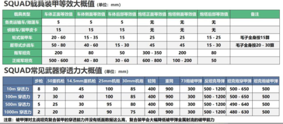
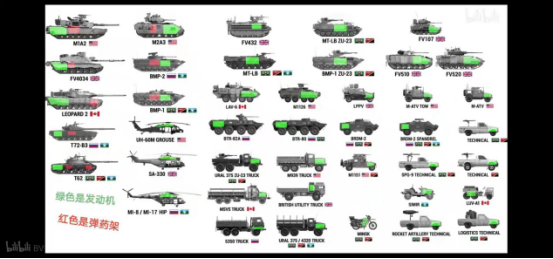
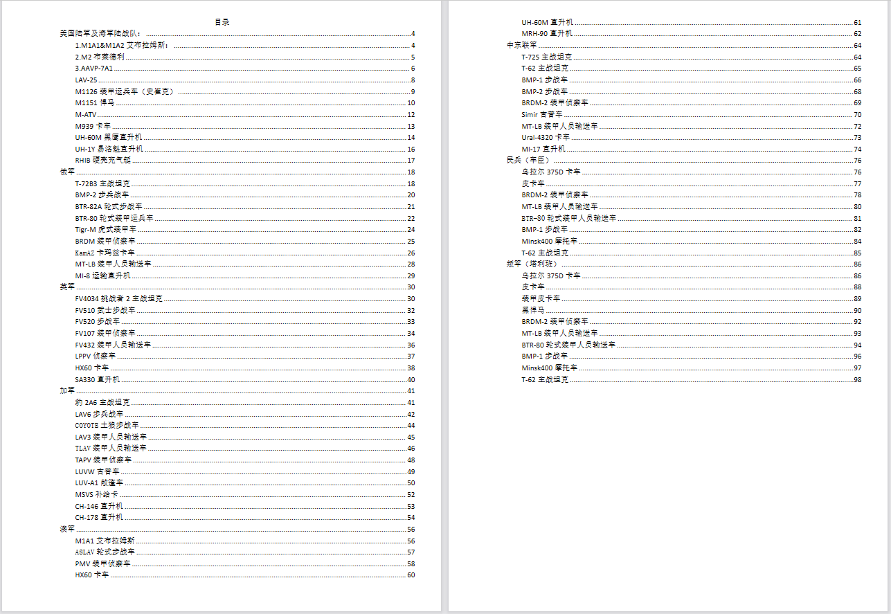

# 第五目 载具识别

> 视频作者：橘猫大尉

> 文章作者：Astesia

<iframe src="//player.bilibili.com/player.html?aid=768296601&bvid=BV1hr4y1H7ZQ&cid=580650402&page=1" height="480" width="720" scrolling="no" border="0" frameborder="no" framespacing="0" allowfullscreen="true"> </iframe>

## （一）载具所发射的弹药种类

载具所发射的弹药主要分为两种，分别为动能弹药和化学能弹药，其中动能弹药为穿甲弹（AP）、脱壳穿甲弹（APDS）和尾翼稳定脱壳穿甲弹也就是我们俗称的钢针（APFSDS），而化学能弹药分为破甲弹（HEAT）、英军特有的碎甲弹（HESH）和高爆破片杀伤榴弹（HE）。各种弹药都有着其独特的穿甲以及杀伤机制。

### AP | 穿甲弹

穿甲弹依靠动能进行杀伤，基本等同于一个大号子弹，需要直接命中并且形成有效穿透才能造成伤害，由于是全口径弹药，截面比动能较小，AP 的穿甲能力较差。大口径机枪以及中东联军的 30mm 机炮的主力穿甲弹 3UBR6 为该种弹药。

### APDS | 脱壳穿甲弹

脱壳穿甲弹同样依靠动能进行杀伤，只不过弹头是一个被弹托包住的小口径弹丸，出膛后弹托脱落，剩余次口径的穿甲弹芯继续飞向目标，但由于截面比动能提高，脱壳穿甲弹的穿深更高，而初速的提高也使其更为弹道更为平直。

俄军 BTR-82A 以及 BMP-2 的穿甲弹药 3UBR8，英军的 FV510，FV107 步战车的穿甲弹药 NM225，这两种弹药均为脱壳穿甲弹。

### APFSDS | 尾翼稳定脱壳穿甲弹（钢针）

尾翼稳定脱壳穿甲弹穿深和伤害较高，是在脱壳穿甲弹的基础上进一步拉伸拉细弹体以提高截面比动能进一步强化穿甲能力的穿甲弹，并且为了稳定减小截面导致旋转角动量不足以稳定其自身轨迹弹体在其后又添加了尾翼。

美陆军布莱德利步战车，美海军陆战队 LAV25 ，加军土狼和 LAV6 ，澳军 ASLAV 的主力穿甲弹药为同一种小口径钢针，英军 FV520 也为 40mm 炮发射的小口径钢针，所有坦克主炮的穿甲弹都为大口径钢针。

### HEFA | 高爆破片弹

依靠爆炸的冲击波和破片进行杀伤，基本没有穿甲能力，但对步兵，直升机，卡车，工事的杀伤效果极其出色。

所有的小口径机炮都配有小口径高爆弹，俄军、中东和叛军的主战坦克拥有高爆榴弹。

### HESH | 碎甲弹

弹头为塑性炸药，依靠塑性炸药在装甲表面爆炸在装甲反面剥落的碎片进行杀伤，对于复合装甲杀伤效果贫弱。英军主战坦克以及 FV520 步兵战车的 ++2++ 号弹种即为破甲弹。

### HEAT | 破甲弹

弹头为空心装药聚能破甲战斗部，在短身管火炮这种低膛压或者无后坐力炮和步兵筒子以及反坦克导弹上应用广泛，因为其并不依靠发射药赋予的动能为主要杀伤手段。

空心弹头内部的锥形装药爆炸后会把黄铜药罩变成一股高温高速金属射流穿透装甲；同样的，这种弹药对于复合装甲和间隙装甲杀伤效果不好。但该种弹同样具有高爆效果。除了英国之外的所有的主战坦克都配备破甲弹。

<figure markdown>
  { loading="lazy" height="100%" width="100%" }
  <figcaption>弹药基本穿深和载具防护对照表</figcaption>
</figure>

## （二）载具模块

### 发动机

载具的动力来源，一旦被摧毁载具就会失去机动能力同时发动机处产生大量烟雾，极为干扰观察。

但注意轮式载具在发动机被摧毁而车轮未被破坏的情况下仍然可以通过溜车的方式移动。

### 方向机、火炮稳定器
该部位一般随着对炮塔的攻击而损坏，方向机损坏后炮塔的转向能力会被大幅度削弱乃至于无法转动，而稳定器损坏（表现为炮手视角玻璃破裂）将会导致火炮无法稳定指向一个方向，移动开火能力将会被大幅削弱，炮塔血量中度受损将会毁坏稳定器，大幅受损时损坏方向机。

### 弹药架

该部件存在于重型载具上，（布莱德利步战车，BMP-1\2 步兵战车、所有的坦克）该部位血量归零后，载具将起火且无法通过人工的紧急抢修修复，同时会清空载具的待发弹药架，在弹药架起火后的十余秒后载具就会爆炸。

### 轮胎＆履带

载具上最为脆弱的部分，对于轮式载具来说可能还好，但履带式载具一旦被摧毁了履带就完全丧失了机动能力，变成筒子群的攻击目标。

<figure markdown>
  { loading="lazy" height="100%" width="100%" }
  <figcaption>弹药基本穿深和载具防护对照表</figcaption>
</figure>

## （三）装甲
运输车等基本等于没有装甲，小口径子弹就可以对其造成有效击穿。

侦察车能防御小口径子弹但是会被重机枪乱穿。

北约的轮式步战车正面可防御大口径重机枪，但侧后则不行。俄系轮战则全向无法防御重机枪直射。

!!! failed "例外"
    加拿大的 LAV6 只有车体正后面和炮塔会被重机枪击穿。

北约履带式步战车基本车体正面侧面和炮塔免疫重机枪，BMP 则是只有车体正面能依靠大倾角跳弹防御，侧面仍然无法抵御重机枪，但是伤害不高。

至于坦克装甲要更为复杂，值得另起一段详细说说。坦克的正面装甲一般都极为强悍，现代主战坦克的正面装甲能等效到 600mm+，而侧后就不太行了。坦克的正面需要大口径钢针或者反坦克导弹来击穿，而车体后部则可以被机炮击穿。

## （四）基本载具识别

<figure markdown>
  [{ loading="lazy" height="100%" width="100%"}](./img/list.png)
  <figcaption>载具识别手册目录</figcaption>
</figure>

详见附件 1 [【载具识别手册 - 战术小队中文维基.pdf】](./enclosure/%E8%BD%BD%E5%85%B7%E8%AF%86%E5%88%AB%E6%89%8B%E5%86%8C-%E6%88%98%E6%9C%AF%E5%B0%8F%E9%98%9F%E4%B8%AD%E6%96%87%E7%BB%B4%E5%9F%BA.pdf)。

## 附件

1. [载具识别手册 - 战术小队中文维基.pdf](./enclosure/%E8%BD%BD%E5%85%B7%E8%AF%86%E5%88%AB%E6%89%8B%E5%86%8C-%E6%88%98%E6%9C%AF%E5%B0%8F%E9%98%9F%E4%B8%AD%E6%96%87%E7%BB%B4%E5%9F%BA.pdf)

!!! info "版权声明"
    本文中视频与图片部分引用自[哔哩哔哩](https://www.bilibili.com)，由[橘猫大尉](https://space.bilibili.com/162372711)创作的视频[【SQUAD入门攻略】战术小队新手教学第五章：载具入门](https://www.bilibili.com/video/BV1hr4y1H7ZQ)，视频的各项权利归其权利人所有，不在[CC BY-SA 4.0](https://creativecommons.org/licenses/by-sa/4.0/deed.zh) 和 [SATA](https://github.com/zTrix/sata-license) 协议之条款下提供；
    正文部分改编自视频，改编已获原作者[橘猫大尉](https://space.bilibili.com/162372711)授权。