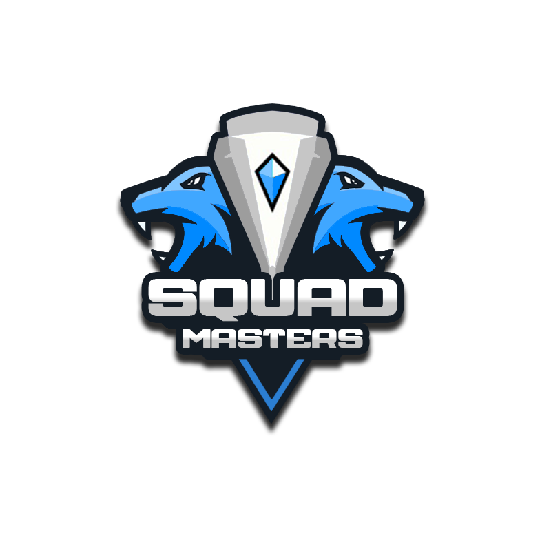
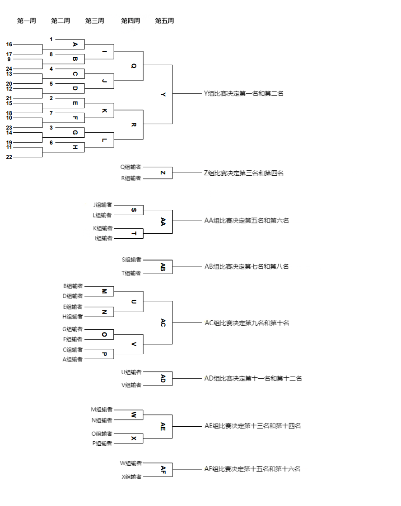

# 战术小队大师赛 | Squad Masters

<figure markdown>
  { width=300 }
  <figcaption>Squad Masters</figcaption>
</figure>

## 介绍

战术小队大师赛是一个持续5周的多级别的单一淘汰赛。

这是一个多阶段的比赛，预选赛将在第一周举行，之后将是淘汰赛阶段。

在预选赛结束后，每支队伍都可以总共打 4 场比赛。没有一支队伍会在预选赛中被淘汰，他们只是降低了一个分区。最后一场比赛将是最难的，因为你的对手将是同样的级别。如果您对这种赛制有任何疑问，请参阅下面的插图。

{width=100% loading=lazy}

详细规则见[《战术小队大师赛规则集》](./Ruleset)（中文，由 Astesia 翻译整理）

## 联系方式

[Discord :fontawesome-brands-discord:](https://discord.gg/gXtzJcK9){.md-button .md-button--primary}