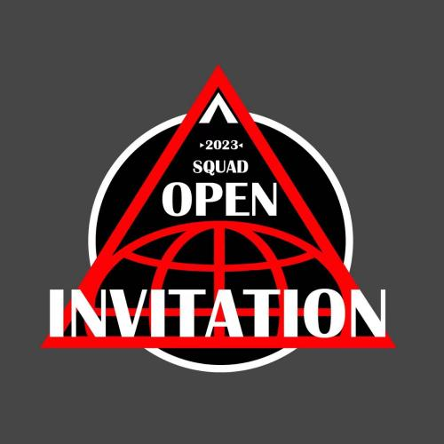

# 战术小队公开邀请赛 | SQUAD OPEN INVITATIONAL

<figure markdown>
  {loading=lazy}
  <figcaption>战术小队公开邀请赛 | SQUAD OPEN INVITATIONAL</figcaption>
</figure>

## 简介

战术小队公开邀请赛（以下简称 SOI）由中国 81Army 战队举办，并计划于 2023 年 5 月正式开赛。（具体日期待定）

SOI 旨在通过举办社区性的战术小队竞技赛事以鼓励国服各战队参与，同时通过赛制、规则方案以最大化的提高比赛的可组织性与可玩性。

为最大化确保公平性与公开性，SOI 欢迎各战队代表入驻赛事委员会，以共同商讨决定比赛相关事宜。

详情请见[《战术小队公开邀请赛策划方案》](./Plan/)。

## 联系方式

[Discord :fontawesome-brands-discord:](https://discord.gg/cunA6e3Q){.md-button .md-button--primary}   [KOOK :simple-kinopoisk:](https://kook.top/9Vi7y4){.md-button .md-button--primary}

<iframe src="https://kookapp.cn/widget?id=4939320590138488&theme=dark" width="100%" height="600" allowtransparency="true" frameborder="0"></iframe>