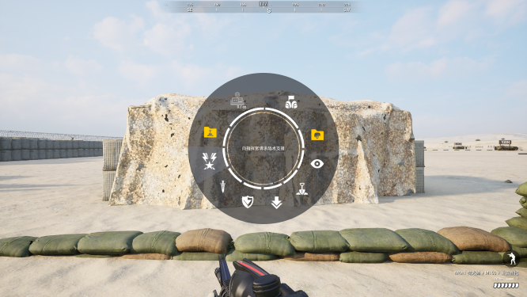
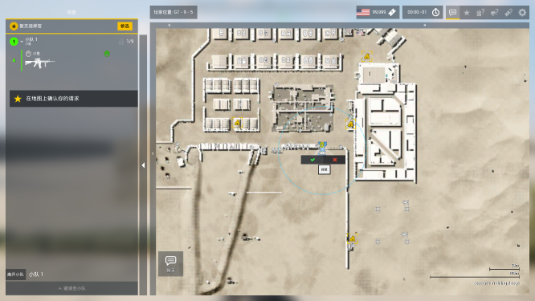
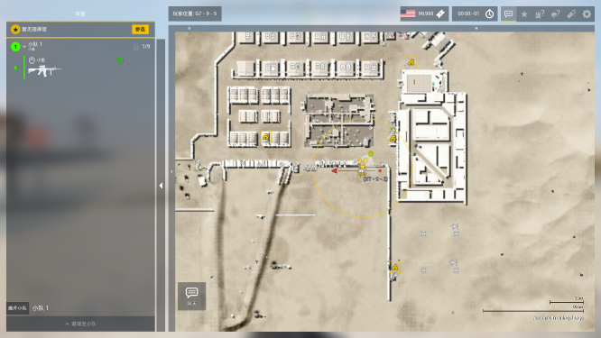

# 队长请求火力支援

> 视频作者：橘猫大尉

> 文章作者：林夕

<iframe src="//player.bilibili.com/player.html?aid=931271989&bvid=BV11M4y1u7ww&cid=360037764&page=1" height="480" width="720" scrolling="no" border="0" frameborder="no" framespacing="0" allowfullscreen="true"> </iframe>

## 确定位置

第一步，选择打击位置，使用**准心对准目标**，使用 ++t++ 键呼出队长菜单，选择轮盘内的**火力标识**，点击左键确认。

!!! warning "注意！"
    一定要更换**队长装**，否则是无法使用队长菜单的。

{loading="lazy" height="75%" width="45%"}

## 提交请求

第二步，按 ++caps-lock++ 大写键打开地图，找到位于你图标位置的蓝色**火力支援圈**，**右键**点击，**左键**左侧确认按钮，并将打击目标在地图上右键标记。

{loading="lazy" height="75%" width="45%"}

## 确认打击

{loading="lazy" height="75%" width="45%"}

第三步，使用 ++g++ 键与指挥官进行交流，向指挥官说明请求何种支援，打击何类目标及目标具体位置。

如果需要攻击机打击，请一定要在地图上**事先画线标记方向**，为指挥官提供参考，防止洗歪或打击效率低下。

在交流时一定要表明自己的队伍编号。

!!!success "示例"
    （确认打击位置并提交请求）

    ++g++ 键指挥频道：“指挥官这里是1队长，在1队长标记处发现敌方兵站，请求攻击机打击。"

    （在地图上右键选择倒数第二个敌军指向标，并在地图上画线进行方向标记）。
    
    “已在地图上标明攻击方向。”

!!! info "版权声明"
    本文中视频部分引用自[哔哩哔哩](https://www.bilibili.com)，由[橘猫大尉](https://space.bilibili.com/162372711)创作的视频[【Squad短教程】队长该如何呼叫火力支援](https://www.bilibili.com/video/BV11M4y1u7ww)，视频的各项权利归其权利人所有，不在[CC BY-SA 4.0](https://creativecommons.org/licenses/by-sa/4.0/deed.zh) 和 [SATA](https://github.com/zTrix/sata-license) 协议之条款下提供；
    正文部分改编自视频，改编已获原作者[橘猫大尉](https://space.bilibili.com/162372711)授权。