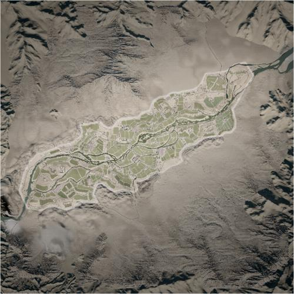

# Chora | 乔拉

> 文章作者：桀氓AlbertWensley

<figure markdown>
  {loading=lazy}
  <figcaption>这一兵家必争的山谷径直通向北方的省府塔林科特。因此，交战双方要争夺山谷的控制权以保障千钧一发的补给线。宽阔的田野和狭窄的道路让穿行期间成为―件很复杂的事情，特殊的地形会将步兵和 载具聚焦到狭窄的杀戮区。</figcaption>
</figure>

### Chora AAS v1

切换代码： `AdminChangeLayer Chora_AAS_v1`

预设代码： `AdminSetNextLayer Chora_AAS_v1`

光照情况： 正午

旗点数量： 6

双方阵营： USA VS MEA

初始票数： 300  -  300

??? abstract "USA 载具"
    - M-ATV M2 *2
    - M-ATV M240 *1
    - M939 Logistics *3
    - M1126 CROWS M2 *1
    - M939 Transport *1

??? abstract "MEA 载具"
    - MT-LBM 6MA S8 *1
    - Simir Kord *1
    - Ural-4320 Logistics *3
    - Ural-4320 Transport *1
    - Simir MG3 *1
    - Simir Kornet *1

### Chora AAS v2

切换代码： `AdminChangeLayer Chora_AAS_v2`

预设代码： `AdminSetNextLayer Chora_AAS_v2`

光照情况： 正午

旗点数量： 5

双方阵营： USMC VS RGF

初始票数： 300  -  300

??? abstract "USMC 载具"
    - M939 Transport *1
    - M939 Logistics *3
    - M1151 M2 *1
    - M1151 CROWS M2 *1
    - LAV-25 *1

??? abstract "RGF 载具"
    - KamAZ 5350 Transport *1
    - KamAZ 5350 Logistics *3
    - Tigr-M Kord *1
    - BTR-80 *1
    - BTR-82A *1

### Chora AAS v3

切换代码： `AdminChangeLayer Chora_AAS_v3`

预设代码： `AdminSetNextLayer Chora_AAS_v3`

光照情况： 正午

旗点数量： 6

双方阵营： USA VS RGF

初始票数： 300  -  300

??? abstract "USA 载具"
    - M939 Transport *1
    - M939 Logistics *3
    - M-ATV M240 *1
    - M-ATV M2 *2
    - M1126 CROWS M2 *1

??? abstract "RGF 载具"
    - KamAZ 5350 Transport *1
    - KamAZ 5350 Logistics *3
    - Tigr-M Kord *1
    - BTR-80 *1
    - BTR-82A *1

### Chora AAS v4

切换代码： `AdminChangeLayer Chora_AAS_v4`

预设代码： `AdminSetNextLayer Chora_AAS_v4`

光照情况： 正午

旗点数量： 5

双方阵营： ADF VS RGF

初始票数： 300  -  300

??? abstract "ADF 载具"
    - ASLAV *1
    - PMV RWS M2 *1
    - PMV Mag58 x3 *1
    - HX60 Logistics *3
    - HX60 Transport *1

??? abstract "RGF 载具"
    - BTR-82A *1
    - BTR-80 *1
    - Tigr-M Kord *1
    - KamAZ 5350 Logistics *3
    - KamAZ 5350 Transport *1

### Chora AAS v5

切换代码： `AdminChangeLayer Chora_AAS_v5`

预设代码： `AdminSetNextLayer Chora_AAS_v5`

光照情况： 正午

旗点数量： 6

双方阵营： CAF VS RGF

初始票数： 300  -  300

??? abstract "CAF 载具"
    - MSVS Transport *1
    - MSVS Logistics *3
    - TAPV M2 *2
    - LAV 6 *1

??? abstract "RGF 载具"
    - KamAZ 5350 Transport *1
    - KamAZ 5350 Logistics *3
    - Tigr-M RWS Kord *1
    - BTR-82A *2

### Chora AAS v6

切换代码： `AdminChangeLayer Chora_AAS_v6`

预设代码： `AdminSetNextLayer Chora_AAS_v6`

光照情况： 正午

旗点数量： 6

双方阵营： USA VS PLA

初始票数： 300  -  300

??? abstract "USA 载具"
    - M939 Transport *1
    - M939 Logistics *3
    - M-ATV M240 *3
    - M-ATV M2 *2

??? abstract "PLA 载具"
    - CTM-131 Transport QJY-88 *1
    - CTM-131 Logistics *3
    - CSK-131 QJY-88 *3
    - CSK-131 QJZ-89 *2

### Chora Insurgency v1

切换代码： `AdminChangeLayer Chora_Insurgency_v1`

预设代码： `AdminSetNextLayer Chora_Insurgency_v1`

光照情况： 正午

旗点数量： 3

双方阵营： USA VS INS

初始票数： 200  -  1000

??? abstract "USA 载具"
    - M1126 CROWS M240 *1
    - M939 Logistics *3
    - M939 Transport *1
    - M1126 CROWS M2 *1
    - M-ATV M2 *1

??? abstract "INS 载具"
    - Armored Technical DShK *2
    - Technical DShK Shielded *2
    - Technical DShK *1
    - Logistics Pickup Truck *4
    - Technical SPG-9 *2
    - Armored Technical SPG-9 *1
    - Minsk 400 *6

### Chora Invasion v1

切换代码： `AdminChangeLayer Chora_Invasion_v1`

预设代码： `AdminSetNextLayer Chora_Invasion_v1`

光照情况： 正午

旗点数量： 6

双方阵营： USA VS INS

初始票数： 200  -  900

??? abstract "USA 载具"
    - M939 Logistics *3
    - M1126 CROWS M2 *2
    - M-ATV M2 *2
    - M939 Transport *1

??? abstract "INS 载具"
    - Minsk 400 *1
    - Transport Pickup Truck *1
    - Logistics Pickup Truck *3
    - Armored Technical DShK *3
    - Technical DShK Shielded *1
    - Technical DShK *1
    - Ural-375D ZU-23-2 *2
    - MT-LB PKT *1
    - Technical SPG-9 *1

### Chora Invasion v2

切换代码： `AdminChangeLayer Chora_Invasion_v2`

预设代码： `AdminSetNextLayer Chora_Invasion_v2`

光照情况： 凌晨

旗点数量： 6

双方阵营： USA VS INS

初始票数： 200  -  900

??? abstract "USA 载具"
    - M939 Logistics *3
    - M1126 CROWS M2 *2
    - M-ATV M2 *2
    - M939 Transport *1

??? abstract "INS 载具"
    - MT-LB PKT *1
    - Armored Technical DShK *3
    - Technical DShK Shielded *1
    - Technical DShK *1
    - Technical SPG-9 *1
    - Logistics Pickup Truck *3
    - Ural-375D ZU-23-2 *2
    - Transport Pickup Truck *1
    - Minsk 400 *4

### Chora RAAS v1

切换代码： `AdminChangeLayer Chora_RAAS_v1`

预设代码： `AdminSetNextLayer Chora_RAAS_v1`

光照情况： 正午

旗点数量： 6

双方阵营： USA VS RGF

初始票数： 300  -  300

??? abstract "USA 载具"
    - M-ATV M2 *3
    - M-ATV CROWS M2 *1
    - M939 Logistics *3
    - M939 Transport *1

??? abstract "RGF 载具"
    - Tigr-M Kord *2
    - KamAZ 5350 Logistics *3
    - Tigr-M RWS Kord *2
    - KamAZ 5350 Transport *1

### Chora RAAS v2

切换代码： `AdminChangeLayer Chora_RAAS_v2`

预设代码： `AdminSetNextLayer Chora_RAAS_v2`

光照情况： 正午

旗点数量： 5

双方阵营： BAF VS MEA

初始票数： 300  -  300

??? abstract "BAF 载具"
    - HX60 Logistics *3
    - FV107 *1
    - HX60 Transport *1
    - FV432 *1

??? abstract "MEA 载具"
    - BRDM-2 S8 *1
    - MT-LBM 6MA S8 *1
    - Ural-4320 Logistics *3
    - Ural-4320 Transport *1
    - Simir MG3 *2

### Chora RAAS v3

切换代码： `AdminChangeLayer Chora_RAAS_v3`

预设代码： `AdminSetNextLayer Chora_RAAS_v3`

光照情况： 正午

旗点数量： 6

双方阵营： ADF VS INS

初始票数： 300  -  340

??? abstract "ADF 载具"
    - HX60 Transport *1
    - HX60 Logistics *3
    - PMV Mag58 x3 *2
    - PMV Mag58 *1

??? abstract "INS 载具"
    - Minsk 400 *1
    - Transport Pickup Truck *1
    - Ural-375D Logistics *1
    - Logistics Pickup Truck *4
    - Technical DShK Shielded *3
    - Technical SPG-9 *2
    - BRDM-2 *1

### Chora RAAS v4

切换代码： `AdminChangeLayer Chora_RAAS_v4`

预设代码： `AdminSetNextLayer Chora_RAAS_v4`

光照情况： 正午

旗点数量： 5

双方阵营： CAF VS MEA

初始票数： 300  -  300

??? abstract "CAF 载具"
    - MSVS Transport *1
    - MSVS Logistics *3
    - LUVW C6 *1
    - LUVW M2 *1
    - TAPV M2 *1
    - M113A3 TLAV *1

??? abstract "MEA 载具"
    - Ural-4320 Transport *1
    - Ural-4320 Logistics *3
    - Simir MG3 *1
    - Simir Kord *1
    - BRDM-2 S8 *1
    - MT-LBM 6MA S8 *1

### Chora RAAS v5

切换代码： `AdminChangeLayer Chora_RAAS_v5`

预设代码： `AdminSetNextLayer Chora_RAAS_v5`

光照情况： 正午

旗点数量： 6

双方阵营： USA VS PLA

初始票数： 300  -  300

??? abstract "USA 载具"
    - M939 Transport *1
    - M939 Logistics *3
    - M-ATV M240 *3
    - M-ATV CROWS M2 *1

??? abstract "PLA 载具"
    - CTM-131 Transport QJY-88 *1
    - CTM-131 Logistics *3
    - CSK-131 QJY-88 *1
    - CTM-131 Transport QJZ-89 *1
    - CSK-131 QJZ-89 RWS *1

### Chora Skirmish v1

切换代码： `AdminChangeLayer Chora_Skirmish_v1`

预设代码： `AdminSetNextLayer Chora_Skirmish_v1`

光照情况： 正午

旗点数量： 4

双方阵营： USA VS RGF

初始票数： 150  -  150

??? abstract "USA 载具"
    - M939 Transport *3
    - M939 Logistics *3
    - M-ATV M240 *1

??? abstract "RGF 载具"
    - KamAZ 5350 Transport *3
    - KamAZ 5350 Logistics *3
    - Tigr-M Kord *1

### Chora TC v1

切换代码： `AdminChangeLayer Chora_TC_v1`

预设代码： `AdminSetNextLayer Chora_TC_v1`

光照情况： 正午

旗点数量： 51

双方阵营： USA VS MEA

初始票数： 400  -  400

??? abstract "USA 载具"
    - M-ATV M2 *1
    - M-ATV M240 *1
    - M939 Logistics *3
    - M1126 CROWS M2 *1
    - M939 Transport *1

??? abstract "MEA 载具"
    - BMP-1 *1
    - Simir Kord *1
    - Ural-4320 Logistics *3
    - Simir MG3 *1
    - Ural-4320 Transport *1

