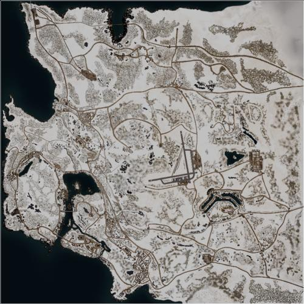

# Goose Bay | 鹅湾

> 文章作者：桀氓AlbertWensley

## AAS | 攻守有序

### Goose Bay AAS v1

切换代码： `AdminChangeLayer Goose_Bay_AAS_v1`

预设代码： `AdminSetNextLayer Goose_Bay_AAS_v1`

光照情况： 正午

旗点数量： 6

双方阵营： 加军 VS 俄军

初始票数： 300  -  300

??? abstract "加军载具"
    - MSVS Transport Truck *1
    - MSVS Logistics Truck *3
    - TAPV M2 *2
    - Coyote *1
    - LAV 6 *2
    - Leopard 2A6M CAN *1
    - CH-146 *1

??? abstract "俄军载具"
    - KamAZ 5350 Transport Truck *1
    - KamAZ 5350 Logistics Truck *3
    - Tigr-M RWS Kord *2
    - BTR-82A *3
    - T-72B3 *1
    - Mi-8 *1

### Goose Bay AAS v2

切换代码： `AdminChangeLayer Goose_Bay_AAS_v2`

预设代码： `AdminSetNextLayer Goose_Bay_AAS_v2`

光照情况： 正午

旗点数量： 7

双方阵营： 加军 VS 俄军

初始票数： 300  -  300

??? abstract "加军载具"
    - MSVS Transport Truck *1
    - MSVS Logistics Truck *3
    - LUVW C6 *6
    - Coyote *1
    - Leopard 2A6M CAN *1
    - CH-146 *1

??? abstract "俄军载具"
    - KamAZ 5350 Transport Truck *1
    - KamAZ 5350 Logistics Truck *3
    - Tigr-M Kord *3
    - BTR-82A *1
    - T-72B3 *1
    - Mi-8 *1

## Invasion | 侵攻

### Goose Bay Invasion v1

切换代码： `AdminChangeLayer Goose_Bay_Invasion_v1`

预设代码： `AdminSetNextLayer Goose_Bay_Invasion_v1`

光照情况： 阴天

旗点数量： 5

双方阵营： 加军 VS 俄军

初始票数： 900  -  200

??? abstract "加军载具"
    - MSVS Transport Truck *1
    - LUVW Logistics *2
    - MSVS Logistics Truck *2
    - LUVW C6 *2
    - LUVW M2 *2
    - TAPV M2 *2
    - Leopard 2A6M CAN *1
    - CH-146 *1

??? abstract "俄军载具"
    - KamAZ 5350 Transport Truck *1
    - KamAZ 5350 Logistics Truck *3
    - BTR-82A *3
    - BTR-80 *2
    - T-72B3 *1
    - Mi-8 *1

### Goose Bay Invasion v2

切换代码： `AdminChangeLayer Goose_Bay_Invasion_v2`

预设代码： `AdminSetNextLayer Goose_Bay_Invasion_v2`

光照情况： 阴天

旗点数量： 5

双方阵营： 加军 VS 民兵

初始票数： 200  -  900

??? abstract "加军载具"
    - MSVS Transport Truck *1
    - MSVS Logistics Truck *3
    - TAPV C6 *1
    - TAPV M2 *1
    - Coyote *1
    - LAV 6 *2
    - Leopard 2A6M CAN *1
    - CH-146 *1

??? abstract "民兵载具"
    - Ural-375D Transport Truck *1
    - Ural-375D Logistics Truck *1
    - Technical SPG-9 *1
    - BMP-1 *1
    - T-62 *1
    - Logistics Pickup Truck *1
    - Technical M2 HB *1

### Goose Bay Invasion v3

切换代码： `AdminChangeLayer Goose_Bay_Invasion_v3`

预设代码： `AdminSetNextLayer Goose_Bay_Invasion_v3`

光照情况： 黄昏

旗点数量： 3

双方阵营： 美军 VS 俄军

初始票数： 800  -  200

??? abstract "美军载具"
    - M939 Transport Truck *2
    - M939 Logistics Truck *3
    - M-ATV M240 *1
    - M-ATV M2 HB *1
    - M1126 CROWS M2 HB *2
    - UH-60M *1

??? abstract "俄军载具"
    - KamAZ 5350 Transport Truck *2
    - KamAZ 5350 Logistics Truck *3
    - Tigr-M Kord *2
    - BTR-80 *2
    - MT-LBM 6MA *1
    - Mi-8 *1

### Goose Bay Invasion v4

切换代码： `AdminChangeLayer Goose_Bay_Invasion_v4`

预设代码： `AdminSetNextLayer Goose_Bay_Invasion_v4`

光照情况： 阴天

旗点数量： 5

双方阵营： USMC VS 俄军

初始票数： 200  -  900

??? abstract "USMC载具"
    - RHIB Transport *1
    - RHIB M240 *1
    - M939 Logistics Truck *2
    - AAVC-7A1 Logistics Vehicle *1
    - M1151 M2 *3
    - M1151 M2 Open Doors *1
    - AAVP-7A1 *3
    - LAV-25 *2
    - UH-1Y *2

??? abstract "俄军载具"
    - KamAZ 5350 Transport Truck *1
    - KamAZ 5350 Logistics Truck *3
    - Tigr-M Kord *3
    - Tigr-M RWS Kord *1
    - BTR-82A *2
    - Mi-8 *1

## RAAS | 随机攻守

### Goose Bay RAAS v1

切换代码： `AdminChangeLayer Goose_Bay_RAAS_v1`

预设代码： `AdminSetNextLayer Goose_Bay_RAAS_v1`

光照情况： 阴天

旗点数量： 6

双方阵营： 加军 VS 俄军

初始票数： 350  -  350

??? abstract "加军载具"
    - MSVS Transport Truck *1
    - MSVS Logistics Truck *2
    - LUVW M2 *2
    - M113A3 TLAV *1
    - Coyote *1
    - LAV 6 *2
    - Leopard 2A6M CAN *2
    - CH-146 *2

??? abstract "俄军载具"
    - KamAZ 5350 Transport Truck *1
    - KamAZ 5350 Logistics Truck *2
    - Tigr-M Kord *2
    - MT-LBM 6MA *1
    - BTR-82A *3
    - T-72B3 *2
    - Mi-8 *2

### Goose Bay RAAS v2

切换代码： `AdminChangeLayer Goose_Bay_RAAS_v2`

预设代码： `AdminSetNextLayer Goose_Bay_RAAS_v2`

光照情况： 阴天

旗点数量： 6

双方阵营： 美军 VS 俄军

初始票数： 350  -  350

??? abstract "美军载具"
    - M939 Transport Truck *1
    - M939 Logistics Truck *3
    - M-ATV M2 HB *2
    - M2A3 *2
    - M1A2 *4
    - UH-60M *1

??? abstract "俄军载具"
    - KamAZ 5350 Transport Truck *1
    - KamAZ 5350 Logistics Truck *3
    - Tigr-M Kord *2
    - BMP-2 *2
    - T-72B3 *4
    - Mi-8 *1

### Goose Bay RAAS v3

切换代码： `AdminChangeLayer Goose_Bay_RAAS_v3`

预设代码： `AdminSetNextLayer Goose_Bay_RAAS_v3`

光照情况： 阴天

旗点数量： 6

双方阵营： USMC VS 俄军

初始票数： 350  -  350

??? abstract "USMC载具"
    - M939 Transport Truck *1
    - M939 Logistics Truck *2
    - M1151 M2 *2
    - M1151 M2 Open Doors *1
    - M1151 CROWS M2 *1
    - AAVP-7A1 *2
    - LAV-25 *2
    - M1A1 *2
    - UH-1Y *2

??? abstract "俄军载具"
    - KamAZ 5350 Transport Truck *1
    - KamAZ 5350 Logistics Truck *2
    - Tigr-M Kord *3
    - Tigr-M RWS Kord *1
    - BMP-2 *1
    - BTR-82A *2
    - T-72B3 *2
    - Mi-8 *2

## Skirmish | 遭遇战

### Goose Bay Skirmish v1

切换代码： `AdminChangeLayer Goose_Bay_Skirmish_v1`

预设代码： `AdminSetNextLayer Goose_Bay_Skirmish_v1`

光照情况： 正午

旗点数量： 5

双方阵营： 加军 VS 俄军

初始票数： 150  -  150

??? abstract "加军载具"
    - MSVS Transport Truck *3
    - MSVS Logistics Truck *3
    - LUVW M2 *1

??? abstract "俄军载具"
    - KamAZ 5350 Transport Truck *3
    - KamAZ 5350 Logistics Truck *3
    - Tigr-M Kord *1