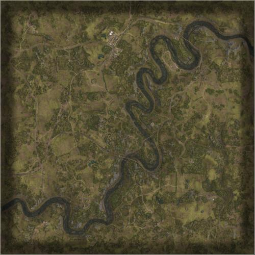

# Gorodok | 格鲁多克

> 文章作者：桀氓AlbertWensley, TL

<figure markdown>
  {loading=lazy}
  <figcaption>一条战略铁路线穿过该地区，控制该地区对于进一步向俄罗斯开放供应线至关重要。许多废弃的小村庄提醒人们在敌对行动开始之前的生活。</figcaption>
</figure>

### Gorodok AAS v1

切换代码： `AdminChangeLayer Gorodok_AAS_v1`

预设代码： `AdminSetNextLayer Gorodok_AAS_v1`

光照情况： 正午

旗点数量： 6

双方阵营： USA VS RGF

初始票数： 300  -  300

??? abstract "USA 载具"
    - M939 Logistics *3
    - M-ATV M2 *2
    - M1126 CROWS M2 *2
    - M939 Transport *1
    - M2A3 *1
    - UH-60M *2

??? abstract "RGF 载具"
    - KamAZ 5350 Logistics *3
    - BTR-82A *2
    - KamAZ 5350 Transport *1
    - BMP-2 *1
    - Tigr-M Kord *2
    - Mi-8 *2

### Gorodok AAS v2

切换代码： `AdminChangeLayer Gorodok_AAS_v2`

预设代码： `AdminSetNextLayer Gorodok_AAS_v2`

光照情况： 黄昏

旗点数量： 8

双方阵营： BAF VS RGF

初始票数： 300  -  300

??? abstract "BAF 载具"
    - HX60 Logistics *3
    - HX60 Transport *1
    - FV432 RWS *1
    - LPPV *1
    - FV510 UA *1
    - FV4034 *1
    - SA330 *2

??? abstract "RGF 载具"
    - KamAZ 5350 Logistics *3
    - MT-LBM 6MA *1
    - KamAZ 5350 Transport *1
    - BMP-2 *1
    - Mi-8 *2
    - T-72B3 *1
    - Tigr-M RWS Kord *1

### Gorodok AAS v3

切换代码： `AdminChangeLayer Gorodok_AAS_v3`

预设代码： `AdminSetNextLayer Gorodok_AAS_v3`

光照情况： 阴天

旗点数量： 6

双方阵营： CAF VS RGF

初始票数： 300  -  300

??? abstract "CAF 载具"
    - MSVS Transport *1
    - MSVS Logistics *3
    - LUVW M2 *1
    - TAPV M2 *1
    - M113A3 TLAV *1
    - Coyote *2
    - CH-146 *1

??? abstract "RGF 载具"
    - KamAZ 5350 Transport *1
    - KamAZ 5350 Logistics *3
    - Tigr-M Kord *1
    - Tigr-M RWS Kord *1
    - MT-LBM 6MA *1
    - BTR-82A *2
    - Mi-8 *1

### Gorodok AAS v4

切换代码： `AdminChangeLayer Gorodok_AAS_v4`

预设代码： `AdminSetNextLayer Gorodok_AAS_v4`

光照情况： 正午

旗点数量： 6

双方阵营： USMC VS RGF

初始票数： 300  -  300

??? abstract "USMC 载具"
    - M939 Transport *1
    - M939 Logistics *3
    - M1151 M2 Open Doors *1
    - M1151 M2 *1
    - AAVP-7A1 *1
    - LAV-25 *2
    - UH-1Y *2

??? abstract "RGF 载具"
    - KamAZ 5350 Transport *1
    - KamAZ 5350 Logistics *3
    - Tigr-M Kord *2
    - MT-LBM 6MB *1
    - BTR-82A *2
    - Mi-8 *2

### Gorodok Destruction v1

切换代码： `AdminChangeLayer Gorodok_Destruction_v1`

预设代码： `AdminSetNextLayer Gorodok_Destruction_v1`

光照情况： 正午

旗点数量： 2

双方阵营： USA VS RGF

初始票数： 200  -  1000

??? abstract "USA 载具"
    - M2A3 *2
    - M-ATV CROWS M240 *1
    - M-ATV M2 *1
    - M939 Logistics *3
    - M1126 CROWS M2 *2
    - M939 Transport *1

??? abstract "RGF 载具"
    - KamAZ 5350 Logistics *3
    - BTR-82A *2
    - BMP-2 *1
    - Tigr-M RWS Kord *1
    - T-72B3 *1
    - KamAZ 5350 Transport *1

### Gorodok Insurgency v1

切换代码： `AdminChangeLayer Gorodok_Insurgency_v1`

预设代码： `AdminSetNextLayer Gorodok_Insurgency_v1`

光照情况： 阴天

旗点数量： 2

双方阵营： RGF VS IMF

初始票数： 200  -  1000

??? abstract "RGF 载具"
    - BMP-2 *1
    - BTR-80 *1
    - KamAZ 5350 Logistics *3
    - BTR-82A *2
    - KamAZ 5350 Transport *1
    - Mi-8 *1

??? abstract "IMF 载具"
    - Ural-375D Logistics *4
    - Ural-375D Transport *1
    - Technical DShK *1
    - Technical DShK Shielded *1
    - Technical SPG-9 *1
    - BMP-1 *1
    - BRDM-2 *1
    - MT-LBM 6MB *1
    - BRDM-2 Spandrel *1
    - Technical UB-32 *2

### Gorodok Invasion v1

切换代码： `AdminChangeLayer Gorodok_Invasion_v1`

预设代码： `AdminSetNextLayer Gorodok_Invasion_v1`

光照情况： 黄昏

旗点数量： 6

双方阵营： USA VS RGF

初始票数： 200  -  900

??? abstract "USA 载具"
    - M1126 CROWS M2 *2
    - M939 Transport *1
    - M939 Logistics *3
    - M2A3 *1
    - M-ATV M2 *1
    - M-ATV TOW *1
    - UH-60M *2

??? abstract "RGF 载具"
    - BTR-82A *2
    - BMP-2 *1
    - Tigr-M RWS Kord *1
    - BTR-80 *1
    - KamAZ 5350 Transport *1
    - KamAZ 5350 Logistics *4
    - Mi-8 *2

### Gorodok Invasion v2

切换代码： `AdminChangeLayer Gorodok_Invasion_v2`

预设代码： `AdminSetNextLayer Gorodok_Invasion_v2`

光照情况： 阴天

旗点数量： 6

双方阵营： RGF VS IMF

初始票数： 200  -  900

??? abstract "RGF 载具"
    - BTR-80 *1
    - KamAZ 5350 Transport *1
    - KamAZ 5350 Logistics *3
    - BTR-82A *1
    - BMP-2 *2
    - Tigr-M Kord *1
    - Mi-8 *2

??? abstract "IMF 载具"
    - BMP-1 ZU-23-2 *1
    - Ural-375D Logistics *3
    - Ural-375D Transport *1
    - Technical SPG-9 *1
    - BRDM-2 *1
    - Technical DShK Shielded *2
    - T-62 *1
    - Logistics Modern Pickup Truck *2
    - Technical UB-32 *2
    - BMP-1 *1
    - Minsk 400 *1

### Gorodok Invasion v3

切换代码： `AdminChangeLayer Gorodok_Invasion_v3`

预设代码： `AdminSetNextLayer Gorodok_Invasion_v3`

光照情况： 黄昏

旗点数量： 5

双方阵营： CAF VS IMF

初始票数： 200  -  900

??? abstract "CAF 载具"
    - MSVS Transport *1
    - MSVS Logistics *3
    - TAPV C6 *2
    - Coyote *1
    - LAV 6 *3
    - Leopard 2A6M CAN *1
    - CH-146 *1

??? abstract "IMF 载具"
    - Ural-375D Transport *1
    - Ural-375D Logistics *3
    - Logistics Modern Pickup Truck *2
    - Modern Technical M2 HB *2
    - Modern Technical SPG-9 *1
    - Modern Technical UB-32 *2
    - Modern Technical ZU-23-2 *1
    - MT-LB ZU-23-2 *1
    - BMP-1 *2
    - T-62 *1

### Gorodok RAAS v1

切换代码： `AdminChangeLayer Gorodok_RAAS_v01`

预设代码： `AdminSetNextLayer Gorodok_RAAS_v01`

光照情况： 正午

旗点数量： 7

双方阵营： USA VS RGF

初始票数： 300  -  300

??? abstract "USA 载具"
    - M939 Logistics *3
    - M939 Transport *1
    - M2A3 *1
    - M1126 CROWS M2 *2
    - M-ATV M2 *1
    - M1A2 *1
    - UH-60M *2

??? abstract "RGF 载具"
    - KamAZ 5350 Logistics *3
    - BMP-2 *1
    - KamAZ 5350 Transport *1
    - BTR-82A *2
    - Tigr-M RWS Kord *1
    - T-72B3 *1
    - Mi-8 *2

### Gorodok RAAS v2

切换代码： `AdminChangeLayer Gorodok_RAAS_v02`

预设代码： `AdminSetNextLayer Gorodok_RAAS_v02`

光照情况： 黄昏

旗点数量： 6

双方阵营： BAF VS RGF

初始票数： 300  -  300

??? abstract "BAF 载具"
    - HX60 Logistics *3
    - HX60 Transport *1
    - FV432 *1
    - FV432 RWS *1
    - FV520 CTAS40 *1
    - FV107 *1
    - FV4034 *1
    - SA330 *2

??? abstract "RGF 载具"
    - KamAZ 5350 Logistics *3
    - KamAZ 5350 Transport *1
    - BTR-82A *3
    - BRDM-2 *1
    - BMP-2 *1
    - T-72B3 *1
    - Mi-8 *2

### Gorodok RAAS v3

切换代码： `AdminChangeLayer Gorodok_RAAS_v03`

预设代码： `AdminSetNextLayer Gorodok_RAAS_v03`

光照情况： 阴天

旗点数量： 5

双方阵营： USA VS RGF

初始票数： 300  -  300

??? abstract "USA 载具"
    - M939 Logistics *3
    - M939 Transport *1
    - M2A3 *1
    - M1126 CROWS M2 *1
    - M-ATV M2 *1
    - M1A2 *1
    - UH-60M *1

??? abstract "RGF 载具"
    - KamAZ 5350 Logistics *3
    - BMP-2 *1
    - KamAZ 5350 Transport *1
    - BTR-82A *1
    - Tigr-M Kord *1
    - T-72B3 *1
    - Mi-8 *1

### Gorodok RAAS v4

切换代码： `AdminChangeLayer Gorodok_RAAS_v04`

预设代码： `AdminSetNextLayer Gorodok_RAAS_v04`

光照情况： 正午

旗点数量： 5

双方阵营： USA VS RGF

初始票数： 300  -  300

??? abstract "USA 载具"
    - M939 Logistics *3
    - M939 Transport *1
    - M2A3 *1
    - M1126 CROWS M2 *2
    - M1A2 *1
    - M-ATV M2 *1

??? abstract "RGF 载具"
    - KamAZ 5350 Logistics *3
    - BTR-82A *2
    - KamAZ 5350 Transport *1
    - BMP-2 *1
    - Tigr-M Kord *1
    - T-72B3 *1

### Gorodok RAAS v5

切换代码： `AdminChangeLayer Gorodok_RAAS_v05`

预设代码： `AdminSetNextLayer Gorodok_RAAS_v05`

光照情况： 黄昏

旗点数量： 7

双方阵营： USA VS RGF

初始票数： 300  -  300

??? abstract "USA 载具"
    - M939 Logistics *3
    - M939 Transport *1
    - M2A3 *1
    - M1126 CROWS M2 *2
    - M1A2 *1
    - M-ATV M2 *1
    - UH-60M *2

??? abstract "RGF 载具"
    - KamAZ 5350 Logistics *3
    - KamAZ 5350 Transport *1
    - BTR-82A *2
    - BMP-2 *1
    - BRDM-2 *1
    - T-72B3 *1
    - Mi-8 *2

### Gorodok RAAS v6

切换代码： `AdminChangeLayer Gorodok_RAAS_v06`

预设代码： `AdminSetNextLayer Gorodok_RAAS_v06`

光照情况： 正午

旗点数量： 5

双方阵营： USMC VS RGF

初始票数： 350  -  350

??? abstract "USMC 载具"
    - M939 Transport *1
    - M939 Logistics *3
    - M1151 M2 *2
    - AAVP-7A1 *2
    - LAV-25 *2
    - M1A1 *1
    - UH-1Y *2

??? abstract "RGF 载具"
    - KamAZ 5350 Transport *1
    - KamAZ 5350 Logistics *3
    - Tigr-M Kord *2
    - BTR-82A *2
    - BMP-2 *1
    - T-72B3 *1
    - Mi-8 *2

### Gorodok RAAS v7

切换代码： `AdminChangeLayer Gorodok_RAAS_v07`

预设代码： `AdminSetNextLayer Gorodok_RAAS_v07`

光照情况： 正午

旗点数量： 7

双方阵营： ADF VS RGF

初始票数： 300  -  300

??? abstract "ADF 载具"
    - HX60 Transport *1
    - HX60 Logistics *3
    - PMV RWS M2 *1
    - PMV Mag58 x3 *1
    - PMV Mag58 *1
    - ASLAV *2
    - M1A1 *2
    - MRH-90 *1
    - UH-60M *1

??? abstract "RGF 载具"
    - KamAZ 5350 Transport *1
    - KamAZ 5350 Logistics *3
    - Tigr-M RWS Kord *1
    - Tigr-M Kord *1
    - BTR-82A *2
    - T-72B3 *2
    - Mi-8 *2

### Gorodok RAAS v8

切换代码： `AdminChangeLayer Gorodok_RAAS_v08`

预设代码： `AdminSetNextLayer Gorodok_RAAS_v08`

光照情况： 阴天

旗点数量： 7

双方阵营： ADF VS IMF

初始票数： 300  -  340

??? abstract "ADF 载具"
    - HX60 Transport *1
    - HX60 Logistics *3
    - PMV Mag58 x3 *3
    - PMV Mag58 *1
    - ASLAV *2
    - MRH-90 *1

??? abstract "IMF 载具"
    - Ural-375D Transport *2
    - Ural-375D Logistics *2
    - Logistics Modern Pickup Truck *2
    - Modern Technical M2 HB *1
    - Modern Technical SPG-9 *1
    - Modern Technical UB-32 *1
    - MT-LBM 6MB *1
    - BRDM-2 *1
    - Ural-375D ZU-23-2 *1
    - Modern Technical ZU-23-2 *1
    - MT-LB ZU-23-2 *1
    - BMP-1 *1
    - T-62 *1

### Gorodok RAAS v9

切换代码： `AdminChangeLayer Gorodok_RAAS_v09`

预设代码： `AdminSetNextLayer Gorodok_RAAS_v09`

光照情况： 阴天

旗点数量： 6

双方阵营： CAF VS RGF

初始票数： 350  -  350

??? abstract "CAF 载具"
    - MSVS Transport *1
    - MSVS Logistics *3
    - LUVW M2 *1
    - TAPV M2 *1
    - M113A3 TLAV *1
    - Coyote *1
    - LAV 6 *2
    - Leopard 2A6M CAN *1
    - CH-146 *2

??? abstract "RGF 载具"
    - KamAZ 5350 Transport *1
    - KamAZ 5350 Logistics *3
    - Tigr-M Kord *1
    - Tigr-M RWS Kord *1
    - BRDM-2 *1
    - BTR-82A *3
    - T-72B3 *1
    - Mi-8 *2

### Gorodok RAAS v10

切换代码： `AdminChangeLayer Gorodok_RAAS_v10`

预设代码： `AdminSetNextLayer Gorodok_RAAS_v10`

光照情况： 正午

旗点数量： 7

双方阵营： CAF VS IMF

初始票数： 300  -  340

??? abstract "CAF 载具"
    - LUVW Transport *2
    - LUVW Logistics *3
    - LUVW C6 *2
    - LUVW M2 *3
    - Leopard 2A6M CAN *1
    - CH-146 *3

??? abstract "IMF 载具"
    - Ural-375D Transport *1
    - Ural-375D Logistics *3
    - Logistics Modern Pickup Truck *2
    - Modern Technical M2 HB *2
    - Modern Technical UB-32 *1
    - Modern Technical ZU-23-2 *1
    - MT-LB ZU-23-2 *1
    - BMP-1 *3
    - T-62 *1

### Gorodok RAAS v11

切换代码： `AdminChangeLayer Gorodok_RAAS_v11`

预设代码： `AdminSetNextLayer Gorodok_RAAS_v11`

光照情况： 正午

旗点数量： 7

双方阵营： CAF VS USA

初始票数： 300  -  300

??? abstract "CAF 载具"
    - MSVS Transport *1
    - MSVS Logistics *3
    - LUVW M2 *1
    - M113A3 TLAV *1
    - TAPV M2 *1
    - Coyote *1
    - LAV 6 *2
    - Leopard 2A6M CAN *1
    - CH-146 *1

??? abstract "USA 载具"
    - M939 Transport *1
    - M939 Logistics *3
    - M-ATV M2 *1
    - M-ATV CROWS M2 *1
    - M1126 CROWS M2 *2
    - M2A3 *2
    - M1A2 *1
    - UH-60M *1

### Gorodok RAAS v12

切换代码： `AdminChangeLayer Gorodok_RAAS_v12`

预设代码： `AdminSetNextLayer Gorodok_RAAS_v12`

光照情况： 阴天

旗点数量： 8

双方阵营： USA VS PLA

初始票数： 350  -  350

??? abstract "USA 载具"
    - M939 Transport *1
    - M939 Logistics *3
    - M-ATV M2 *3
    - M-ATV CROWS M2 *1
    - M2A3 *2
    - M1A2 *1
    - UH-60M *1

??? abstract "PLA 载具"
    - CTM-131 Transport QJZ-89 *1
    - CTM-131 Logistics *3
    - CSK-131 QJZ-89 *2
    - CSK-131 QJZ-89 RWS *1
    - ZSL-10 *1
    - ZBD-04A *2
    - ZTZ-99A *1
    - Z-8G *1

### Gorodok Skirmish v1

切换代码： `AdminChangeLayer Gorodok_Skirmish_v1`

预设代码： `AdminSetNextLayer Gorodok_Skirmish_v1`

光照情况： 阴天

旗点数量： 5

双方阵营： BAF VS RGF

初始票数： 150  -  150

??? abstract "BAF 载具"
    - HX60 Transport *3
    - HX60 Logistics *3
    - LPPV *1

??? abstract "RGF 载具"
    - KamAZ 5350 Transport *3
    - KamAZ 5350 Logistics *3
    - Tigr-M Kord *1

### Gorodok TC v1

切换代码： `AdminChangeLayer Gorodok_TC_v1`

预设代码： `AdminSetNextLayer Gorodok_TC_v1`

光照情况： 正午

旗点数量： 64

双方阵营： USA VS RGF

初始票数： 400  -  400

??? abstract "USA 载具"
    - M939 Transport *1
    - M939 Logistics *3
    - M-ATV M2 *2
    - M1126 CROWS M2 *1
    - M2A3 *1
    - UH-60M *1

??? abstract "RGF 载具"
    - KamAZ 5350 Transport *1
    - KamAZ 5350 Logistics *3
    - Tigr-M Kord *1
    - BRDM-2 *1
    - BTR-82A *1
    - BMP-2 *1
    - Mi-8 *1

### Gorodok TC v2

切换代码： `AdminChangeLayer Gorodok_TC_v2`

预设代码： `AdminSetNextLayer Gorodok_TC_v2`

光照情况： 黄昏

旗点数量： 64

双方阵营： CAF VS RGF

初始票数： 450  -  450

??? abstract "CAF 载具"
    - MSVS Transport *1
    - MSVS Logistics *3
    - LUVW M2 *1
    - TAPV M2 *1
    - M113A3 TLAV *1
    - Coyote *2
    - CH-146 *1

??? abstract "RGF 载具"
    - KamAZ 5350 Transport *1
    - KamAZ 5350 Logistics *3
    - MT-LB VMK *2
    - MT-LBM 6MA *1
    - BTR-82A *2
    - Mi-8 *1

