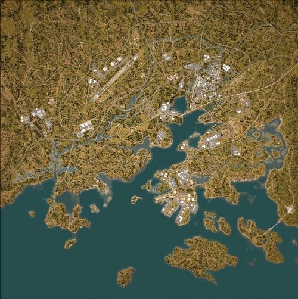

# Harju | 哈留

> 文章作者：桀氓AlbertWensley, TL

## AAS | 攻守有序

### Harju AAS v1

切换代码： `AdminChangeLayer Harju_AAS_v1`

预设代码： `AdminSetNextLayer Harju_AAS_v1`

光照情况： 正午

旗点数量： 7

双方阵营： USMC VS 俄军

初始票数： 250  -  250

??? abstract "USMC载具"
    - M939 Transport Truck *1
    - M939 Logistics Truck *2
    - AAVC-7A1 Logistics Vehicle *1
    - M1151 M2 *3
    - M1151 CROWS M2 *1
    - LAV-25 *2
    - UH-1Y *1

??? abstract "俄军载具"
    - MT-LB Logistics Vehicle *1
    - KamAZ 5350 Logistics Truck *2
    - KamAZ 5350 Transport Truck *1
    - Tigr-M RWS Kord *1
    - Tigr-M Kord *3
    - BTR-82A *2
    - Mi-8 *1

### Harju AAS v2

切换代码： `AdminChangeLayer Harju_AAS_v2`

预设代码： `AdminSetNextLayer Harju_AAS_v2`

光照情况： 中午

旗点数量： 5

双方阵营： 美军 VS 俄军

初始票数： 350  -  350

??? abstract "美军载具"
    - M939 Logistics Truck *3
    - M939 Transport Truck *1
    - M-ATV M2 HB *2
    - M-ATV CROWS M2 HB *2
    - M2A3 *1

??? abstract "俄军载具"
    - KamAZ 5350 Logistics Truck *3
    - Tigr-M RWS Kord *2
    - KamAZ 5350 Transport Truck *1
    - BMP-2 *1
    - Tigr-M Kord *2

### Harju AAS v3

切换代码： `AdminChangeLayer Harju_AAS_v3`

预设代码： `AdminSetNextLayer Harju_AAS_v3`

光照情况： 正午

旗点数量： 5

双方阵营： 英军 VS 民兵

初始票数： 300  -  300

??? abstract "英军载具"
    - HX60 Logistics Truck *3
    - HX60 Transport Truck *1
    - LPPV RWS *1
    - LPPV *3
    - FV107 *1
    - FV510 *1

??? abstract "民兵载具"
    - Ural-375D Logistics Truck *2
    - Logistics Modern Pickup Truck *2
    - Ural-375D Transport Truck *1
    - Modern Technical M2 HB *2
    - BRDM-2 *1
    - MT-LBM 6MB *1
    - BMP-1 *1
    - MT-LB ZU-23-2 *1
    - Modern Technical UB-32 *1
    - Modern Technical SPG-9 *1

## Invasion | 侵攻

### Harju Invasion v1

切换代码： `AdminChangeLayer Harju_Invasion_v1`

预设代码： `AdminSetNextLayer Harju_Invasion_v1`

光照情况： 中午

旗点数量： 4

双方阵营： USMC VS 俄军

初始票数： 200  -  800

??? abstract "USMC载具"
    - M939 Logistics Truck *2
    - AAVC-7A1 Logistics Vehicle *2
    - RHIB Logistics *2
    - RHIB M240 *2
    - RHIB M2 *2
    - M1151 M2 *2
    - LAV-25 *3
    - AAVP-7A1 *3
    - UH-1Y *2

??? abstract "俄军载具"
    - BTR-82A *3
    - Tigr-M Kord *1
    - BMP-2 *1
    - Tigr-M RWS Kord *1
    - BRDM-2 *1
    - BTR-80 *1
    - KamAZ 5350 Transport Truck *2
    - KamAZ 5350 Logistics Truck *4
    - Mi-8 *2

### Harju Invasion v2

切换代码： `AdminChangeLayer Harju_Invasion_v2`

预设代码： `AdminSetNextLayer Harju_Invasion_v2`

光照情况： 阴天

旗点数量： 6

双方阵营： 俄军 VS 民兵

初始票数： 200  -  900

??? abstract "俄军载具"
    - MT-LB Logistics Vehicle *3
    - KamAZ 5350 Transport Truck *1
    - KamAZ 5350 Logistics Truck *2
    - BTR-82A *2
    - BMP-2 *1
    - BRDM-2 *2
    - Tigr-M Kord *2
    - T-72B3 *2
    - Mi-8 *2

??? abstract "民兵载具"
    - Ural-375D Logistics Truck *3
    - Ural-375D Transport Truck *1
    - Modern Technical SPG-9 *2
    - Logistics Modern Pickup Truck *3
    - Minsk 400 *5
    - Technical DShK *1
    - Modern Technical M2 HB
    - BRDM-2 *1
    - BTR-80 *1
    - BMP-1 *1
    - T-62 *1
    - Ural-375D ZU-23-2 *2
    - MT-LB ZU-23-2 *1
    - Modern Technical UB-32 *1

### Harju Invasion v3

切换代码： `AdminChangeLayer Harju_Invasion_v3`

预设代码： `AdminSetNextLayer Harju_Invasion_v3`

光照情况： 下午

旗点数量： 5

双方阵营：英军 VS 民兵

初始票数： 200  -  900

??? abstract "英军载具"
    - HX60 Transport Truck *1
    - HX60 Logistics Truck *3
    - FV107 *2
    - FV432 RWS *2
    - FV432 *2
    - FV4034 *1
    - SA330 *1
    

??? abstract "民兵载具"
    - Ural-375D Transport Truck *1
    - Ural-375D Logistics Truck *3
    - BRDM-2 *1
    - Minsk 400 *5
    - Ural-375D ZU-23-2 *2
    - Logistics Modern Pickup Truck *3
    - Modern Technical M2 HB *1
    - Technical DShK *1
    - Technical SPG-9 *2
    - Technical UB-32 *1
    - MT-LB ZU-23-2 *1
    - BMP-1 *1
    - T-62 *1

### Harju Invasion v4

切换代码： `AdminChangeLayer Harju_Invasion_v4`

预设代码： `AdminSetNextLayer Harju_Invasion_v4`

光照情况： 下午

旗点数量： 5

双方阵营： 加军 VS 俄军

初始票数： 200  -  900

??? abstract "加军载具"
    - MSVS Transport Truck *1
    - MSVS Logistics Truck *1
    - TAPV M2 *1
    - LUVW M2 *2
    - M113A3 TLAV *1
    - Coyote *1
    - LAV 6 *2
    - Leopard 2A6M CAN *1
    - CH-146 *1

??? abstract "俄军载具"
    - MT-LB Logistics Vehicle *1
    - KamAZ 5350 Logistics Truck *2
    - KamAZ 5350 Transport Truck *1
    - Tigr-M Kord *3
    - BTR-82A *3
    - T-72B3 *1

## RAAS | 随机攻守

### Harju RAAS v1

切换代码： `AdminChangeLayer Harju_RAAS_v1`

预设代码： `AdminSetNextLayer Harju_RAAS_v1`

光照情况： 下午

旗点数量： 5

双方阵营： USMC VS 俄军

初始票数： 300  -  300

??? abstract "USMC载具"
    - MSVS Transport Truck *1
    - MSVS Logistics Truck *3
    - AAVC-7A1 Logistics Vehicle *1
    - MATV M2 *1
    - M1151 M2 *1
    - LAV-25 *1
    - AAVP-7A1 *1
    - UH-1Y *2

??? abstract "俄军载具"
    - MT-LB Logistics Vehicle *1
    - KamAZ 5350 Logistics Truck *3
    - KamAZ 5350 Transport Truck *1
    - Tigr-M Kord *1
    - Tigr-M RWS Kord *1
    - BTR-82A *2
    - BTR-80 *1
    - Mi-8 *2

### Harju RAAS v2

切换代码： `AdminChangeLayer Harju_RAAS_v2`

预设代码： `AdminSetNextLayer Harju_RAAS_v2`

光照情况： 阴天

旗点数量： 6

双方阵营： 英军 VS 俄军

初始票数： 350  -  350

??? abstract "英军载具"
    - HX60 Transport Truck *1
    - HX60 Logistics Truck *3
    - LPPV RWS *2
    - LPPV *1
    - FV107 *3
    - FV432 RWS *1
    - FV432 *1
    - SA330 *1
    

??? abstract "俄军载具"
    - MT-LB Logistics Vehicle *1
    - KamAZ 5350 Logistics Truck *2
    - KamAZ 5350 Transport Truck *1
    - BRDM-2 *1
    - Tigr-M Kord *1
    - Tigr-M RWS Kord *1
    - MT-LB VMK *1
    - MT-LBM 6MA *1
    - BTR-80 *3
    - Mi-8 *1

### Harju RAAS v3

切换代码： `AdminChangeLayer Harju_RAAS_v3`

预设代码： `AdminSetNextLayer Harju_RAAS_v3`

光照情况： 正午

旗点数量： 6

双方阵营： 美军 VS 俄军

初始票数： 300  -  300

??? abstract "美军载具"
    - RHIB Logistics *1
    - RHIB M240 *1
    - RHIB M2 *1
    - M939 Transport Truck *1
    - M939 Logistics Truck *2
    - M-ATV M2 HB *2
    - M-ATV M240 *1
    - M-ATV CROWS M240 *1
    - M-ATV CROWS M2 HB *1
    - M1126 CROWS M2 HB *2
    - M2A3 *1
    - M1A2 *1
    - UH-60M *2
    

??? abstract "俄军载具"
    - MT-LB Logistics Vehicle *1
    - RHIB Logistics *1
    - RHIB NSV *1
    - RHIB PKP *1
    - KamAZ 5350 Logistics Truck *1
    - KamAZ 5350 Transport Truck *1
    - BRDM-2 *1
    - Tigr-M Kord *3
    - BTR-82A *2
    - BMP-2 *1
    - T-72B3 *1
    - Mi-8 *2

### Harju RAAS v4

切换代码： `AdminChangeLayer Harju_RAAS_v4`

预设代码： `AdminSetNextLayer Harju_RAAS_v4`

光照情况： 正午

旗点数量： 6

双方阵营： 加军 VS 俄军

初始票数： 300  -  300

??? abstract "加军载具"
    - RHIB Logistics *1
    - RHIB M2 *1
    - RHIB Transport *1
    - MSVS Transport Truck *1
    - MSVS Logistics Truck *1
    - TAPV M2 *1
    - LUVW M2 *2
    - M113A3 TLAV *1
    - LAV 6 *2
    - Coyote *1
    - Leopard 2A6M CAN *1
    - CH-146 *2
    

??? abstract "俄军载具"
    - MT-LB Logistics Vehicle *1
    - RHIB Logistics *1
    - RHIB NSV *1
    - RHIB PKP *1
    - KamAZ 5350 Logistics Truck *1
    - KamAZ 5350 Transport Truck *1
    - BRDM-2 *1
    - Tigr-M Kord *3
    - BTR-82A *2
    - BMP-2 *1
    - T-72B3 *1
    - Mi-8 *2

### Harju RAAS v5

切换代码： `AdminChangeLayer Harju_RAAS_v5`

预设代码： `AdminSetNextLayer Harju_RAAS_v5`

光照情况： 正午

旗点数量： 6

双方阵营： 俄军 VS 民兵

初始票数： 300  -  300

??? abstract "俄军载具"
    - MT-LB Logistics Vehicle *2
    - KamAZ 5350 Logistics Truck *1
    - KamAZ 5350 Transport Truck *1
    - Tigr-M Kord *4
    - MT-LB VMK *1
    - Mi-8 *1
    

??? abstract "民兵载具"
    - Logistics Modern Pickup Truck *4
    - Ural-375D Logistics Truck *1
    - Ural-375D Transport Truck *1
    - Minsk 400 *3
    - Modern Technical M2 HB *2
    - Modern Technical UB-32 *1
    - Modern Technical SPG-9 *1
    - BTR-80 *2
    - Ural-375D ZU-23-2 *1
    - MT-LB ZU-23-2 *1

## Seed | 暖服

### Harju Seed v1

切换代码： `AdminChangeLayer Harju_Seed_v1`

预设代码： `AdminSetNextLayer Harju_Seed_v1`

光照情况： 清晨

旗点数量： 5

双方阵营： USMC VS 俄军

初始票数： 100  -  100

??? abstract "USMC载具"
    - M939 Logistics Truck *3
    - M1151 M2 *2

??? abstract "俄军载具"
    - KamAZ 5350 Logistics Truck *3
    - Tigr-M Kord *2

## Skirmish | 遭遇战

### Harju Skirmish v1

切换代码： `AdminChangeLayer Harju_Skirmish_v1`

预设代码： `AdminSetNextLayer Harju_Skirmish_v1`

光照情况： 正午

旗点数量： 5

双方阵营： USMC VS 俄军

初始票数： 150  -  150

??? abstract "USMC载具"
    - M939 Logistics Truck *2
    - M939 Transport Truck *2
    - AAVC-7A1 Logistics Vehicle *1

??? abstract "俄军载具"
    - KamAZ 5350 Logistics Truck *2
    - KamAZ 5350 Transport Truck *2
    - MT-LB Logistics Vehicle *1

### Harju Skirmish v2

切换代码： `AdminChangeLayer Harju_Skirmish_v2`

预设代码： `AdminSetNextLayer Harju_Skirmish_v2`

光照情况： 正午

旗点数量： 5

双方阵营： 加军 VS 俄军

初始票数： 150  -  150

??? abstract "加军载具"
    - MSVS Logistics Truck *3
    - MSVS Transport Truck *1
    - M113A3 TLAV *1

??? abstract "俄军载具"
    - KamAZ 5350 Logistics Truck *2
    - KamAZ 5350 Transport Truck *1
    - MT-LB Logistics Vehicle *1
    - MT-LBM 6MA *1