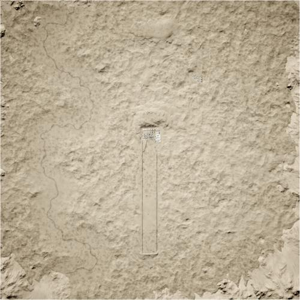

# Jensen's Range | 延森训练场

> 文章作者：桀氓AlbertWensley

## Training | 训练

### JensensRange Training v1

切换代码： `AdminChangeLayer JensensRange_GB-MIL`

预设代码： `AdminSetNextLayer JensensRange_GB-MIL`

光照情况： 正午

旗点数量： 3

双方阵营： 英军 VS 民兵

初始票数： 99999  -  99999

??? abstract "英军载具"
    - HX60 Transport Truck *1
    - HX60 Logistics Truck *1
    - LPPV *1
    - LPPV RWS *1
    - FV107 *1
    - FV432 *1
    - FV432 RWS *1
    - FV510 *1
    - FV510 UA *1
    - FV520 CTAS40 *1
    - FV4034 *1
    - SA330 *1

??? abstract "民兵载具"
    - Minsk 400 *1
    - Transport Pickup Truck *1
    - Ural-375D Transport Truck *1
    - Logistics Pickup Truck *1
    - Ural-375D Logistics Truck *1
    - Ural-375D ZU-23-2 *1
    - BRDM-2 *1
    - BRDM-2 Spandrel *1
    - Technical DShK *1
    - Technical DShK Shielded *1
    - Technical SPG-9 *1
    - Technical UB-32 *1
    - MT-LB VMK *1
    - MT-LBM 6MB *1
    - MT-LB ZU-23-2 *1
    - BTR-80 *1
    - BMP-1 *1
    - BMP-1 ZU-23-2 *1
    - T-62 *1

### JensensRange Training v2

切换代码： `AdminChangeLayer JensensRange_US-RUS`

预设代码： `AdminSetNextLayer JensensRange_US-RUS`

光照情况： 正午

旗点数量： 3

双方阵营： 美军 VS 俄军

初始票数： 99999  -  99999

??? abstract "美军载具"
    - M939 Transport Truck *1
    - M939 Logistics Truck *1
    - M-ATV M2 HB *1
    - M-ATV M240 *1
    - M-ATV CROWS M240 *1
    - M-ATV CROWS M2 HB *1
    - M-ATV TOW *1
    - M1126 CROWS M240 *1
    - M1126 CROWS M2 HB *1
    - M2A3 *1
    - M1A2 *1
    - UH-60M *1

??? abstract "俄军载具"
    - KamAZ 5350 Transport Truck *1
    - KamAZ 5350 Logistics Truck *1
    - Tigr-M Kord *1
    - Tigr-M RWS Kord *1
    - BRDM-2 *1
    - BTR-80 *1
    - MT-LB VMK *1
    - BTR-82A *1
    - BRDM-2 Spandrel *1
    - MT-LBM 6MA *1
    - BMP-2 *1
    - T-72B3 *1
    - Mi-8 *1
    - MT-LB Logistics Vehicle *1

### JensensRange Training v3

切换代码： `AdminChangeLayer JensensRange_USMC-MEA`

预设代码： `AdminSetNextLayer JensensRange_USMC-MEA`

光照情况： 正午

旗点数量： 3

双方阵营： USMC VS 中东

初始票数： 99999  -  99999

??? abstract "USMC载具"
    - M939 Transport Truck *1
    - M939 Logistics Truck *1
    - AAVC-7A1 Logistics Vehicle *1
    - M1151 M2 *1
    - M1151 CROWS M2 *1
    - AAVP-7A1 *1
    - LAV-25 *1
    - M1A1 *1
    - UH-1Y *1

??? abstract "中东载具"
    - Ural-4320 Transport Truck *1
    - Ural-4320 Logistics Truck *1
    - Simir Logi *1
    - BRDM-2 *1
    - BRDM-2 Spandrel *1
    - Simir MG3 *1
    - Simir Kord *1
    - Simir Kornet *1
    - MT-LB VMK *1
    - MT-LBM 6MA *1
    - BMP-1 *1
    - BMP-2 *1
    - T-62 *1
    - T-72S *1
    - Mi-17 *1

### JensensRange Training v4

切换代码： `AdminChangeLayer JensensRange_CAF-INS`

预设代码： `AdminSetNextLayer JensensRange_CAF-INS`

光照情况： 正午

旗点数量： 3

双方阵营： 加军 VS 叛军

初始票数： 99999  -  99999

??? abstract "加军载具"
    - LUV-A1 Transport *1
    - LUVW Transport *1
    - MSVS Transport Truck *1
    - LUV-A1 Logistics *1
    - LUVW Logistics *1
    - MSVS Logistics Truck *1
    - LUVW C6 *1
    - LUVW M2 *1
    - TAPV M2 *1
    - M113A3 C6 *1
    - M113A3 M2 *1
    - M113A3 TLAV *1
    - LAV III C6 RWS *1
    - LAV III M2 RWS *1
    - Coyote *1
    - LAV 6 *1
    - Leopard 2A6M CAN *2
    - CH-146 *1
    - CH-178 *1

??? abstract "叛军载具"
    - Minsk 400 *1
    - Ural-375D Logistics Truck *1
    - Ural-375D Transport Truck *1
    - Transport Pickup Truck *2
    - Logistics Pickup Truck *1
    - Technical DShK *1
    - Technical DShK Shielded *2
    - Technical SPG-9 *2
    - Technical UB-32 *2
    - Armored Technical DShK *1
    - Armored Technical SPG-9 *1
    - Technical BMP-1 *1
    - Technical M2 HB *1
    - Technical ZU-23-2 *1
    - Ural-375D ZU-23-2 *1
    - MT-LB PKT *1
    - MT-LB ZU-23-2 *1
    - BRDM-2 *1
    - BRDM-2 Spandrel *1
    - BMP-1 ZU-23-2 *1
    - BMP-1 *1
    - T-62 *1

### JensensRange Training v5

切换代码： `AdminChangeLayer JensensRange_AUS-PLA`

预设代码： `AdminSetNextLayer JensensRange_AUS-PLA`

光照情况： 正午

旗点数量： 3

双方阵营： 澳军 VS PLA

初始票数： 99999  -  99999

??? abstract "澳军载具"
    - HX60 Transport Truck *1
    - HX60 Logistics Truck *1
    - PMV Mag58 *1
    - PMV Mag58 x3 *1
    - PMV RWS M2 *1
    - ASLAV *1
    - M1A1 *1
    - MRH-90 *1
    - UH-60M *1

??? abstract "PLA载具"
    - CTM-131 Logistics Truck *1
    - CTM-131 Transport QJY-88 *1
    - CTM-131 Transport QJZ-89 *1
    - CSK-131 QJY-88 *1
    - CSK-131 QJZ-89 *1
    - CSK-131 QJZ-89 RWS *1
    - CSK-131 HJ-8 *1
    - ZSL-10 *1
    - ZBL-08 HJ-73C *1
    - ZBL-08 *1
    - ZBD-04A *1
    - ZTZ-99A *1
    - Z-8G *1