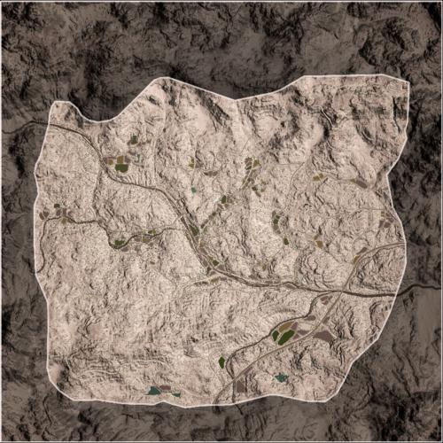

# Kohat Toi | 科哈特

> 文章作者：桀氓AlbertWensley, TL

### Kohat Toi AAS v1

切换代码： `AdminChangeLayer Kohat_AAS_v1`

预设代码： `AdminSetNextLayer Kohat_AAS_v1`

光照情况： 正午

旗点数量： 7

双方阵营： 美军 VS PLA

初始票数： 300  -  300

??? abstract "美军载具"
    - M939 Transport *1
    - M939 Logistics *3
    - M-ATV M240 *3
    - M-ATV M2 *1
    - M-ATV CROWS M2 *1
    - M1126 CROWS M2 *1
    - UH-60M *2

??? abstract "PLA载具"
    - CTM131 Transport QJY88 *1
    - CTM131 Transport QJZ89 *1
    - CTM131 Logistics *3
    - CSK131 QJY88 *3
    - CSK131 QJC88 RWS *2
    - ZSL10 *2
    - Z-8G *2

### Kohat Toi AAS v2

切换代码： `AdminChangeLayer Kohat_AAS_v2`

预设代码： `AdminSetNextLayer Kohat_AAS_v2`

光照情况： 早晨

旗点数量： 8

双方阵营： 美军 VS 俄军

初始票数： 300  -  300

??? abstract "美军载具"
    - M-ATV M2 *3
    - M939 Logistics *3
    - M939 Transport *1
    - UH-60M *2
    - M-ATV CROWS M2 *1

??? abstract "俄军载具"
    - KamAZ 5350 Logistics *3
    - BRDM-2 *1
    - KamAZ 5350 Transport *1
    - Mi-8 *2
    - Tigr-M Kord *2
    - Tigr-M RWS Kord *1

### Kohat Toi AAS v3

切换代码： `AdminChangeLayer Kohat_AAS_v3`

预设代码： `AdminSetNextLayer Kohat_AAS_v3`

光照情况： 正午

旗点数量： 7

双方阵营： 澳军 VS 俄军

初始票数： 300  -  300

??? abstract "澳军载具"
    - HX60 Transport *1
    - HX60 Logistics *3
    - PMV Mag58 x3 *1
    - PMV Mag58 *1
    - PMV RWS M2 *2
    - ASLAV *1
    - MRH-90 *1
    - UH-60M *1

??? abstract "俄军载具"
    - KamAZ 5350 Transport *1
    - KamAZ 5350 Logistics *3
    - Tigr-M Kord *2
    - BRDM-2 *1
    - Tigr-M RWS Kord *1
    - BTR-82A *1
    - Mi-8 *2

### Kohat Toi Insurgency v1

切换代码： `AdminChangeLayer Kohat_Insurgency_v1`

预设代码： `AdminSetNextLayer Kohat_Insurgency_v1`

光照情况： 早晨

旗点数量： 3

双方阵营： 美军 VS 叛军

初始票数： 200  -  1000

??? abstract "美军载具"
    - M939 Transport *1
    - M939 Logistics *3
    - M-ATV M2 *3
    - M-ATV M240 *1
    - M1126 CROWS M2 *1
    - M2A3 *2
    - UH-60M *2

??? abstract "叛军载具"
    - Minsk 400 *2
    - Logistics Pickup Truck *2
    - Technical DShK *1
    - Armored Technical DShK *1
    - Technical UB-32 *2
    - Technical BMP-1 *1
    - BRDM-2 *1
    - Technical SPG-9 *1
    - Armored Technical SPG-9 *1
    - BMP-1 ZU-23-2 *1
    - BMP-1 *1

### Kohat Toi Invasion v1

切换代码： `AdminChangeLayer Kohat_Invasion_v1`

预设代码： `AdminSetNextLayer Kohat_Invasion_v1`

光照情况： 正午

旗点数量： 5

双方阵营： 美军 VS 叛军

初始票数： 200  -  800

??? abstract "美军载具"
    - M-ATV M2 *3
    - M939 Logistics *3
    - M2A3 *2
    - M1126 CROWS M2 *1
    - M939 Transport *1
    - UH-60M *1

??? abstract "叛军载具"
    - Minsk 400 *2
    - Logistics Pickup Truck *2
    - Ural-375D Logistics *1
    - Technical DShK *1
    - Armored Technical DShK *1
    - Ural-375D ZU-23-2 *1
    - Technical UB-32 *1
    - Technical SPG-9 *2
    - BMP-1 *2
    - T-62 *1

### Kohat Toi Invasion v2

切换代码： `AdminChangeLayer Kohat_Invasion_v2`

预设代码： `AdminSetNextLayer Kohat_Invasion_v2`

光照情况： 正午

旗点数量： 4

双方阵营： 美军 VS 叛军

初始票数： 200  -  700

??? abstract "美军载具"
    - M939 Transport *1
    - M939 Logistics *3
    - M-ATV M2 *3
    - M2A3 *2
    - UH-60M *1

??? abstract "叛军载具"
    - Minsk 400 *2
    - Logistics Pickup Truck *1
    - Technical DShK *1
    - Armored Technical DShK *1
    - Ural-375D ZU-23-2 *1
    - Technical UB-32 *3
    - Technical SPG-9 *1
    - BMP-1 *1
    - T-62 *1

### Kohat Toi Invasion v3

切换代码： `AdminChangeLayer Kohat_Invasion_v3`

预设代码： `AdminSetNextLayer Kohat_Invasion_v3`

光照情况： 正午

旗点数量： 4

双方阵营： 加军 VS 叛军

初始票数： 200  -  900

??? abstract "加军载具"
    - MSVS Transport *1
    - MSVS Logistics *3
    - LUVW M2 *3
    - M113A3 TLAV *1
    - Coyote *1
    - LAV 6 *3
    - CH-146 *1

??? abstract "叛军载具"
    - Minsk 400 *2
    - Ural-375D Transport *1
    - Logistics Pickup Truck *1
    - Technical DShK *1
    - Armored Technical DShK *1
    - Technical UB-32 *2
    - Armored Technical SPG-9 *1
    - Technical SPG-9 *1
    - Ural-375D ZU-23-2 *1
    - BMP-1 *1
    - T-62 *1

### Kohat Toi Invasion v4

切换代码： `AdminChangeLayer Kohat_Invasion_v4`

预设代码： `AdminSetNextLayer Kohat_Invasion_v4`

光照情况： 正午

旗点数量： 4

双方阵营： USMC VS PLA

初始票数： 800  -  200

??? abstract "USMC载具"
    - M939 Transport *1
    - M939 Logistics *4
    - M1151 M2 Open Doors *1
    - M1151 M2 *2
    - LAV-25 *2
    - MATV TOW *2
    - UH-1Y *1

??? abstract "PLA载具"
    - CTM131 Transport QJY88 *2
    - CTM131 Logistics *3
    - CSK131 QJZ89 *2
    - ZBL08 *2
    - ZBD04A *1
    - Z-8G *1
    - ZTZ99A *1

### Kohat Toi RAAS v1

切换代码： `AdminChangeLayer Kohat_RAAS_v01`

预设代码： `AdminSetNextLayer Kohat_RAAS_v01`

光照情况： 正午

旗点数量： 6

双方阵营： 美军 VS 俄军

初始票数： 300  -  300

??? abstract "美军载具"
    - M-ATV M2 *1
    - M939 Logistics *3
    - M2A3 *1
    - M1126 CROWS M2 *2
    - M939 Transport *1
    - UH-60M *2

??? abstract "俄军载具"
    - BTR-82A *2
    - KamAZ 5350 Logistics *3
    - BMP-2 *1
    - Tigr-M RWS Kord *1
    - KamAZ 5350 Transport *1
    - Mi-8 *2

### Kohat Toi RAAS v2

切换代码： `AdminChangeLayer Kohat_RAAS_v02`

预设代码： `AdminSetNextLayer Kohat_RAAS_v02`

光照情况： 正午

旗点数量： 6

双方阵营： USMC VS 俄军

初始票数： 300  -  300

??? abstract "USMC载具"
    - M939 Transport *1
    - M939 Logistics *3
    - M1151 M2 *2
    - M1151 CROWS M2 *1
    - AAVP-7A1 *1
    - LAV-25 *2
    - UH-1Y *1

??? abstract "俄军载具"
    - KamAZ 5350 Transport *1
    - KamAZ 5350 Logistics *3
    - Tigr-M Kord *2
    - Tigr-M RWS Kord *1
    - MT-LBM 6MB *1
    - BTR-82A *2
    - Mi-8 *1

### Kohat Toi RAAS v3

切换代码： `AdminChangeLayer Kohat_RAAS_v03`

预设代码： `AdminSetNextLayer Kohat_RAAS_v03`

光照情况： 正午

旗点数量： 5

双方阵营： 俄军 VS 中东

初始票数： 300  -  300

??? abstract "俄军载具"
    - Tigr-M RWS Kord *1
    - KamAZ 5350 Logistics *3
    - Tigr-M Kord *1
    - BMP-2 *1
    - BTR-80 *1
    - BTR-82A *1
    - KamAZ 5350 Transport *1
    - Mi-8 *1

??? abstract "中东载具"
    - Ural-4320 Logistics *3
    - MT-LBM 6MA S8 *1
    - BMP-2 *1
    - Simir Logi *1
    - Mi-17 *1
    - Simir Kord *1
    - Simir MG3 *1
    - Simir Kornet *1
    - BRDM-2 S8 *1

### Kohat Toi RAAS v4

切换代码： `AdminChangeLayer Kohat_RAAS_v04`

预设代码： `AdminSetNextLayer Kohat_RAAS_v04`

光照情况： 早晨

旗点数量： 8

双方阵营： 英军 VS 俄军

初始票数： 300  -  300

??? abstract "英军载具"
    - FV107 *1
    - HX60 Logistics *3
    - FV432 RWS *1
    - FV432 *1
    - LPPV *1
    - FV520 CTAS40 *1
    - HX60 Transport *1
    - SA330 *2

??? abstract "俄军载具"
    - BTR-82A *3
    - KamAZ 5350 Logistics *3
    - Tigr-M RWS Kord *1
    - BMP-2 *1
    - KamAZ 5350 Transport *1
    - Mi-8 *2

### Kohat Toi RAAS v5

切换代码： `AdminChangeLayer Kohat_RAAS_v05`

预设代码： `AdminSetNextLayer Kohat_RAAS_v05`

光照情况： 正午

旗点数量： 26

双方阵营： 美军 VS 俄军

初始票数： 300  -  300

??? abstract "美军载具"
    - M939 Transport *1
    - M939 Logistics *3
    - M-ATV M2 *1
    - M1126 CROWS M2 *2
    - M2A3 *1
    - UH-60M *2

??? abstract "俄军载具"
    - BTR-82A *2
    - KamAZ 5350 Logistics *3
    - BMP-2 *1
    - Tigr-M RWS Kord *1
    - KamAZ 5350 Transport *1
    - Mi-8 *2

### Kohat Toi RAAS v6

切换代码： `AdminChangeLayer Kohat_RAAS_v06`

预设代码： `AdminSetNextLayer Kohat_RAAS_v06`

光照情况： 正午

旗点数量： 13

双方阵营： 英军 VS 俄军

初始票数： 300  -  300

??? abstract "英军载具"
    - LPPV RWS *1
    - FV432 RWS *1
    - HX60 Logistics *3
    - FV510 UA *1
    - FV107 *1
    - HX60 Transport *1
    - SA330 *1

??? abstract "俄军载具"
    - BTR-82A *1
    - KamAZ 5350 Logistics *3
    - BRDM-2 *2
    - BMP-2 *1
    - KamAZ 5350 Transport *1
    - Mi-8 *1

### Kohat Toi RAAS v7

切换代码： `AdminChangeLayer Kohat_RAAS_v07`

预设代码： `AdminSetNextLayer Kohat_RAAS_v07`

光照情况： 正午

旗点数量： 22

双方阵营： 俄军 VS 中东

初始票数： 300  -  300

??? abstract "俄军载具"
    - Tigr-M RWS Kord *1
    - KamAZ 5350 Logistics *3
    - Tigr-M Kord *1
    - BMP-2 *1
    - BTR-80 *1
    - BTR-82A *1
    - KamAZ 5350 Transport *1
    - Mi-8 *1

??? abstract "中东载具"
    - Ural-4320 Logistics *3
    - MT-LBM 6MA S8 *1
    - BMP-2 *1
    - Simir Logi *1
    - Mi-17 *1
    - Simir Kord *1
    - Simir MG3 *1
    - Simir Kornet *1
    - BRDM-2 S8 *1

### Kohat Toi RAAS v8

切换代码： `AdminChangeLayer Kohat_RAAS_v08`

预设代码： `AdminSetNextLayer Kohat_RAAS_v08`

光照情况： 正午

旗点数量： 6

双方阵营： 澳军 VS 俄军

初始票数： 300  -  300

??? abstract "澳军载具"
    - HX60 Transport *1
    - HX60 Logistics *3
    - PMV RWS M2 *2
    - ASLAV *2
    - MRH-90 *1
    - UH-60M *1

??? abstract "俄军载具"
    - KamAZ 5350 Transport *1
    - KamAZ 5350 Logistics *3
    - Tigr-M RWS Kord *1
    - BRDM-2 *1
    - BTR-82A *2
    - Mi-8 *2

### Kohat Toi RAAS v9

切换代码： `AdminChangeLayer Kohat_RAAS_v09`

预设代码： `AdminSetNextLayer Kohat_RAAS_v09`

光照情况： 正午

旗点数量： 7

双方阵营： 加军 VS 叛军

初始票数： 300  -  340

??? abstract "加军载具"
    - MSVS Transport *1
    - LUVW Logistics *3
    - LUVW C6 *2
    - LUVW M2 *2
    - M113A3 TLAV *1
    - LAV III C6 RWS *1
    - CH-178 *1

??? abstract "叛军载具"
    - Minsk 400 *1
    - Transport Pickup Truck *2
    - Ural-375D Logistics *2
    - Logistics Pickup Truck *3
    - Technical UB-32 *1
    - Technical DShK *1
    - Technical SPG-9 *3
    - BRDM-2 *1
    - BMP-1 *1
    - Ural-375D ZU-23-2 *2

### Kohat Toi RAAS v10

切换代码： `AdminChangeLayer Kohat_RAAS_v10`

预设代码： `AdminSetNextLayer Kohat_RAAS_v10`

光照情况： 正午

旗点数量： 6

双方阵营： 澳军 VS PLA

初始票数： 300  -  300

??? abstract "澳军载具"
    - HX60 Transport *1
    - HX60 Logistics *3
    - PMV Mag58 *2
    - PMV RWS M2 *1
    - ASLAV *2
    - MRH-90 *2

??? abstract "PLA载具"
    - CTM131 Transport QJY88 *1
    - CTM131 Logistics *3
    - CSK131 QJZ89 *2
    - CSK131 QJC88 RWS *1
    - ZBL08 *2
    - Z-8G *2

### Kohat Toi Skirmish v1

切换代码： `AdminChangeLayer Kohat_Skirmish_v1`

预设代码： `AdminSetNextLayer Kohat_Skirmish_v1`

光照情况： 正午

旗点数量： 5

双方阵营： 美军 VS 英军

初始票数： 150  -  150

??? abstract "美军载具"
    - M939 Transport *3
    - M939 Logistics *3
    - M-ATV M240 *1

??? abstract "英军载具"
    - HX60 Transport *3
    - HX60 Logistics *3
    - LPPV *1

### Kohat Toi TC v1

切换代码： `AdminChangeLayer Kohat_TC_v1`

预设代码： `AdminSetNextLayer Kohat_TC_v1`

光照情况： 正午

旗点数量： 36

双方阵营： 俄军 VS 中东

初始票数： 400  -  400

??? abstract "俄军载具"
    - KamAZ 5350 Transport *1
    - KamAZ 5350 Logistics *3
    - Tigr-M Kord *1
    - Tigr-M RWS Kord *1
    - BTR-80 *1
    - BMP-2 *1
    - Mi-8 *2

??? abstract "中东载具"
    - Ural-4320 Transport *1
    - Ural-4320 Logistics *3
    - Simir MG3 *3
    - Simir Kord *2
    - BRDM-2 S8 *1
    - BMP-2 *1
    - Mi-17 *2

