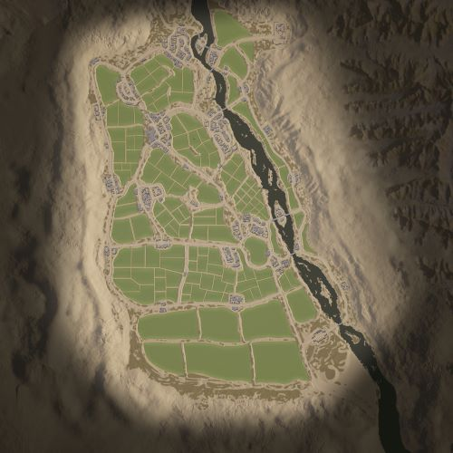

# Kokan | 寇坎

> 文章作者：桀氓AlbertWensley

## AAS | 攻守有序

### Kokan AAS v1

切换代码： `AdminChangeLayer Kokan_AAS_v1`

预设代码： `AdminSetNextLayer Kokan_AAS_v1`

光照情况： 正午

旗点数量： 7

双方阵营： 美军 VS PLA

初始票数： 250  -  250

??? abstract "美军载具"
    - M939 Logistics Truck *3
    - M939 Transport Truck *1
    - RHIB M240 *1
    - M-ATV M240 *3
    - M-ATV CROWS M2 *1

??? abstract "PLA载具"
    - CTM-131 Logistics Truck *3
    - CTM-131 Transport QJZ-89 *1
    - CTM-131 Transport QJY-88 *1
    - RHIB QJY-88 *1
    - CSK-131 QJZ-89 RWS *1
    - CSK-131 QJY-88 *1

### Kokan AAS v2

切换代码： `AdminChangeLayer Kokan_AAS_v2`

预设代码： `AdminSetNextLayer Kokan_AAS_v2`

光照情况： 正午

旗点数量： 5

双方阵营： 英军 VS 中东

初始票数： 250  -  250

??? abstract "英军载具"
    - HX60 Transport Truck *1
    - HX60 Logistics Truck *3
    - LPPV *2
    - LPPV RWS *2
    - FV432 *1

??? abstract "中东载具"
    - Ural-4320 Transport Truck *1
    - Simir Logi *2
    - Ural-4320 Logistics Truck *2
    - Simir MG3 *1
    - Simir Kord *3
    - MT-LBM 6MA *1

### Kokan AAS v3

切换代码： `AdminChangeLayer Kokan_AAS_v3`

预设代码： `AdminSetNextLayer Kokan_AAS_v3`

光照情况： 正午

旗点数量： 7

双方阵营： 澳军 VS 俄军

初始票数： 250  -  250

??? abstract "澳军载具"
    - HX60 Transport Truck *1
    - HX60 Logistics Truck *3
    - PMV RWS M2 *1
    - PMV Mag58 x3 *1
    - PMV Mag58 *1
    - ASLAV *1

??? abstract "俄军载具"
    - KamAZ 5350 Transport Truck *1
    - KamAZ 5350 Logistics Truck *3
    - Tigr-M Kord *2
    - Tigr-M RWS Kord *1
    - BTR-82A *1

## Insurgency | 叛乱

### Kokan Insurgency v1

切换代码： `AdminChangeLayer Kokan_Insurgency_v1`

预设代码： `AdminSetNextLayer Kokan_Insurgency_v1`

光照情况： 正午

旗点数量： 2

双方阵营： 美军 VS 叛军

初始票数： 200  -  1000

??? abstract "美军载具"
    - M-ATV M2 HB *2
    - M939 Logistics Truck *3
    - M-ATV CROWS M240 *1
    - M939 Transport Truck *1

??? abstract "叛军载具"
    - Minsk 400 *2
    - Logistics Pickup Truck *3
    - Technical DShK *2
    - Armored Technical DShK *3
    - Ural-375D ZU-23-2 *1

## Invasion | 侵攻

### Kokan Invasion v1

切换代码： `AdminChangeLayer Kokan_Invasion_v1`

预设代码： `AdminSetNextLayer Kokan_Invasion_v1`

光照情况： 黎明

旗点数量： 5

双方阵营： 俄军 VS 叛军

初始票数： 200  -  800

??? abstract "俄军载具"
    - KamAZ 5350 Logistics Truck *3
    - BTR-80 *1
    - Tigr-M RWS Kord *1
    - KamAZ 5350 Transport Truck *1
    - Tigr-M Kord *1

??? abstract "叛军载具"
    - Minsk 400 *1
    - Transport Pickup Truck *1
    - Logistics Pickup Truck *3
    - Technical DShK *1
    - Armored Technical DShK *2
    - Armored Technical SPG-9 *1

## RAAS | 随机攻守

### Kokan RAAS v1

切换代码： `AdminChangeLayer Kokan_RAAS_v1`

预设代码： `AdminSetNextLayer Kokan_RAAS_v1`

光照情况： 正午

旗点数量： 6

双方阵营： 美军 VS 中东

初始票数： 250  -  250

??? abstract "美军载具"
    - M-ATV M2 HB *4
    - M939 Logistics Truck *3
    - M939 Transport Truck *1

??? abstract "中东载具"
    - Ural-4320 Logistics Truck *3
    - Simir Logi *1
    - Simir Kord *3
    - MT-LB VMK *1
    - Simir Kornet *1

### Kokan RAAS v2

切换代码： `AdminChangeLayer Kokan_RAAS_v2`

预设代码： `AdminSetNextLayer Kokan_RAAS_v2`

光照情况： 黎明

旗点数量： 5

双方阵营： 俄军 VS 中东

初始票数： 250  -  250

??? abstract "俄军载具"
    - KamAZ 5350 Logistics Truck *3
    - Tigr-M Kord *3
    - KamAZ 5350 Transport Truck *1
    - Tigr-M RWS Kord *1

??? abstract "中东载具"
    - Ural-4320 Logistics Truck *3
    - Simir Logi *1
    - Simir Kord *3
    - Simir MG3 *1
    - BRDM-2 *1
    - MT-LB VMK *1

### Kokan RAAS v3

切换代码： `AdminChangeLayer Kokan_RAAS_v3`

预设代码： `AdminSetNextLayer Kokan_RAAS_v3`

光照情况： 正午

旗点数量： 6

双方阵营： 澳军 VS 俄军

初始票数： 250  -  250

??? abstract "澳军载具"
    - HX60 Transport Truck *1
    - HX60 Logistics Truck *3
    - PMV RWS M2 *1
    - PMV Mag58 x3 *1
    - PMV Mag58 *1
    - ASLAV *1

??? abstract "俄军载具"
    - KamAZ 5350 Transport Truck *1
    - KamAZ 5350 Logistics Truck *3
    - Tigr-M Kord *2
    - Tigr-M RWS Kord *1
    - BTR-82A *1

### Kokan RAAS v4

切换代码： `AdminChangeLayer Kokan_RAAS_v4`

预设代码： `AdminSetNextLayer Kokan_RAAS_v4`

光照情况： 正午

旗点数量： 6

双方阵营： 加军 VS 中东

初始票数： 250  -  250

??? abstract "加军载具"
    - MSVS Transport Truck *1
    - LUVW Logistics *3
    - LUVW C6 *2
    - LUVW M2 *2
    - M113A3 TLAV *1

??? abstract "中东载具"
    - Ural-4320 Transport Truck *1
    - Simir Logi *3
    - Simir MG3 *2
    - Simir Kord *2
    - MT-LBM 6MA *1

## Skirmish | 遭遇战

### Kokan Skirmish v1

切换代码： `AdminChangeLayer Kokan_Skirmish_v1`

预设代码： `AdminSetNextLayer Kokan_Skirmish_v1`

光照情况： 正午

旗点数量： 5

双方阵营： 民兵 VS 叛军

初始票数： 150  -  150

??? abstract "民兵载具"
    - Transport Pickup Truck *2
    - Ural-375D Transport Truck *1
    - Ural-375D Logistics Truck *3
    - Technical DShK *2

??? abstract "叛军载具"
    - Minsk 400 *1
    - Transport Pickup Truck *2
    - Logistics Pickup Truck *4
    - Technical DShK *1

## TC | 领土控制

### Kokan TC v1

切换代码： `AdminChangeLayer Kokan_TC_v1`

预设代码： `AdminSetNextLayer Kokan_TC_v1`

光照情况： 正午

旗点数量： 37

双方阵营： 美军 VS 中东

初始票数： 400  -  400

??? abstract "美军载具"
    - M-ATV M2 HB *3
    - M939 Logistics Truck *3
    - M939 Transport Truck *1

??? abstract "中东载具"
    - Simir Kord *3
    - Ural-4320 Logistics Truck *3
    - Simir Logi *2
    - Simir Kornet *1
    - Simir MG3 *1