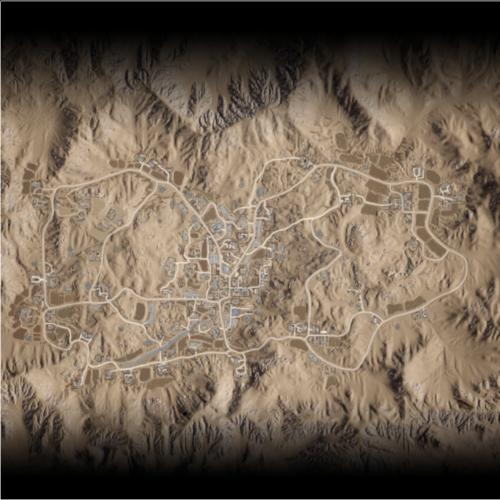

# Logar Valley | 罗杰尔谷

> 文章作者：桀氓AlbertWensley

## AAS | 攻守有序

### Logar Valley AAS v1

切换代码： `AdminChangeLayer Logar_AAS_v1`

预设代码： `AdminSetNextLayer Logar_AAS_v1`

光照情况： 正午

旗点数量： 8

双方阵营： 美军 VS PLA

初始票数： 200  -  200

??? abstract "美军载具"
    - M939 Logistics Truck *3
    - M939 Transport Truck *1
    - M-ATV M240 *3
    - M-ATV CROWS M2 *1

??? abstract "PLA载具"
    - CTM-131 Logistics Truck *3
    - CTM-131 Transport QJZ-89 *1
    - CTM-131 Transport QJY-88 *1
    - CSK-131 QJZ-89 RWS *1
    - CSK-131 QJY-88 *1

### Logar Valley AAS v2

切换代码： `AdminChangeLayer Logar_AAS_v2`

预设代码： `AdminSetNextLayer Logar_AAS_v2`

光照情况： 阴天

旗点数量： 6

双方阵营： 美军 VS 中东

初始票数： 200  -  200

??? abstract "美军载具"
    - M-ATV M2 HB *1
    - M939 Logistics Truck *3
    - M939 Transport Truck *1

??? abstract "中东载具"
    - Ural-4320 Transport Truck *1
    - Simir Logi *1
    - Ural-4320 Logistics Truck *3
    - Simir Kord *2

### Logar Valley AAS v3

切换代码： `AdminChangeLayer Logar_AAS_v3`

预设代码： `AdminSetNextLayer Logar_AAS_v3`

光照情况： 正午

旗点数量： 8

双方阵营： 澳军 VS 俄军

初始票数： 200  -  200

??? abstract "澳军载具"
    - HX60 Transport Truck *1
    - HX60 Logistics Truck *2
    - PMV RWS M2 *1
    - PMV Mag58 x3 *2
    - PMV Mag58 *1

??? abstract "俄军载具"
    - KamAZ 5350 Transport Truck *1
    - KamAZ 5350 Logistics Truck *2
    - Tigr-M Kord *2
    - Tigr-M RWS Kord *1

## Insurgency | 叛乱

### Logar Valley Insurgency v1

切换代码： `AdminChangeLayer Logar_Insurgency_v1`

预设代码： `AdminSetNextLayer Logar_Insurgency_v1`

光照情况： 傍晚

旗点数量： 2

双方阵营： 俄军 VS 叛军

初始票数： 200  -  1000

??? abstract "俄军载具"
    - Tigr-M Kord *2
    - KamAZ 5350 Logistics Truck *3
    - Tigr-M RWS Kord *1
    - KamAZ 5350 Transport Truck *1

??? abstract "叛军载具"
    - Minsk 400 *1
    - Transport Pickup Truck *1
    - Logistics Pickup Truck *4
    - Technical DShK *1
    - Technical DShK Shielded *2
    - Technical SPG-9 *1

## RAAS | 随机攻守

### Logar Valley RAAS v1

切换代码： `AdminChangeLayer Logar_RAAS_v1`

预设代码： `AdminSetNextLayer Logar_RAAS_v1`

光照情况： 正午

旗点数量： 7

双方阵营： 俄军 VS 中东

初始票数： 250  -  250

??? abstract "俄军载具"
    - KamAZ 5350 Logistics Truck *3
    - Tigr-M Kord *2
    - KamAZ 5350 Transport Truck *1

??? abstract "中东载具"
    - Ural-4320 Transport Truck *1
    - Ural-4320 Logistics Truck *3
    - Simir MG3 *1
    - Simir Kord *3

### Logar Valley RAAS v2

切换代码： `AdminChangeLayer Logar_RAAS_v2`

预设代码： `AdminSetNextLayer Logar_RAAS_v2`

光照情况： 正午

旗点数量： 6

双方阵营： 加军 VS 中东

初始票数： 350  -  350

??? abstract "加军载具"
    - LUVW C6 *5
    - LUVW Logistics *2
    - M113A3 TLAV *1

??? abstract "中东载具"
    - Simir MG3 *5
    - Simir Kord *1
    - Simir Logi *2
    - MT-LBM 6MA *1

## Seed | 暖服

### Logar Valley Seed v1

切换代码： `AdminChangeLayer Logar_Seed_v1`

预设代码： `AdminSetNextLayer Logar_Seed_v1`

光照情况： 傍晚

旗点数量： 5

双方阵营： 美军 VS 俄军

初始票数： 300  -  300

??? abstract "美军载具"
    - M939 Transport Truck *3
    - M939 Logistics Truck *3

??? abstract "俄军载具"
    - KamAZ 5350 Transport Truck *3
    - KamAZ 5350 Logistics Truck *3

## Skirmish | 遭遇战

### Logar Valley Skirmish v1

切换代码： `AdminChangeLayer Logar_Skirmish_v1`

预设代码： `AdminSetNextLayer Logar_Skirmish_v1`

光照情况： 傍晚

旗点数量： 5

双方阵营： 美军 VS 中东

初始票数： 150  -  150

??? abstract "美军载具"
    - M939 Transport Truck *3
    - M939 Logistics Truck *3
    - M-ATV M240 *1

??? abstract "中东载具"
    - Ural-4320 Transport Truck *2
    - Simir Logi *2
    - Ural-4320 Logistics Truck *2
    - Simir MG3 *1

## TC | 领土控制

### Logar Valley TC v1

切换代码： `AdminChangeLayer Logar_TC_v1`

预设代码： `AdminSetNextLayer Logar_TC_v1`

光照情况： 正午

旗点数量： 40

双方阵营： 美军 VS 中东

初始票数： 400  -  400

??? abstract "美军载具"
    - M-ATV M2 HB *2
    - M939 Logistics Truck *3
    - M-ATV M240 *1
    - M939 Transport Truck *1

??? abstract "中东载具"
    - Simir Kord *2
    - Simir MG3 *1
    - Ural-4320 Logistics Truck *3
    - Simir Kornet *1
    - Simir Logi *1