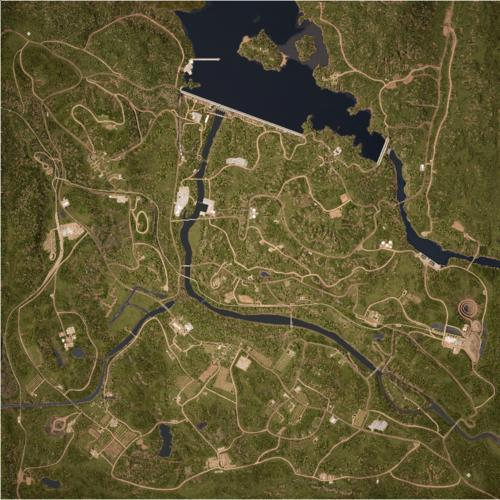

# Manicouagan | 曼尼古根

> 文章作者：桀氓AlbertWensley, TL

### Manicouagan AAS v1

切换代码： `AdminChangeLayer Manicouagan_AAS_v1`

预设代码： `AdminSetNextLayer Manicouagan_AAS_v1`

光照情况： 正午

旗点数量： 7

双方阵营： 加军 VS 俄军

初始票数： 300  -  300

??? abstract "加军载具"
    - MSVS Transport *1
    - MSVS Logistics *2
    - LUVW Logistics *1
    - LUVW C6 *2
    - LUVW M2 *1
    - M113A3 TLAV *1
    - CH-146 *1

??? abstract "俄军载具"
    - KamAZ 5350 Transport *1
    - KamAZ 5350 Logistics *2
    - MT-LB Logistics *1
    - Tigr-M Kord *2
    - BTR-80 *1
    - Mi-8 *1

### Manicouagan AAS v2

切换代码： `AdminChangeLayer Manicouagan_AAS_v2`

预设代码： `AdminSetNextLayer Manicouagan_AAS_v2`

光照情况： 正午

旗点数量： 7

双方阵营： USMC VS 俄军

初始票数： 300  -  300

??? abstract "USMC载具"
    - M939 Transport *2
    - M939 Logistics *2
    - M1151 M2 *2
    - M1151 M2 Open Doors *1
    - M1151 CROWS M2 *1
    - AAVP-7A1 *1
    - LAV-25 *1
    - UH-1Y *1

??? abstract "俄军载具"
    - KamAZ 5350 Transport *2
    - KamAZ 5350 Logistics *2
    - Tigr-M Kord *3
    - Tigr-M RWS Kord *1
    - BTR-82A *2
    - Mi-8 *1

### Manicouagan AAS v3

切换代码： `AdminChangeLayer Manicouagan_AAS_v3`

预设代码： `AdminSetNextLayer Manicouagan_AAS_v3`

光照情况： 正午

旗点数量： 7

双方阵营： 美军 VS 俄军

初始票数： 300  -  300

??? abstract "美军载具"
    - M939 Transport *1
    - M939 Logistics *2
    - M-ATV M2 *3
    - M-ATV CROWS M2 *1
    - M2A3 *1
    - M1A2 *1
    - UH-60M *1

??? abstract "俄军载具"
    - KamAZ 5350 Transport *1
    - KamAZ 5350 Logistics *1
    - MT-LB Logistics *1
    - Tigr-M Kord *3
    - BRDM-2 *1
    - BMP-2 *1
    - T-72B3 *1
    - Mi-8 *1

### Manicouagan Invasion v1

切换代码： `AdminChangeLayer Manicouagan_Invasion_v1`

预设代码： `AdminSetNextLayer Manicouagan_Invasion_v1`

光照情况： 正午

旗点数量： 5

双方阵营： 加军 VS 俄军

初始票数： 800  -  200

??? abstract "加军载具"
    - MSVS Transport *1
    - LUVW Logistics *3
    - LUVW M2 *3
    - TAPV M2 *1
    - M113A3 TLAV *1
    - Coyote *2
    - Leopard 2A6M CAN *1
    - CH-146 *1
    - LUV-A1 Logistics *1
    - RHIB Logistics *1
    - RHIB Transport *1

??? abstract "俄军载具"
    - KamAZ 5350 Transport *1
    - MT-LB Logistics *2
    - KamAZ 5350 Logistics *1
    - BRDM-2 *2
    - BTR-82A *2
    - BMP-2 *2
    - T-72B3 *1
    - Mi-8 *1

### Manicouagan Invasion v2

切换代码： `AdminChangeLayer Manicouagan_Invasion_v2`

预设代码： `AdminSetNextLayer Manicouagan_Invasion_v2`

光照情况： 正午

旗点数量： 5

双方阵营： 加军 VS 俄军

初始票数： 200  -  800

??? abstract "加军载具"
    - MSVS Transport *1
    - MSVS Logistics *2
    - LUVW Logistics *1
    - TAPV M2 *2
    - M113A3 TLAV *1
    - LAV 6 *3
    - Leopard 2A6M CAN *1
    - CH-146 *1

??? abstract "俄军载具"
    - KamAZ 5350 Transport *1
    - MT-LB Logistics *1
    - KamAZ 5350 Logistics *2
    - Tigr-M Kord *4
    - Tigr-M RWS Kord *1
    - BMP-2 *1
    - T-72B3 *1
    - Mi-8 *1

### Manicouagan Invasion v3

切换代码： `AdminChangeLayer Manicouagan_Invasion_v3`

预设代码： `AdminSetNextLayer Manicouagan_Invasion_v3`

光照情况： 暴雨

旗点数量： 5

双方阵营： 美军 VS 俄军

初始票数： 200  -  800

??? abstract "美军载具"
    - M939 Transport *1
    - M939 Logistics *3
    - M-ATV M2 *2
    - M-ATV CROWS M2 *1
    - M2A3 *3
    - M1A2 *1
    - UH-60M *1

??? abstract "俄军载具"
    - KamAZ 5350 Transport *1
    - MT-LB Logistics *1
    - KamAZ 5350 Logistics *2
    - Tigr-M Kord *4
    - BRDM-2 *1
    - BTR-82A *2
    - BMP-2 *1
    - T-72B3 *1
    - Mi-8 *1

### Manicouagan Invasion v4

切换代码： `AdminChangeLayer Manicouagan_Invasion_v4`

预设代码： `AdminSetNextLayer Manicouagan_Invasion_v4`

光照情况： 正午

旗点数量： 5

双方阵营： USMC VS 俄军

初始票数： 200  -  800

??? abstract "USMC载具"
    - M939 Transport *1
    - AAVC-7A1 Logistics *1
    - M939 Logistics *2
    - M1151 M2 *2
    - M1151 CROWS M2 *1
    - AAVP-7A1 *2
    - LAV-25 *2
    - M1A1 *1
    - UH-1Y *1

??? abstract "俄军载具"
    - KamAZ 5350 Transport *1
    - MT-LB Logistics *1
    - KamAZ 5350 Logistics *2
    - Tigr-M Kord *3
    - BRDM-2 *1
    - BTR-82A *2
    - BMP-2 *1
    - T-72B3 *1
    - Mi-8 *1

### Manicouagan Invasion v5

切换代码： `AdminChangeLayer Manicouagan_Invasion_v5`

预设代码： `AdminSetNextLayer Manicouagan_Invasion_v5`

光照情况： 暴雨

旗点数量： 5

双方阵营： USMC VS 俄军

初始票数： 200  -  800

??? abstract "USMC载具"
    - AAVC-7A1 Logistics *3
    - AAVP-7A1 *3
    - LAV-25 *4
    - UH-1Y *1
    - RHIB Logistics *1
    - RHIB M2 *2
    - RHIB Transport *1

??? abstract "俄军载具"
    - MT-LB Logistics *4
    - BRDM-2 *2
    - BTR-82A *2
    - BMP-2 *1
    - Mi-8 *1
    - RHIB PKP *1
    - RHIB NSV *1
    - RHIB Logistics *1

### Manicouagan Invasion v6

切换代码： `AdminChangeLayer Manicouagan_Invasion_v6`

预设代码： `AdminSetNextLayer Manicouagan_Invasion_v6`

光照情况： 正午

旗点数量： 5

双方阵营： 加军 VS PLA

初始票数： 200  -  800

??? abstract "加军载具"
    - MSVS Transport *1
    - MSVS Logistics *2
    - LUVW Logistics *1
    - LUVW M2 *1
    - TAPV M2 *1
    - LAV 6 *3
    - Leopard 2A6M CAN *1
    - CH-146 *1

??? abstract "PLA载具"
    - CTM131 Transport QJZ89 *1
    - CTM131 Logistics *3
    - CSK131 QJZ89 *1
    - CSK131 QJC88 RWS *1
    - ZSL10 *2
    - ZBL08 HJ73C *2
    - ZTZ99A *1
    - Z-8G *1

### Manicouagan Invasion v7

切换代码： `AdminChangeLayer Manicouagan_Invasion_v7`

预设代码： `AdminSetNextLayer Manicouagan_Invasion_v7`

光照情况： 暴雨

旗点数量： 5

双方阵营： 加军 VS 民兵

初始票数： 200  -  900

??? abstract "加军载具"
    - MSVS Transport *1
    - MSVS Logistics *2
    - LUVW Logistics *1
    - LUVW M2 *2
    - TAPV M2 *2
    - LAV 6 *2
    - Leopard 2A6M CAN *1
    - CH-146 *1

??? abstract "民兵载具"
    - Minsk 400 *1
    - Armored Ural-375D Transport *1
    - Armored Ural-375D Logistics *2
    - Armored Logistics Modern Pickup *2
    - Logistics Modern Pickup *1
    - Armored Modern Technical M2 HB *3
    - Armored Modern Technical SPG-9 *3
    - Ural-375D ZU-23-2 *2
    - Modern Technical UB-32 *1
    - BM-21 Grad *1
    - T-62 *1

### Manicouagan RAAS v1

切换代码： `AdminChangeLayer Manicouagan_RAAS_v1`

预设代码： `AdminSetNextLayer Manicouagan_RAAS_v1`

光照情况： 正午

旗点数量： 7

双方阵营： 加军 VS 俄军

初始票数： 300  -  300

??? abstract "加军载具"
    - MSVS Transport *1
    - MSVS Logistics *2
    - LUVW M2 *2
    - TAPV M2 *1
    - M113A3 TLAV *1
    - Coyote *1
    - LAV 6 *2
    - Leopard 2A6M CAN *1
    - CH-146 *2

??? abstract "俄军载具"
    - KamAZ 5350 Transport *1
    - KamAZ 5350 Logistics *1
    - MT-LB Logistics *1
    - Tigr-M Kord *2
    - Tigr-M RWS Kord *1
    - MT-LBM 6MA *1
    - BTR-82A *3
    - T-72B3 *1
    - Mi-8 *2

### Manicouagan RAAS v2

切换代码： `AdminChangeLayer Manicouagan_RAAS_v2`

预设代码： `AdminSetNextLayer Manicouagan_RAAS_v2`

光照情况： 正午

旗点数量： 7

双方阵营： USMC VS 俄军

初始票数： 300  -  300

??? abstract "USMC载具"
    - M939 Transport *1
    - AAVC-7A1 Logistics *1
    - M939 Logistics *1
    - M1151 M2 *2
    - M1151 M2 Open Doors *1
    - M1151 CROWS M2 *1
    - AAVP-7A1 *2
    - LAV-25 *2
    - M1A1 *1
    - UH-1Y *2

??? abstract "俄军载具"
    - KamAZ 5350 Transport *1
    - MT-LB Logistics *1
    - KamAZ 5350 Logistics *1
    - Tigr-M Kord *3
    - BRDM-2 *1
    - BTR-82A *2
    - BMP-2 *1
    - T-72B3 *1
    - Mi-8 *2

### Manicouagan RAAS v3

切换代码： `AdminChangeLayer Manicouagan_RAAS_v3`

预设代码： `AdminSetNextLayer Manicouagan_RAAS_v3`

光照情况： 暴雨

旗点数量： 7

双方阵营： 美军 VS 俄军

初始票数： 300  -  300

??? abstract "美军载具"
    - M939 Transport *1
    - M939 Logistics *2
    - M-ATV M2 *2
    - M-ATV CROWS M2 *1
    - M2A3 *2
    - M1A2 *2
    - UH-60M *2

??? abstract "俄军载具"
    - KamAZ 5350 Transport *1
    - MT-LB Logistics *1
    - KamAZ 5350 Logistics *1
    - Tigr-M Kord *2
    - BRDM-2 *1
    - BMP-2 *2
    - T-72B3 *2
    - Mi-8 *2

### Manicouagan RAAS v4

切换代码： `AdminChangeLayer Manicouagan_RAAS_v4`

预设代码： `AdminSetNextLayer Manicouagan_RAAS_v4`

光照情况： 正午

旗点数量： 7

双方阵营： 加军 VS PLA

初始票数： 300  -  300

??? abstract "加军载具"
    - MSVS Transport *1
    - MSVS Logistics *3
    - LUVW M2 *2
    - TAPV M2 *1
    - Coyote *1
    - LAV 6 *3
    - Leopard 2A6M CAN *1
    - CH-146 *1

??? abstract "PLA载具"
    - CTM131 Transport QJZ89 *1
    - CTM131 Logistics *3
    - CSK131 QJZ89 *2
    - CSK131 QJC88 RWS *1
    - ZBL08 *2
    - ZBD04A *1
    - ZTZ99A *1
    - Z-8G *1

### Manicouagan RAAS v5

切换代码： `AdminChangeLayer Manicouagan_RAAS_v5`

预设代码： `AdminSetNextLayer Manicouagan_RAAS_v5`

光照情况： 暴雨

旗点数量： 7

双方阵营： USMC VS PLA

初始票数： 300  -  300

??? abstract "USMC载具"
    - M939 Transport *1
    - AAVC-7A1 Logistics *1
    - M939 Logistics *1
    - M1151 CROWS M2 *1
    - M1151 M2 *1
    - AAVP-7A1 *1
    - LAV-25 *3
    - M1A1 *1
    - UH-1Y *2

??? abstract "PLA载具"
    - CTM131 Transport QJZ89 *1
    - CTM131 Logistics *2
    - CSK131 QJZ89 *1
    - CSK131 QJC88 RWS *1
    - ZSL10 *1
    - ZBL08 *3
    - ZTZ99A *1
    - Z-8G *2

### Manicouagan RAAS v6

切换代码： `AdminChangeLayer Manicouagan_RAAS_v6`

预设代码： `AdminSetNextLayer Manicouagan_RAAS_v6`

光照情况： 正午

旗点数量： 7

双方阵营： 美军 VS PLA

初始票数： 300  -  300

??? abstract "美军载具"
    - M939 Transport *1
    - M939 Logistics *2
    - M-ATV M2 *1
    - M-ATV CROWS M2 *1
    - M2A3 *2
    - M1A2 *2
    - UH-60M *2

??? abstract "PLA载具"
    - CTM131 Transport QJZ89 *1
    - CTM131 Logistics *2
    - CSK131 QJZ89 *1
    - CSK131 QJC88 RWS *1
    - ZBD04A *2
    - ZTZ99A *2
    - Z-8G *2

### Manicouagan RAAS v7

切换代码： `AdminChangeLayer Manicouagan_RAAS_v7`

预设代码： `AdminSetNextLayer Manicouagan_RAAS_v7`

光照情况： 正午

旗点数量： 7

双方阵营： 加军 VS 民兵

初始票数： 300  -  300

??? abstract "加军载具"
    - MSVS Transport *1
    - MSVS Logistics *2
    - LUVW C6 *2
    - LUVW M2 *2
    - TAPV M2 *1
    - LAV 6 *2
    - Leopard 2A6M CAN *1
    - CH-146 *1

??? abstract "民兵载具"
    - Armored Ural-375D Transport *1
    - Armored Ural-375D Logistics *2
    - Ural-375D Logistics *1
    - Armored Logistics Modern Pickup *1
    - Logistics Modern Pickup *1
    - Modern Technical M2 HB *1
    - Armored Modern Technical DShK *1
    - Tigr-M Kord *1
    - BRDM-2 *1
    - Armored Modern Technical SPG-9 *1
    - Ural-375D ZU-23-2 *1
    - MT-LB ZU-23-2 *1
    - BMP-1 *2
    - BM-21 Grad *1
    - T-62 *1

### Manicouagan RAAS v8

切换代码： `AdminChangeLayer Manicouagan_RAAS_v8`

预设代码： `AdminSetNextLayer Manicouagan_RAAS_v8`

光照情况： 

旗点数量： 

双方阵营： 英军 VS 民兵

初始票数： 

### Manicouagan RAAS v9

切换代码： `AdminChangeLayer Manicouagan_RAAS_v9`

预设代码： `AdminSetNextLayer Manicouagan_RAAS_v9`

光照情况： 

旗点数量： 

双方阵营： 俄军 VS 民兵

初始票数： 

### Manicouagan Seed v1

切换代码： `AdminChangeLayer Manicouagan_Seed_v1`

预设代码： `AdminSetNextLayer Manicouagan_Seed_v1`

光照情况： 正午

旗点数量： 5

双方阵营： 加军 VS 民兵

初始票数： 100  -  100

??? abstract "加军载具"
    - MSVS Transport *1
    - LUVW Transport *3
    - LUVW Logistics *3
    - MSVS Logistics *2

??? abstract "民兵载具"
    - Minsk 400 *1
    - Transport Modern Pickup *1
    - Armored Transport Modern Pickup *1
    - Ural-375D Transport *1
    - Armored Ural-375D Transport *1
    - Logistics Modern Pickup *1
    - Armored Logistics Modern Pickup *1
    - Ural-375D Logistics *1
    - Armored Ural-375D Logistics *2

### Manicouagan Skirmish v1

切换代码： `AdminChangeLayer Manicouagan_Skirmish_v1`

预设代码： `AdminSetNextLayer Manicouagan_Skirmish_v1`

光照情况： 暴雨

旗点数量： 5

双方阵营： 加军 VS 俄军

初始票数： 150  -  150

??? abstract "加军载具"
    - LUVW Transport *2
    - LUV-A1 Transport *2
    - MSVS Transport *1
    - LUVW Logistics *1
    - MSVS Logistics *2
    - LUVW C6 *1

??? abstract "俄军载具"
    - KamAZ 5350 Transport *3
    - KamAZ 5350 Logistics *3
    - Tigr-M Kord *1

### Manicouagan Skirmish v2

切换代码： `AdminChangeLayer Manicouagan_Skirmish_v2`

预设代码： `AdminSetNextLayer Manicouagan_Skirmish_v2`

光照情况： 正午

旗点数量： 5

双方阵营： USMC VS 俄军

初始票数： 150  -  150

??? abstract "USMC载具"
    - M939 Logistics *3
    - M1151 M2 *2

??? abstract "俄军载具"
    - KamAZ 5350 Logistics *3
    - Tigr-M Kord *2

### Manicouagan Skirmish v3

切换代码： `AdminChangeLayer Manicouagan_Skirmish_v3`

预设代码： `AdminSetNextLayer Manicouagan_Skirmish_v3`

光照情况： 正午

旗点数量： 5

双方阵营： 美军 VS 俄军

初始票数： 150  -  150

??? abstract "美军载具"
    - M939 Transport *3
    - M939 Logistics *3
    - M-ATV M240 *1

??? abstract "俄军载具"
    - KamAZ 5350 Transport *3
    - KamAZ 5350 Logistics *3
    - Tigr-M Kord *1

