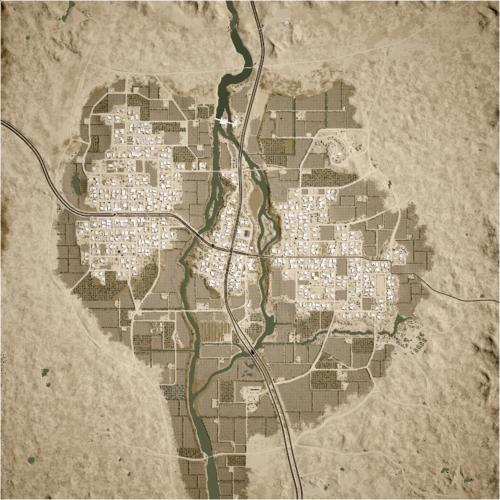

# Mutaha | 穆塔哈

> 文章作者：桀氓AlbertWensley, TL

## AAS | 攻守有序

### Mutaha AAS v1

切换代码： `AdminChangeLayer Mutaha_AAS_v1`

预设代码： `AdminSetNextLayer Mutaha_AAS_v1`

光照情况： 黎明

旗点数量： 5

双方阵营： 美军 VS 俄军

初始票数： 300  -  300

??? abstract "美军载具"
    - M939 Logistics Truck *3
    - M1126 CROWS M2 HB *1
    - M-ATV M2 HB *1
    - M2A3 *1
    - M1A2 *1
    - M939 Transport Truck *1
    - UH-60M *1

??? abstract "俄军载具"
    - KamAZ 5350 Logistics Truck *3
    - KamAZ 5350 Transport Truck *1
    - Tigr-M RWS Kord *1
    - BTR-82A *1
    - BMP-2 *1
    - T-72B3 *1
    - Mi-8 *1

### Mutaha AAS v2

切换代码： `AdminChangeLayer Mutaha_AAS_v2`

预设代码： `AdminSetNextLayer Mutaha_AAS_v2`

光照情况： 黎明

旗点数量： 6

双方阵营： 英军 VS 俄军

初始票数： 300  -  300

??? abstract "英军载具"
    - HX60 Transport Truck *1
    - HX60 Logistics Truck *3
    - LPPV *2
    - LPPV RWS *2
    - FV432 *1
    - FV107 *2

??? abstract "俄军载具"
    - KamAZ 5350 Transport Truck *1
    - KamAZ 5350 Logistics Truck *3
    - Tigr-M Kord *2
    - Tigr-M RWS Kord *2
    - BTR-82A *2

### Mutaha AAS v3

切换代码： `AdminChangeLayer Mutaha_AAS_v3`

预设代码： `AdminSetNextLayer Mutaha_AAS_v3`

光照情况： 正午

旗点数量： 5

双方阵营： 澳军 VS 俄军

初始票数： 300  -  300

??? abstract "澳军载具"
    - HX60 Transport Truck *1
    - HX60 Logistics Truck *3
    - PMV Mag58 x3 *2
    - PMV Mag58 *1
    - PMV RWS M2 *1
    - ASLAV *1

??? abstract "俄军载具"
    - KamAZ 5350 Transport Truck *1
    - KamAZ 5350 Logistics Truck *3
    - Tigr-M Kord *2
    - BRDM-2 *1
    - BTR-82A *1

### Mutaha AAS v4

切换代码： `AdminChangeLayer Mutaha_AAS_v4`

预设代码： `AdminSetNextLayer Mutaha_AAS_v4`

光照情况： 黎明

旗点数量： 5

双方阵营： 加军 VS 俄军

初始票数： 300  -  300

??? abstract "加军载具"
    - MSVS Transport Truck *1
    - MSVS Logistics Truck *3
    - LUVW M2 *1
    - TAPV M2 *1
    - M113A3 TLAV *1
    - Coyote *2
    - CH-146 *1

??? abstract "俄军载具"
    - KamAZ 5350 Transport Truck *1
    - KamAZ 5350 Logistics Truck *3
    - Tigr-M Kord *1
    - Tigr-M RWS Kord *1
    - MT-LBM 6MA *1
    - BTR-82A *2
    - Mi-8 *1

## Invasion | 侵攻

### Mutaha Invasion v1

切换代码： `AdminChangeLayer Mutaha_Invasion_v1`

预设代码： `AdminSetNextLayer Mutaha_Invasion_v1`

光照情况： 黄昏

旗点数量： 5

双方阵营： 英军 VS 叛军

初始票数： 200  -  800

??? abstract "英军载具"
    - HX60 Logistics Truck *3
    - LPPV RWS *1
    - FV107 *1
    - FV4034 *1
    - HX60 Transport Truck *1
    - FV510 UA *1
    - FV432 RWS *1
    - FV520 CTAS40 *1
    - SA330 *1

??? abstract "叛军载具"
    - Minsk 400 *2
    - Ural-375D Transport Truck *1
    - Logistics Pickup Truck *3
    - Ural-375D Logistics Truck *1
    - Technical M2 HB *1
    - Technical Mortar *1
    - Technical ZU-23-2 *1
    - Armored Technical SPG-9 *1
    - Technical BMP-1 *1
    - BMP-1 *1
    - T-62 *1

### Mutaha Invasion v2

切换代码： `AdminChangeLayer Mutaha_Invasion_v2`

预设代码： `AdminSetNextLayer Mutaha_Invasion_v2`

光照情况： 正午

旗点数量： 5

双方阵营： 英军 VS 叛军

初始票数： 200  -  800

??? abstract "英军载具"
    - HX60 Transport Truck *1
    - HX60 Logistics Truck *3
    - LPPV RWS *1
    - FV432 RWS *1
    - FV107 *1
    - FV510 UA *1
    - FV520 CTAS40 *1
    - FV4034 *1
    - SA330 *1

??? abstract "叛军载具"
    - Minsk 400 *2
    - Transport Pickup Truck *1
    - Logistics Pickup Truck *3
    - Ural-375D Logistics Truck *1
    - Technical M2 HB *1
    - Armored Technical SPG-9 *1
    - Technical ZU-23-2 *1
    - Technical Mortar *1
    - Technical BMP-1 *1
    - BMP-1 *1
    - T-62 *1

### Mutaha Invasion v3

切换代码： `AdminChangeLayer Mutaha_Invasion_v3`

预设代码： `AdminSetNextLayer Mutaha_Invasion_v3`

光照情况： 正午

旗点数量： 5

双方阵营： 澳军 VS 叛军

初始票数： 200  -  800

??? abstract "澳军载具"
    - HX60 Transport Truck *1
    - HX60 Logistics Truck *3
    - PMV Mag58 x3 *2
    - PMV RWS M2 *1
    - ASLAV *2
    - M1A1 *2
    - MRH-90 *1

??? abstract "叛军载具"
    - Minsk 400 *2
    - Transport Pickup Truck *1
    - Logistics Pickup Truck *3
    - Ural-375D Logistics Truck *1
    - Technical M2 HB *1
    - Armored Technical SPG-9 *1
    - Technical ZU-23-2 *1
    - Technical Mortar *1
    - Technical BMP-1 *1
    - BMP-1 *1
    - T-62 *2

### Mutaha Invasion v4

切换代码： `AdminChangeLayer Mutaha_Invasion_v4`

预设代码： `AdminSetNextLayer Mutaha_Invasion_v4`

光照情况： 正午

旗点数量： 5

双方阵营： 加军 VS 叛军

初始票数： 200  -  900

??? abstract "加军载具"
    - MSVS Transport Truck *1
    - MSVS Logistics Truck *2
    - LUV-A1 Logistics *1
    - TAPV M2 *2
    - M113A3 TLAV *1
    - Coyote *1
    - LAV 6 *3
    - Leopard 2A6M CAN *1
    - CH-146 *1

??? abstract "叛军载具"
    - Minsk 400 *2
    - Ural-375D Transport Truck *1
    - Logistics Pickup Truck *1
    - Ural-375D Logistics Truck *1
    - Technical M2 HB *2
    - Technical ZU-23-2 *2
    - Armored Technical SPG-9 *2
    - BRDM-2 *1
    - BTR-80 *1
    - BMP-1 *2
    - T-62 *1
    - Ural-375D ZU-23-2 *1

## RAAS | 随机攻守

### Mutaha RAAS v1

切换代码： `AdminChangeLayer Mutaha_RAAS_v1`

预设代码： `AdminSetNextLayer Mutaha_RAAS_v1`

光照情况： 正午

旗点数量： 5

双方阵营： 美军 VS 中东

初始票数： 300  -  300

??? abstract "美军载具"
    - M939 Logistics Truck *3
    - M1126 CROWS M2 HB *1
    - M-ATV M2 HB *1
    - M2A3 *1
    - M1A2 *1
    - M939 Transport Truck *1
    - UH-60M *1
    - M-ATV M240 *1

??? abstract "中东载具"
    - Ural-4320 Logistics Truck *3
    - Ural-4320 Transport Truck *1
    - MT-LBM 6MA *1
    - BMP-1 *1
    - BMP-2 *1
    - T-72S *1
    - Mi-17 *1
    - Simir MG3 *1

### Mutaha RAAS v2

切换代码： `AdminChangeLayer Mutaha_RAAS_v2`

预设代码： `AdminSetNextLayer Mutaha_RAAS_v2`

光照情况： 正午

旗点数量： 5

双方阵营： 澳军 VS 俄军

初始票数： 300  -  300

??? abstract "澳军载具"
    - HX60 Transport Truck *1
    - HX60 Logistics Truck *3
    - PMV Mag58 x3 *2
    - PMV Mag58 *1
    - PMV RWS M2 *1
    - ASLAV *2
    - M1A1 *1
    - MRH-90 *1

??? abstract "俄军载具"
    - KamAZ 5350 Transport Truck *1
    - KamAZ 5350 Logistics Truck *3
    - Tigr-M Kord *2
    - BRDM-2 *1
    - BTR-82A *1
    - BMP-2 *1
    - T-72B3 *1
    - Mi-8 *1

### Mutaha RAAS v3

切换代码： `AdminChangeLayer Mutaha_RAAS_v3`

预设代码： `AdminSetNextLayer Mutaha_RAAS_v3`

光照情况： 正午

旗点数量： 5

双方阵营： 英军 VS 中东

初始票数： 300  -  300

??? abstract "英军载具"
    - HX60 Transport Truck *1
    - HX60 Logistics Truck *3
    - LPPV *3
    - FV432 *1
    - FV432 RWS *1
    - FV510 UA *2
    - FV4034 *1
    - SA330 *1

??? abstract "中东载具"
    - Ural-4320 Transport Truck *1
    - Simir Logi *2
    - Ural-4320 Logistics Truck *2
    - Simir Kord *3
    - BRDM-2 *1
    - MT-LBM 6MA *1
    - BMP-1 *1
    - BMP-2 *1
    - T-72S *1
    - Mi-17 *1

### Mutaha RAAS v4

切换代码： `AdminChangeLayer Mutaha_RAAS_v4`

预设代码： `AdminSetNextLayer Mutaha_RAAS_v4`

光照情况： 正午

旗点数量： 5

双方阵营： 加军 VS 俄军

初始票数： 350  -  350

??? abstract "加军载具"
    - MSVS Transport Truck *1
    - MSVS Logistics Truck *3
    - M113A3 TLAV *2
    - Coyote *1
    - Leopard 2A6M CAN *3
    - CH-146 *1

??? abstract "俄军载具"
    - KamAZ 5350 Transport Truck *1
    - KamAZ 5350 Logistics Truck *3
    - MT-LBM 6MA *1
    - MT-LB VMK *1
    - MT-LBM 6MB *1
    - T-72B3 *3
    - Mi-8 *1

### Mutaha RAAS v5

切换代码： `AdminChangeLayer Mutaha_RAAS_v5`

预设代码： `AdminSetNextLayer Mutaha_RAAS_v5`

光照情况： 正午

旗点数量： 7

双方阵营： 加军 VS 中东

初始票数： 300  -  300

??? abstract "加军载具"
    - MSVS Transport Truck *1
    - MSVS Logistics Truck *3
    - LUVW M2 *2
    - M113A3 TLAV *1
    - LAV 6 *2
    - Leopard 2A6M CAN *1
    - CH-146 *1

??? abstract "中东载具"
    - Ural-4320 Transport Truck *1
    - Ural-4320 Logistics Truck *3
    - Simir Kord *2
    - Simir MG3 *1
    - MT-LBM 6MA *1
    - BMP-1 *1
    - BMP-2 *1
    - T-72S *1
    - Mi-17 *1

### Mutaha RAAS v6

切换代码： `AdminChangeLayer Mutaha_RAAS_v6`

预设代码： `AdminSetNextLayer Mutaha_RAAS_v6`

光照情况： 正午

旗点数量： 5

双方阵营： USMC VS 中东

初始票数： 300  -  300

??? abstract "USMC载具"
    - M939 Transport Truck *1
    - M939 Logistics Truck *3
    - M1151 M2 *1
    - M1151 M2 Open Doors *1
    - AAVP-7A1 *2
    - LAV-25 *2
    - M1A1 *1
    - UH-1Y *1

??? abstract "中东载具"
    - Ural-4320 Transport Truck *1
    - Simir Logi *2
    - Ural-4320 Logistics Truck *2
    - Simir Kord *3
    - BRDM-2 *1
    - MT-LBM 6MA *1
    - BMP-2 *2
    - T-72S *1
    - Mi-17 *1

### Mutaha RAAS v7

切换代码： `AdminChangeLayer Mutaha_RAAS_v7`

预设代码： `AdminSetNextLayer Mutaha_RAAS_v7`

光照情况： 正午

旗点数量： 5

双方阵营： PLA VS 俄军

初始票数： 300  -  300

??? abstract "PLA载具"
    - CTM-131 Logistics Truck *3
    - CTM-131 Transport QJZ-89 *1
    - CSK-131 QJZ-89 *2
    - ZSL-10 *1
    - ZBD-04A *1
    - ZTZ-99A *1
    - Z-8G *1

??? abstract "俄军载具"
    - KamAZ 5350 Transport Truck *3
    - KamAZ 5350 Logistics Truck *1
    - Tigr-M Kord *2
    - BTR-82A *1
    - BMP-2 *1
    - T-72B3 *1
    - Mi-8 *1

## Skirmish | 遭遇战

### Mutaha Skirmish v1

切换代码： `AdminChangeLayer Mutaha_Skirmish_v1`

预设代码： `AdminSetNextLayer Mutaha_Skirmish_v1`

光照情况： 黎明

旗点数量： 5

双方阵营： 美军 VS 中东

初始票数： 150  -  150

??? abstract "美军载具"
    - M939 Transport Truck *3
    - M939 Logistics Truck *3
    - M-ATV M240 *1

??? abstract "中东载具"
    - Ural-4320 Transport Truck *2
    - Simir Logi *2
    - Ural-4320 Logistics Truck *2
    - Simir MG3 *1

## TC | 领土控制

### Mutaha TC v1

切换代码： `AdminChangeLayer Mutaha_TC_v1`

预设代码： `AdminSetNextLayer Mutaha_TC_v1`

光照情况： 正午

旗点数量： 17

双方阵营： 美军 VS 俄军

初始票数： 300  -  300

??? abstract "美军载具"
    - M939 Logistics Truck *3
    - M939 Transport Truck *1
    - M-ATV M2 HB *1
    - M-ATV CROWS M2 HB *1

??? abstract "俄军载具"
    - KamAZ 5350 Logistics Truck *3
    - Tigr-M Kord *1
    - KamAZ 5350 Transport Truck *1
    - BTR-80 *1

### Mutaha TC v2

切换代码： `AdminChangeLayer Mutaha_TC_v2`

预设代码： `AdminSetNextLayer Mutaha_TC_v2`

光照情况： 黎明

旗点数量： 35

双方阵营： 美军 VS 中东

初始票数： 400  -  400

??? abstract "美军载具"
    - M939 Transport Truck *1
    - M939 Logistics Truck *3
    - M-ATV M2 HB *1
    - M1126 CROWS M2 HB *2
    - M2A3 *1
    - M1A2 *1
    - UH-60M *1

??? abstract "中东载具"
    - Ural-4320 Transport Truck *1
    - Ural-4320 Logistics Truck *3
    - Simir Kord *1
    - MT-LBM 6MA *1
    - BRDM-2 Spandrel *1
    - BMP-1 *1
    - BMP-2 *1
    - T-72S *1
    - Mi-17 *1