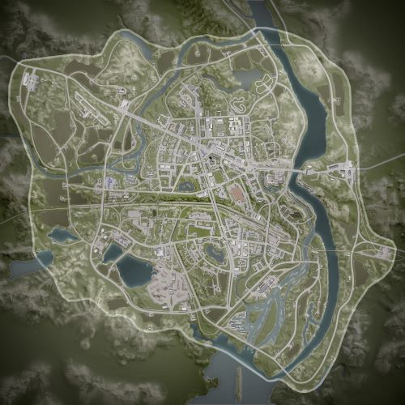

# Narva | 纳尔瓦

> 文章作者：桀氓AlbertWensley, Astesia, TL

### Narva AAS v1

切换代码： `AdminChangeLayer Narva_AAS_v1`

预设代码： `AdminSetNextLayer Narva_AAS_v1`

光照情况： 正午&多云

旗点数量： 6

双方阵营： 美军 VS 俄军

初始票数： 300  -  300

??? abstract "美军载具"
    - M1126 CROWS M2 *3
    - M939 Logistics *3
    - M-ATV M2 *2
    - M939 Transport *1

??? abstract "俄军载具"
    - BTR-82A *2
    - BTR-80 *1
    - Tigr-M Kord *1
    - KamAZ 5350 Logistics *3
    - KamAZ 5350 Transport *1
    - Tigr-M RWS Kord *1

### Narva AAS v2

切换代码： `AdminChangeLayer Narva_AAS_v2`

预设代码： `AdminSetNextLayer Narva_AAS_v2`

光照情况： 正午&多云

旗点数量： 6

双方阵营： 英军 VS 俄军

初始票数： 300  -  300

??? abstract "英军载具"
    - HX60 Logistics *3
    - HX60 Transport *1
    - LPPV *2
    - FV107 *1
    - FV520 CTAS40 *1

??? abstract "俄军载具"
    - BMP-2 *1
    - BTR-82A *2
    - BRDM-2 *1
    - KamAZ 5350 Logistics *3
    - KamAZ 5350 Transport *1

### Narva AAS v3

切换代码： `AdminChangeLayer Narva_AAS_v3`

预设代码： `AdminSetNextLayer Narva_AAS_v3`

光照情况： 大雾

旗点数量： 5

双方阵营： 美军 VS 俄军

初始票数： 300  -  300

??? abstract "美军载具"
    - M1126 CROWS M2 *3
    - M939 Logistics *3
    - M-ATV CROWS M2 *1
    - M-ATV M2 *1
    - M939 Transport *1

??? abstract "俄军载具"
    - BTR-82A *3
    - MT-LBM 6MA *1
    - BRDM-2 *1
    - KamAZ 5350 Logistics *3
    - KamAZ 5350 Transport *1
    - Tigr-M RWS Kord *1

### Narva AAS v4

切换代码： `AdminChangeLayer Narva_AAS_v4`

预设代码： `AdminSetNextLayer Narva_AAS_v4`

光照情况： 正午&多云

旗点数量： 6

双方阵营： USMC VS 俄军

初始票数： 300  -  300

??? abstract "USMC载具"
    - M939 Transport *1
    - M939 Logistics *3
    - M1151 M2 *1
    - M1151 M2 Open Doors *1
    - LAV-25 *2
    - AAVP-7A1 *1

??? abstract "俄军载具"
    - KamAZ 5350 Transport *1
    - KamAZ 5350 Logistics *3
    - Tigr-M Kord *2
    - BTR-82A *2
    - MT-LBM 6MB *1

### Narva Destruction v1

切换代码： `AdminChangeLayer Narva_Destruction_v1`

预设代码： `AdminSetNextLayer Narva_Destruction_v1`

光照情况： 正午&多云

旗点数量： 2

双方阵营： 美军 VS 俄军

初始票数： 200  -  1000

??? abstract "美军载具"
    - M1126 CROWS M2 *2
    - M939 Logistics *3
    - M-ATV M2 *1
    - M939 Transport *1
    - M2A3 *2
    - M-ATV CROWS M240 *1

??? abstract "俄军载具"
    - BTR-82A *2
    - KamAZ 5350 Logistics *3
    - T-72B3 *1
    - KamAZ 5350 Transport *1
    - Tigr-M RWS Kord *1
    - BTR-80 *1

### Narva Invasion v1

切换代码： `AdminChangeLayer Narva_Invasion_v1`

预设代码： `AdminSetNextLayer Narva_Invasion_v1`

光照情况： 黎明

旗点数量： 5

双方阵营： 美军 VS 俄军

初始票数： 800  -  200

??? abstract "美军载具"
    - M939 Transport *1
    - M939 Logistics *3
    - M-ATV M2 *2
    - M1126 CROWS M2 *2
    - M2A3 *1

??? abstract "俄军载具"
    - KamAZ 5350 Transport *1
    - KamAZ 5350 Logistics *3
    - Tigr-M Kord *1
    - Tigr-M RWS Kord *1
    - BTR-80 *1
    - BTR-82A *2
    - BMP-2 *1

### Narva Invasion v2

切换代码： `AdminChangeLayer Narva_Invasion_v2`

预设代码： `AdminSetNextLayer Narva_Invasion_v2`

光照情况： 正午&多云

旗点数量： 5

双方阵营： 英军 VS 俄军

初始票数： 200  -  800

??? abstract "英军载具"
    - HX60 Transport *1
    - HX60 Logistics *3
    - LPPV *1
    - FV107 *1
    - FV510 *1
    - FV510 UA *1
    - FV520 CTAS40 *1
    - FV4034 *1

??? abstract "俄军载具"
    - KamAZ 5350 Transport *1
    - KamAZ 5350 Logistics *3
    - Tigr-M Kord *1
    - BTR-82A *2
    - BMP-2 *1
    - T-72B3 *1

### Narva Invasion v3

切换代码： `AdminChangeLayer Narva_Invasion_v3`

预设代码： `AdminSetNextLayer Narva_Invasion_v3`

光照情况： 黎明

旗点数量： 4

双方阵营： 美军 VS 俄军

初始票数： 800  -  200

??? abstract "美军载具"
    - M939 Transport *1
    - M939 Logistics *3
    - M-ATV M2 *1
    - M1126 CROWS M240 *3

??? abstract "俄军载具"
    - KamAZ 5350 Transport *1
    - KamAZ 5350 Logistics *3
    - Tigr-M Kord *1
    - MT-LB VMK *3

### Narva Invasion v4

切换代码： `AdminChangeLayer Narva_Invasion_v4`

预设代码： `AdminSetNextLayer Narva_Invasion_v4`

光照情况： 大雾

旗点数量： 5

双方阵营： 加军 VS 民兵

初始票数： 200  -  900

??? abstract "加军载具"
    - MSVS Transport *1
    - MSVS Logistics *3
    - M113A3 M2 *2
    - M113A3 TLAV *2
    - Coyote *1
    - Leopard 2A6M CAN *3

??? abstract "民兵载具"
    - Ural-375D Transport *1
    - Ural-375D Logistics *2
    - Logistics Modern Pickup Truck *3
    - Modern Technical M2 HB *2
    - Modern Technical SPG-9 *1
    - MT-LB ZU-23-2 *1
    - MT-LB VMK *1
    - MT-LBM 6MB *1
    - BMP-1 *1
    - T-62 *2

### Narva Invasion v5

切换代码： `AdminChangeLayer Narva_Invasion_v5`

预设代码： `AdminSetNextLayer Narva_Invasion_v5`

光照情况： 阴天

旗点数量： 5

双方阵营： USMC VS 俄军

初始票数： 800  -  250

??? abstract "USMC载具"
    - RHIB Transport *1
    - RHIB Logistics *1
    - RHIB M240 *2
    - AAVC-7A1 Logistics *2
    - AAVP-7A1 *2
    - LAV-25 *1

??? abstract "俄军载具"
    - RHIB Transport *1
    - RHIB Logistics *1
    - RHIB PKP *1
    - RHIB NSV *1
    - MT-LB Logistics *1
    - BRDM-2 *2
    - BTR-80 *1
    - BTR-82A *3
    - BMP-2 *1

### Narva RAAS v1

切换代码： `AdminChangeLayer Narva_RAAS_v1`

预设代码： `AdminSetNextLayer Narva_RAAS_v1`

光照情况： 正午&多云

旗点数量： 5

双方阵营： 美军 VS 俄军

初始票数： 300  -  300

??? abstract "美军载具"
    - M1126 CROWS M2 *2
    - M2A3 *1
    - M939 Logistics *3
    - M-ATV M2 *2
    - M1A2 *1
    - M939 Transport *1

??? abstract "俄军载具"
    - BTR-82A *2
    - BMP-2 *1
    - KamAZ 5350 Logistics *3
    - Tigr-M RWS Kord *1
    - T-72B3 *1
    - KamAZ 5350 Transport *1
    - BTR-80 *1

### Narva RAAS v2

切换代码： `AdminChangeLayer Narva_RAAS_v2`

预设代码： `AdminSetNextLayer Narva_RAAS_v2`

光照情况： 正午&多云

旗点数量： 27

双方阵营： USMC VS 俄军

初始票数： 300  -  300

??? abstract "USMC载具"
    - M939 Transport *1
    - M939 Logistics *3
    - M1151 M2 *2
    - M1151 M2 Open Doors *1
    - AAVP-7A1 *1
    - LAV-25 *2
    - M1A1 *1

??? abstract "俄军载具"
    - KamAZ 5350 Transport *1
    - KamAZ 5350 Logistics *3
    - Tigr-M Kord *2
    - BTR-80 *1
    - BTR-82A *3
    - T-72B3 *1

### Narva RAAS v3

切换代码： `AdminChangeLayer Narva_RAAS_v3`

预设代码： `AdminSetNextLayer Narva_RAAS_v3`

光照情况： 正午&多云

旗点数量： 5

双方阵营： 加军 VS 民兵

初始票数： 300  -  320

??? abstract "加军载具"
    - MSVS Transport *1
    - LUVW Logistics *3
    - LUVW C6 *2
    - LUVW M2 *2
    - M113A3 TLAV *1
    - Coyote *2
    - Leopard 2A6M CAN *1

??? abstract "民兵载具"
    - Ural-375D Transport *1
    - Ural-375D Logistics *2
    - Logistics Modern Pickup Truck *3
    - MT-LB VMK *1
    - MT-LB ZU-23-2 *1
    - MT-LBM 6MB *2
    - BMP-1 *1
    - T-62 *1

### Narva RAAS v4

切换代码： `AdminChangeLayer Narva_RAAS_v4`

预设代码： `AdminSetNextLayer Narva_RAAS_v4`

光照情况： 正午&多云

旗点数量： 27

双方阵营： 加军 VS 俄军

初始票数： 300  -  300

??? abstract "加军载具"
    - MSVS Transport *1
    - MSVS Logistics *3
    - LUVW M2 *1
    - TAPV M2 *1
    - M113A3 TLAV *1
    - Coyote *1
    - LAV 6 *2
    - Leopard 2A6M CAN *1

??? abstract "俄军载具"
    - KamAZ 5350 Transport *1
    - KamAZ 5350 Logistics *3
    - Tigr-M Kord *1
    - Tigr-M RWS Kord *1
    - MT-LBM 6MA *1
    - BTR-82A *3
    - T-72B3 *1

### Narva RAAS v5

切换代码： `AdminChangeLayer Narva_RAAS_v5`

预设代码： `AdminSetNextLayer Narva_RAAS_v5`

光照情况： 阴天

旗点数量： 5

双方阵营： USMC VS 俄军

初始票数： 300  -  300

??? abstract "USMC载具"
    - RHIB Transport *1
    - RHIB Logistics *1
    - RHIB M240 *1
    - RHIB M2 *1
    - AAVC-7A1 Logistics *2

??? abstract "俄军载具"
    - RHIB Transport *1
    - RHIB Logistics *1
    - RHIB PKP *1
    - MT-LB Logistics *2

### Narva RAAS v6

切换代码： `AdminChangeLayer Narva_RAAS_v6`

预设代码： `AdminSetNextLayer Narva_RAAS_v6`

光照情况： 正午&多云

旗点数量： 5

双方阵营： 英军 VS PLA

初始票数： 300  -  300

??? abstract "英军载具"
    - HX60 Transport *1
    - HX60 Logistics *3
    - LPPV *1
    - LPPV RWS *1
    - FV432 *1
    - FV510 UA *2
    - FV4034 *1

??? abstract "PLA载具"
    - CTM-131 Logistics *4
    - CSK-131 QJY-88 *1
    - CSK-131 QJZ-89 RWS *1
    - ZSL-10 *1
    - ZBL-08 *2
    - ZTZ-99A *1

### Narva Skirmish v1

切换代码： `AdminChangeLayer Narva_Skirmish_v1`

预设代码： `AdminSetNextLayer Narva_Skirmish_v1`

光照情况： 阴天

旗点数量： 5

双方阵营： 美军 VS 俄军

初始票数： 150  -  150

??? abstract "美军载具"
    - M939 Transport *3
    - M939 Logistics *3
    - M-ATV M240 *1

??? abstract "俄军载具"
    - KamAZ 5350 Transport *3
    - KamAZ 5350 Logistics *3
    - Tigr-M Kord *1

### Narva TA v1

切换代码： `AdminChangeLayer Narva_TA_v1`

预设代码： `AdminSetNextLayer Narva_TA_v1`

光照情况： 正午&多云

旗点数量： 1

双方阵营： 俄军 VS 俄军

初始票数： 24  -  24

??? abstract "俄军载具"
    - BTR-82A *2

??? abstract "俄军载具"
    - BTR-82A *2

### Narva TC v1

切换代码： `AdminChangeLayer Narva_TC_v1`

预设代码： `AdminSetNextLayer Narva_TC_v1`

光照情况： 大雾

旗点数量： 29

双方阵营： 美军 VS 俄军

初始票数： 400  -  400

??? abstract "美军载具"
    - M1126 CROWS M2 *2
    - M2A3 *1
    - M939 Logistics *3
    - M-ATV CROWS M2 *1
    - M-ATV M2 *1
    - M939 Transport *1

??? abstract "俄军载具"
    - BTR-82A *2
    - BTR-80 *1
    - Tigr-M RWS Kord *1
    - KamAZ 5350 Logistics *3
    - KamAZ 5350 Transport *1
    - BMP-2 *1

### Narva TC v2

切换代码： `AdminChangeLayer Narva_TC_v2`

预设代码： `AdminSetNextLayer Narva_TC_v2`

光照情况： 正午&多云

旗点数量： 52

双方阵营： 美军 VS 俄军

初始票数： 400  -  400

??? abstract "美军载具"
    - M1126 CROWS M2 *2
    - M2A3 *1
    - M939 Logistics *3
    - M-ATV M2 *2
    - M1A2 *1
    - M939 Transport *1

??? abstract "俄军载具"
    - BTR-82A *2
    - BMP-2 *1
    - KamAZ 5350 Logistics *3
    - BRDM-2 *1
    - T-72B3 *1
    - KamAZ 5350 Transport *1
    - BTR-80 *1

