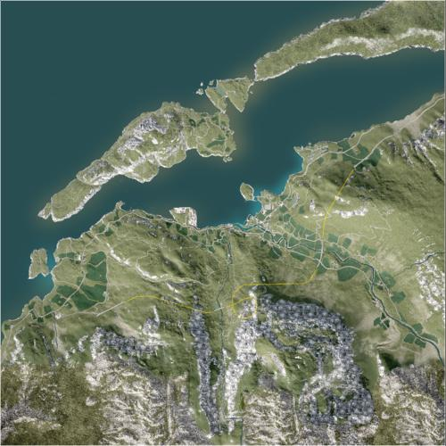

# Skorpo | 斯科珀

> 文章作者：桀氓AlbertWensley, Astesia, TL

<figure markdown>
  {loading=lazy}
  <figcaption>宁静的乌斯克达伦村和斯科波岛坐落在挪威广阔的峡湾中，被视为控制北海航道的关键战略战场。狭窄蜿蜒的道路和黑暗的隧道沿着海岸线，对于任何机械化部队来说都是危险的瓶颈。</figcaption>
</figure>

### Skorpo AAS v1

切换代码： `AdminChangeLayer Skorpo_AAS_v1`

预设代码： `AdminSetNextLayer Skorpo_AAS_v1`

光照情况： 正午

旗点数量： 5

双方阵营： 美军 VS 俄军

初始票数： 300  -  300

??? abstract "美军载具"
    - M1126 CROWS M2 *1
    - M2A3 *1
    - M-ATV M2 *1
    - M939 Logistics *3
    - M939 Transport *1
    - UH-60M *2

??? abstract "俄军载具"
    - BTR-82A *1
    - BMP-2 *1
    - Tigr-M Kord *1
    - KamAZ 5350 Logistics *3
    - KamAZ 5350 Transport *1
    - Mi-8 *2

### Skorpo Invasion v1

切换代码： `AdminChangeLayer Skorpo_Invasion_v1`

预设代码： `AdminSetNextLayer Skorpo_Invasion_v1`

光照情况： 黄昏

旗点数量： 6

双方阵营： 美军 VS 民兵

初始票数： 200  -  900

??? abstract "美军载具"
    - M939 Logistics *1
    - M-ATV M2 *2
    - M1126 CROWS M2 *2
    - M1A2 *2
    - UH-60M *3

??? abstract "民兵载具"
    - Minsk 400 *2
    - Logistics Modern Pickup Truck *1
    - Ural-375D Logistics *1
    - Technical DShK Shielded *3
    - Technical UB-32 *2
    - BRDM-2 *1
    - BMP-1 ZU-23-2 *2
    - Technical SPG-9 *1

### Skorpo Invasion v2

切换代码： `AdminChangeLayer Skorpo_Invasion_v2`

预设代码： `AdminSetNextLayer Skorpo_Invasion_v2`

光照情况： 黄昏

旗点数量： 5

双方阵营： 俄军 VS 民兵

初始票数： 200  -  800

??? abstract "俄军载具"
    - KamAZ 5350 Logistics *4
    - KamAZ 5350 Transport *1
    - BTR-82A *1
    - BRDM-2 *1

??? abstract "民兵载具"
    - Logistics Modern Pickup Truck *4
    - Transport Pickup Truck *1
    - Technical DShK *1

### Skorpo Invasion v3

切换代码： `AdminChangeLayer Skorpo_Invasion_v3`

预设代码： `AdminSetNextLayer Skorpo_Invasion_v3`

光照情况： 黄昏

旗点数量： 4

双方阵营： USMC VS 俄军

初始票数： 200  -  900

??? abstract "USMC载具"
    - RHIB Logistics *2
    - RHIB M2 *1
    - RHIB M240 *1
    - AAVC-7A1 Logistics *1
    - AAVP-7A1 *1
    - LAV-25 *1
    - UH-1Y *2

??? abstract "俄军载具"
    - KamAZ 5350 Transport *1
    - KamAZ 5350 Logistics *4
    - Tigr-M Kord *3
    - BRDM-2 *1
    - BTR-80 *2
    - BTR-82A *1
    - Mi-8 *2

### Skorpo Invasion v4

切换代码： `AdminChangeLayer Skorpo_Invasion_v4`

预设代码： `AdminSetNextLayer Skorpo_Invasion_v4`

光照情况： 大雾

旗点数量： 5

双方阵营： 俄军 VS 民兵

初始票数： 200  -  900

??? abstract "俄军载具"
    - MT-LB Logistics *1
    - BRDM-2 *1
    - BTR-80 *1
    - BTR-82A *1
    - Mi-8 *2

??? abstract "民兵载具"
    - Minsk 400 *1
    - Ural-375D Transport *1
    - Ural-375D Logistics *1
    - Logistics Modern Pickup Truck *1
    - Modern Technical M2 HB *1
    - Modern Technical ZU-23-2 *1
    - Ural-375D ZU-23-2 *2
    - Modern Technical SPG-9 *1
    - BRDM-2 *1
    - BTR-80 *1

### Skorpo RAAS v1

切换代码： `AdminChangeLayer Skorpo_RAAS_v1`

预设代码： `AdminSetNextLayer Skorpo_RAAS_v1`

光照情况： 大雾

旗点数量： 7

双方阵营： 美军 VS 俄军

初始票数： 350  -  350

??? abstract "美军载具"
    - M939 Logistics *3
    - M2A3 *1
    - M1126 CROWS M2 *1
    - M939 Transport *1
    - M-ATV M2 *1
    - M1A2 *1
    - UH-60M *2

??? abstract "俄军载具"
    - BTR-82A *1
    - BMP-2 *1
    - T-72B3 *1
    - KamAZ 5350 Transport *1
    - KamAZ 5350 Logistics *3
    - Tigr-M Kord *1
    - Mi-8 *2

### Skorpo RAAS v2

切换代码： `AdminChangeLayer Skorpo_RAAS_v2`

预设代码： `AdminSetNextLayer Skorpo_RAAS_v2`

光照情况： 暴雨

旗点数量： 5

双方阵营： 美军 VS 俄军

初始票数： 350  -  350

??? abstract "美军载具"
    - M939 Logistics *3
    - M2A3 *1
    - M1126 CROWS M2 *1
    - M-ATV M2 *2
    - M939 Transport *1
    - M1A2 *1
    - UH-60M *2

??? abstract "俄军载具"
    - BMP-2 *1
    - T-72B3 *1
    - KamAZ 5350 Transport *1
    - KamAZ 5350 Logistics *3
    - Tigr-M RWS Kord *1
    - BTR-82A *1
    - BRDM-2 *1
    - Mi-8 *2

### Skorpo RAAS v3

切换代码： `AdminChangeLayer Skorpo_RAAS_v3`

预设代码： `AdminSetNextLayer Skorpo_RAAS_v3`

光照情况： 正午

旗点数量： 6

双方阵营： 美军 VS 民兵

初始票数： 350  -  350

??? abstract "美军载具"
    - M939 Logistics *4
    - M2A3 *1
    - M1126 CROWS M2 *1
    - M-ATV M2 *2
    - M1A2 *1
    - M-ATV TOW *1

??? abstract "民兵载具"
    - Technical UB-32 *2
    - Ural-375D Logistics *3
    - T-62 *2
    - Transport Pickup Truck *3
    - Logistics Modern Pickup Truck *2
    - MT-LBM 6MB *1
    - BTR-80 *1

### Skorpo RAAS v4

切换代码： `AdminChangeLayer Skorpo_RAAS_v4`

预设代码： `AdminSetNextLayer Skorpo_RAAS_v4`

光照情况： 暴雨

旗点数量： 5

双方阵营： 美军 VS 俄军

初始票数： 350  -  350

??? abstract "美军载具"
    - M939 Logistics *3
    - M2A3 *1
    - M1126 CROWS M2 *1
    - M-ATV M2 *2
    - M939 Transport *1
    - M1126 CROWS M240 *1
    - M1A2 *1
    - UH-60M *2

??? abstract "俄军载具"
    - BTR-82A *1
    - T-72B3 *1
    - KamAZ 5350 Transport *1
    - KamAZ 5350 Logistics *3
    - BTR-80 *1
    - Tigr-M RWS Kord *1
    - Tigr-M Kord *1
    - BMP-2 *1
    - Mi-8 *2

### Skorpo RAAS v5

切换代码： `AdminChangeLayer Skorpo_RAAS_v5`

预设代码： `AdminSetNextLayer Skorpo_RAAS_v5`

光照情况： 正午

旗点数量： 8

双方阵营： 加军 VS 俄军

初始票数： 300  -  320

??? abstract "加军载具"
    - MSVS Transport *1
    - LUVW Logistics *2
    - LUVW M2 *3
    - Coyote *2
    - Leopard 2A6M CAN *1
    - CH-146 *3

??? abstract "俄军载具"
    - KamAZ 5350 Transport *1
    - KamAZ 5350 Logistics *3
    - MT-LB VMK *1
    - MT-LBM 6MA *1
    - BMP-2 *3
    - T-72B3 *1
    - Mi-8 *1

### Skorpo Skirmish v1

切换代码： `AdminChangeLayer Skorpo_Skirmish_v1`

预设代码： `AdminSetNextLayer Skorpo_Skirmish_v1`

光照情况： 大雾

旗点数量： 5

双方阵营： 美军 VS 俄军

初始票数： 150  -  150

??? abstract "美军载具"
    - M939 Transport *3
    - M939 Logistics *3
    - M-ATV M240 *1

??? abstract "俄军载具"
    - KamAZ 5350 Transport *3
    - KamAZ 5350 Logistics *3
    - Tigr-M Kord *1

### Skorpo TC v1

切换代码： `AdminChangeLayer Skorpo_TC_v1`

预设代码： `AdminSetNextLayer Skorpo_TC_v1`

光照情况： 正午

旗点数量： 33

双方阵营： 美军 VS 俄军

初始票数： 400  -  400

??? abstract "美军载具"
    - M1126 CROWS M2 *1
    - M-ATV M2 *2
    - M939 Logistics *3
    - M939 Transport *1
    - UH-60M *1

??? abstract "俄军载具"
    - BTR-82A *1
    - Tigr-M Kord *2
    - KamAZ 5350 Logistics *3
    - KamAZ 5350 Transport *1
    - Mi-8 *1

### Skorpo TC v2

切换代码： `AdminChangeLayer Skorpo_TC_v2`

预设代码： `AdminSetNextLayer Skorpo_TC_v2`

光照情况： 正午

旗点数量： 40

双方阵营： 美军 VS 俄军

初始票数： 400  -  400

??? abstract "美军载具"
    - M1126 CROWS M2 *2
    - M-ATV M2 *2
    - M939 Logistics *3
    - M939 Transport *1
    - UH-60M *2

??? abstract "俄军载具"
    - Mi-8 *2
    - BTR-82A *2
    - BRDM-2 *1
    - KamAZ 5350 Logistics *3
    - KamAZ 5350 Transport *1
    - Tigr-M Kord *1

### Skorpo TC v3

切换代码： `AdminChangeLayer Skorpo_TC_v3`

预设代码： `AdminSetNextLayer Skorpo_TC_v3`

光照情况： 黄昏

旗点数量： 109

双方阵营： 美军 VS 俄军

初始票数： 500  -  500

??? abstract "美军载具"
    - M1126 CROWS M2 *2
    - M-ATV M2 *2
    - M939 Logistics *3
    - M939 Transport *1
    - M2A3 *1
    - M1A2 *1
    - UH-60M *2

??? abstract "俄军载具"
    - BTR-82A *2
    - BMP-2 *1
    - Tigr-M RWS Kord *1
    - KamAZ 5350 Logistics *3
    - KamAZ 5350 Transport *1
    - T-72B3 *1
    - Mi-8 *2
    - Tigr-M Kord *1

