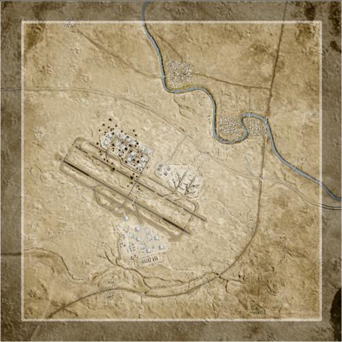

# Tallil Outskirts | 塔利尔郊区

> 文章作者：桀氓AlbertWensley

## AAS | 攻守有序

### Tallil Outskirts AAS_v1

切换代码： `AdminChangeLayer Tallil_AAS_v1`

预设代码： `AdminSetNextLayer Tallil_AAS_v1`

光照情况： 正午

旗点数量： 7

双方阵营： 美军 VS 俄军

初始票数： 350  -  350

??? abstract "美军载具"
    - M939 Logistics Truck *3
    - M2A3 *1
    - M1126 CROWS M2 HB *2
    - M-ATV M2 HB *2
    - M1A2 *2
    - M939 Transport Truck *1
    - UH-60M *2

??? abstract "俄军载具"
    - KamAZ 5350 Logistics Truck *3
    - BTR-82A *2
    - T-72B3 *2
    - BMP-2 *1
    - KamAZ 5350 Transport Truck *1
    - Tigr-M Kord *2
    - Mi-8 *2

### Tallil Outskirts AAS v2

切换代码： `AdminChangeLayer Tallil_AAS_v2`

预设代码： `AdminSetNextLayer Tallil_AAS_v2`

光照情况： 正午

旗点数量： 7

双方阵营： 美军 VS 中东

初始票数： 350  -  350

??? abstract "美军载具"
    - M939 Logistics Truck *3
    - M2A3 *1
    - M1126 CROWS M2 HB *2
    - M-ATV M2 HB *2
    - M1A2 *2
    - M939 Transport Truck *1
    - M-ATV TOW *1
    - UH-60M *2

??? abstract "中东载具"
    - Ural-4320 Logistics Truck *2
    - BMP-1 *1
    - MT-LBM 6MA *1
    - T-72S *2
    - BMP-2 *1
    - Simir Kord *2
    - Ural-4320 Transport Truck *1
    - Simir Kornet *1
    - Mi-17 *2
    - Simir Logi *2

## Invasion | 侵攻

### Tallil Outskirts Invasion v1

切换代码： `AdminChangeLayer Tallil_Invasion_v1`

预设代码： `AdminSetNextLayer Tallil_Invasion_v1`

光照情况： 黎明

旗点数量： 5

双方阵营： 美军 VS 俄军

初始票数： 200  -  800

??? abstract "美军载具"
    - M2A3 *2
    - M1126 CROWS M2 HB *1
    - M1A2 *2
    - M939 Logistics Truck *3
    - M939 Transport Truck *1
    - M-ATV M2 HB *1
    - UH-60M *2

??? abstract "俄军载具"
    - KamAZ 5350 Transport Truck *1
    - KamAZ 5350 Logistics Truck *3
    - Tigr-M Kord *1
    - BRDM-2 Spandrel *1
    - BMP-2 *1
    - BTR-82A *2
    - T-72B3 *2
    - Mi-8 *2

### Tallil Outskirts Invasion v2

切换代码： `AdminChangeLayer Tallil_Invasion_v2`

预设代码： `AdminSetNextLayer Tallil_Invasion_v2`

光照情况： 黎明

旗点数量： 4

双方阵营： 俄军 VS 叛军

初始票数： 200  -  700

??? abstract "俄军载具"
    - KamAZ 5350 Logistics Truck *3
    - KamAZ 5350 Transport Truck *1
    - BTR-82A *2
    - BRDM-2 *1
    - Tigr-M RWS Kord *1
    - BRDM-2 Spandrel *1
    - BMP-2 *1

??? abstract "叛军载具"
    - Logistics Pickup Truck *3
    - Transport Pickup Truck *1
    - Technical ZU-23-2 *1
    - Armored Technical DShK *1
    - Technical SPG-9 *1
    - Technical Mortar *1
    - Minsk 400 *3
    - BMP-1 *1
    - T-62 *1

### Tallil Outskirts Invasion v3

切换代码： `AdminChangeLayer Tallil_Invasion_v3`

预设代码： `AdminSetNextLayer Tallil_Invasion_v3`

光照情况： 黎明

旗点数量： 5

双方阵营： 美军 VS 叛军

初始票数： 200  -  800

??? abstract "美军载具"
    - M939 Transport Truck *1
    - M939 Logistics Truck *3
    - M-ATV M240 *2
    - M1126 CROWS M2 HB *2
    - M2A3 *1
    - UH-60M *1

??? abstract "叛军载具"
    - Transport Pickup Truck *1
    - Logistics Pickup Truck *1
    - Ural-375D Logistics Truck *1
    - Technical DShK Shielded *1
    - Armored Technical DShK *1
    - Ural-375D ZU-23-2 *1
    - Technical Mortar *1
    - Technical UB-32 *2
    - Armored Technical SPG-9 *1
    - Technical BMP-1 *1
    - BMP-1 *1
    - Minsk 400 *1

### Tallil Outskirts Invasion v4

切换代码： `AdminChangeLayer Tallil_Invasion_v4`

预设代码： `AdminSetNextLayer Tallil_Invasion_v4`

光照情况： 黎明

旗点数量： 4

双方阵营： 澳军 VS 叛军

初始票数： 200  -  800

??? abstract "澳军载具"
    - HX60 Transport Truck *1
    - HX60 Logistics Truck *3
    - PMV RWS M2 *2
    - ASLAV *2
    - M1A1 *2

??? abstract "叛军载具"
    - Logistics Pickup Truck *3
    - Transport Pickup Truck *1
    - Technical ZU-23-2 *1
    - Armored Technical DShK *1
    - Technical SPG-9 *1
    - Technical Mortar *1
    - Minsk 400 *3
    - BMP-1 *1
    - T-62 *2

## RAAS | 随机攻守

### Tallil Outskirts RAAS v1

切换代码： `AdminChangeLayer Tallil_RAAS_v1`

预设代码： `AdminSetNextLayer Tallil_RAAS_v1`

光照情况： 正午

旗点数量： 6

双方阵营： USMC VS 中东

初始票数： 350  -  350

??? abstract "USMC载具"
    - M939 Transport Truck *1
    - AAVC-7A1 Logistics Vehicle *2
    - M1151 M2 Open Doors *3
    - UH-1Y *1

??? abstract "中东载具"
    - Ural-4320 Transport Truck *1
    - Ural-4320 Logistics Truck *2
    - Simir Logi *2
    - Simir MG3 *2
    - Simir Kord *2
    - Mi-17 *1

### Tallil Outskirts RAAS v2

切换代码： `AdminChangeLayer Tallil_RAAS_v2`

预设代码： `AdminSetNextLayer Tallil_RAAS_v2`

光照情况： 黎明

旗点数量： 6

双方阵营： 美军 VS 中东

初始票数： 300  -  300

??? abstract "美军载具"
    - M939 Logistics Truck *3
    - M939 Transport Truck *1
    - M1126 CROWS M2 HB *2
    - M-ATV M2 HB *1
    - M-ATV TOW *1
    - M-ATV CROWS M2 HB *1
    - UH-60M *2

??? abstract "中东载具"
    - Ural-4320 Logistics Truck *2
    - Ural-4320 Transport Truck *1
    - BRDM-2 *1
    - MT-LBM 6MA *1
    - MT-LB VMK *1
    - BRDM-2 Spandrel *1
    - Mi-17 *2
    - Simir Kord *1
    - Simir Kornet *1
    - Simir Logi *2
    - Simir MG3 *1

### Tallil Outskirts RAAS v3

切换代码： `AdminChangeLayer Tallil_RAAS_v3`

预设代码： `AdminSetNextLayer Tallil_RAAS_v3`

光照情况： 正午

旗点数量： 7

双方阵营： 美军 VS 俄军

初始票数： 300  -  300

??? abstract "美军载具"
    - M939 Logistics Truck *3
    - M-ATV M2 HB *1
    - M1126 CROWS M2 HB *2
    - M2A3 *1
    - M1A2 *1
    - M939 Transport Truck *1
    - M-ATV CROWS M240 *1
    - UH-60M *2

??? abstract "俄军载具"
    - KamAZ 5350 Logistics Truck *3
    - BTR-82A *2
    - T-72B3 *1
    - Tigr-M RWS Kord *1
    - KamAZ 5350 Transport Truck *1
    - BMP-2 *1
    - BRDM-2 *1
    - Mi-8 *2

### Tallil Outskirts RAAS v4

切换代码： `AdminChangeLayer Tallil_RAAS_v4`

预设代码： `AdminSetNextLayer Tallil_RAAS_v4`

光照情况： 正午

旗点数量： 6

双方阵营： 英军 VS 俄军

初始票数： 350  -  350

??? abstract "英军载具"
    - HX60 Transport Truck *1
    - HX60 Logistics Truck *3
    - LPPV RWS *1
    - FV432 *1
    - FV107 *2
    - FV520 CTAS40 *1
    - FV4034 *2
    - SA330 *2

??? abstract "俄军载具"
    - KamAZ 5350 Transport Truck *1
    - KamAZ 5350 Logistics Truck *3
    - Tigr-M RWS Kord *1
    - BRDM-2 *1
    - BTR-82A *2
    - T-72B3 *2
    - BMP-2 *1
    - Mi-8 *2

### Tallil Outskirts RAAS v5

切换代码： `AdminChangeLayer Tallil_RAAS_v5`

预设代码： `AdminSetNextLayer Tallil_RAAS_v5`

光照情况： 正午

旗点数量： 6

双方阵营： 澳军 VS 俄军

初始票数： 350  -  350

??? abstract "澳军载具"
    - HX60 Transport Truck *1
    - HX60 Logistics Truck *3
    - PMV RWS M2 *2
    - ASLAV *2
    - M1A1 *2
    - MRH-90 *1
    - UH-60M *1

??? abstract "俄军载具"
    - KamAZ 5350 Transport Truck *1
    - KamAZ 5350 Logistics Truck *3
    - Tigr-M RWS Kord *1
    - BRDM-2 *1
    - BTR-82A *2
    - T-72B3 *2
    - Mi-8 *2

### Tallil Outskirts RAAS v6

切换代码： `AdminChangeLayer Tallil_RAAS_v6`

预设代码： `AdminSetNextLayer Tallil_RAAS_v6`

光照情况： 正午

旗点数量： 6

双方阵营： 加军 VS 俄军

初始票数： 350  -  350

??? abstract "加军载具"
    - MSVS Transport Truck *1
    - MSVS Logistics Truck *3
    - LUVW M2 *2
    - TAPV M2 *1
    - M113A3 TLAV *1
    - Coyote *1
    - LAV 6 *2
    - Leopard 2A6M CAN *2
    - CH-146 *2

??? abstract "俄军载具"
    - KamAZ 5350 Transport Truck *1
    - KamAZ 5350 Logistics Truck *3
    - Tigr-M Kord *2
    - Tigr-M RWS Kord *1
    - MT-LBM 6MA *1
    - BTR-82A *3
    - T-72B3 *2
    - Mi-8 *2

### Tallil Outskirts RAAS v7

切换代码： `AdminChangeLayer Tallil_RAAS_v7`

预设代码： `AdminSetNextLayer Tallil_RAAS_v7`

光照情况： 正午

旗点数量： 5

双方阵营： 加军 VS 中东

初始票数： 350  -  350

??? abstract "加军载具"
    - MSVS Transport Truck *1
    - MSVS Logistics Truck *2
    - LUVW Logistics *2
    - M113A3 TLAV *1
    - Coyote *2
    - Leopard 2A6M CAN *3
    - CH-146 *1

??? abstract "中东载具"
    - Ural-4320 Transport Truck *1
    - Ural-4320 Logistics Truck *2
    - Simir Logi *2
    - MT-LBM 6MA *2
    - BMP-1 *2
    - T-72S *3
    - Mi-17 *1

## Seed | 暖服

### Tallil Outskirts Seed v1

切换代码： `AdminChangeLayer Tallil_Seed_v1`

预设代码： `AdminSetNextLayer Tallil_Seed_v1`

光照情况： 正午

旗点数量： 6

双方阵营： USMC VS 叛军

初始票数： 300  -  300

??? abstract "USMC载具"
    - M939 Logistics Truck *2
    - AAVC-7A1 Logistics Vehicle *1
    - M1151 M2 Open Doors *1

??? abstract "叛军载具"
    - Minsk 400 *1
    - Logistics Pickup Truck *3
    - Shitty Technical DShK *1

### Tallil Outskirts Seed v2

切换代码： `AdminChangeLayer Tallil_Seed_v2`

预设代码： `AdminSetNextLayer Tallil_Seed_v2`

光照情况： 正午

旗点数量： 6

双方阵营： 加军 VS 叛军

初始票数： 300  -  300

??? abstract "加军载具"
    - LUVW Logistics *3
    - LUVW Transport *3

??? abstract "叛军载具"
    - Minsk 400 *1
    - Transport Pickup Truck *3
    - Logistics Pickup Truck *3

## Skirmish | 遭遇战

### Tallil Outskirts Skirmish v1

切换代码： `AdminChangeLayer Tallil_Skirmish_v1`

预设代码： `AdminSetNextLayer Tallil_Skirmish_v1`

光照情况： 正午

旗点数量： 6

双方阵营： 美军 VS 俄军

初始票数： 150  -  150

??? abstract "美军载具"
    - M939 Transport Truck *3
    - M939 Logistics Truck *3
    - M-ATV M240 *1

??? abstract "俄军载具"
    - KamAZ 5350 Transport Truck *3
    - KamAZ 5350 Logistics Truck *3
    - Tigr-M Kord *1

### Tallil Outskirts Skirmish v2

切换代码： `AdminChangeLayer Tallil_Skirmish_v2`

预设代码： `AdminSetNextLayer Tallil_Skirmish_v2`

光照情况： 黎明

旗点数量： 5

双方阵营： 美军 VS 俄军

初始票数： 150  -  150

??? abstract "美军载具"
    - M939 Transport Truck *3
    - M939 Logistics Truck *3
    - M-ATV M240 *1

??? abstract "俄军载具"
    - KamAZ 5350 Transport Truck *3
    - KamAZ 5350 Logistics Truck *3
    - Tigr-M Kord *1

### Tallil Outskirts Skirmish v3

切换代码： `AdminChangeLayer Tallil_Skirmish_v3`

预设代码： `AdminSetNextLayer Tallil_Skirmish_v3`

光照情况： 正午

旗点数量： 5

双方阵营： 民兵 VS 叛军

初始票数： 200  -  200

??? abstract "民兵载具"
    - Minsk 400 *1
    - Logistics Pickup Truck *3
    - Ural-375D ZU-23-2 *1
    - Technical UB-32 *1
    - Technical DShK Shielded *3
    - MT-LB ZU-23-2 *1
    - Technical SPG-9 *1
    - BMP-1 ZU-23-2 *1

??? abstract "叛军载具"
    - Minsk 400 *1
    - Logistics Pickup Truck *3
    - Ural-375D ZU-23-2 *1
    - Technical UB-32 *1
    - Armored Technical SPG-9 *1
    - Armored Technical DShK *2
    - Technical M2 HB *1
    - Technical BMP-1 *1
    - Technical ZU-23-2 *1

## Tanks | 载具大战

### Tallil Outskirts Tanks v1

切换代码： `AdminChangeLayer Tallil_Tanks_v1`

预设代码： `AdminSetNextLayer Tallil_Tanks_v1`

光照情况： 正午

旗点数量： 5

双方阵营： 美军 VS 中东

初始票数： 300  -  300

??? abstract "美军载具"
    - M939 Transport Truck *1
    - M939 Logistics Truck *1
    - M2A3 *1
    - M1A2 *1

??? abstract "中东载具"
    - Ural-4320 Transport Truck *1
    - Simir Logi *1
    - Ural-4320 Logistics Truck *1
    - BMP-1 *1
    - BMP-2 *1
    - T-62 *1

### Tallil Outskirts Tanks v2

切换代码： `AdminChangeLayer Tallil_Tanks_v2`

预设代码： `AdminSetNextLayer Tallil_Tanks_v2`

光照情况： 正午

旗点数量： 5

双方阵营： 美军 VS 俄军

初始票数： 300  -  300

??? abstract "美军载具"
    - M939 Transport Truck *1
    - M939 Logistics Truck *1
    - M-ATV TOW *1
    - M1A2 *1

??? abstract "俄军载具"
    - KamAZ 5350 Transport Truck *1
    - KamAZ 5350 Logistics Truck *1
    - BRDM-2 Spandrel *1
    - T-72B3 *1

## TA | 精准打击

### Tallil Outskirts TA v1

切换代码： `AdminChangeLayer Tallil_TA_v1`

预设代码： `AdminSetNextLayer Tallil_TA_v1`

光照情况： 正午

旗点数量： 2

双方阵营： 美军 VS 美军

初始票数： 34  -  34

??? abstract "美军载具"
    - M1A2 *2

??? abstract "美军载具"
    - M1A2 *2

## TC | 领土控制

### Tallil Outskirts TC v1

切换代码： `AdminChangeLayer Tallil_TC_v1`

预设代码： `AdminSetNextLayer Tallil_TC_v1`

光照情况： 正午

旗点数量： 61

双方阵营： 美军 VS 俄军

初始票数： 500  -  500

??? abstract "美军载具"
    - M939 Logistics Truck *3
    - M-ATV M2 HB *1
    - M1126 CROWS M2 HB *2
    - M2A3 *1
    - M1A2 *2
    - M939 Transport Truck *1
    - UH-60M *2

??? abstract "俄军载具"
    - KamAZ 5350 Logistics Truck *3
    - BTR-82A *2
    - T-72B3 *2
    - BMP-2 *1
    - KamAZ 5350 Transport Truck *1
    - Tigr-M Kord *1
    - Mi-8 *2