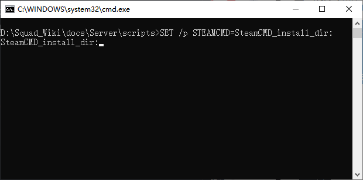
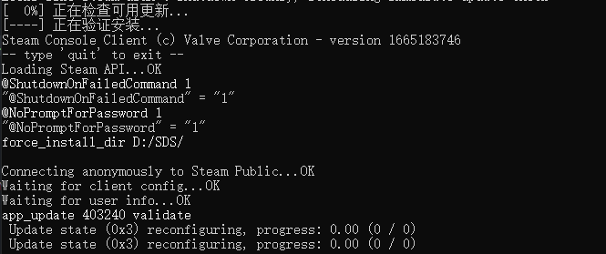
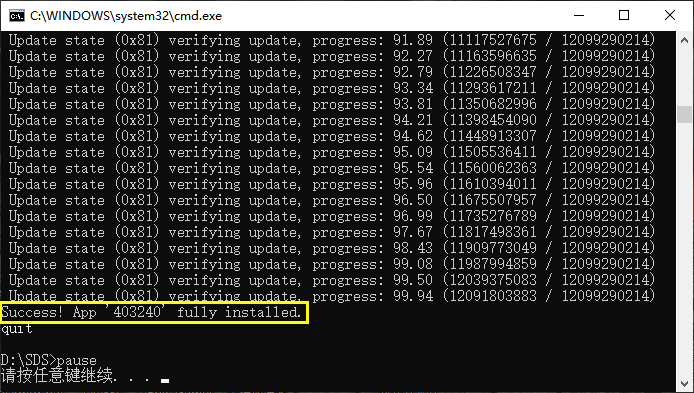

# 服务器安装

> 文章作者：桀氓AlbertWensley

本文将详细介绍 Squad 服务器的安装流程。

> 由于 Microsoft 和 Steam 在国内可访问性较差，因此本文中的软件下载可能需要科学上网；服务器程序下载可能需要 Steam 加速工具（网易UU加速器等）；

## 准备

- 下载并安装 [Visual C++ Redistributable for Visual Studio 2013 vc_redist.x64.exe](https://www.microsoft.com/en-us/download/details.aspx?id=40784)

- 下载并安装 [Visual C++ Redistributable for Visual Studio 2015 vc_redist.x64.exe](https://www.microsoft.com/en-us/download/details.aspx?id=48145)

- 下载并安装 [DirectX End-User Runtimes (June 2010)](https://www.microsoft.com/en-us/download/details.aspx?id=8109)

- 下载 [steamcmd.zip](https://steamcdn-a.akamaihd.net/client/installer/steamcmd.zip)

## 安装

1. 解压 steamcmd.zip。

    本文以解压到 C:\steamcmd\ 为例。

2. 下载 `update.bat` 至你要安装 Squad 服务端的目录（本文以 D:\SDS\ 为例）。

    点此下载 [update.bat](./scripts/update.bat).

    ```bat title="update.bat" linenums="1"
    SET /p STEAMCMD=SteamCMD_install_dir: 
    %STEAMCMD% +@ShutdownOnFailedCommand 1 +@NoPromptForPassword 1 +force_install_dir %~dp0% +login anonymous +app_update 403240 validate +quit
    pause
    ```

2. 双击运行 `update.bat`。

    脚本显示如图所示：

    {loading=lazy width=80%}

    输入你的 `steamcmd.exe` 安装路径并按 ++enter++ 键。

    > 在示例中，此路径为 C:\steamcmd\steamcmd.exe。

    如果出现以下界面，则证明你的 Squad 服务端已开始下载。

    {loading=lazy width=80%}

    !!! failure "Steam 访问性问题"

        Steam 在中国大陆的访问性较差，建议有条件的服主安装前就打开加速工具。

        如果出现以下几种情况，则必须打开加速工具：
            
        1. 脚本在 `正在检查可用更新` 或`Connecting anonymously to Steam Public...` 时报错并退出，请打开 Steam 加速工具后再次运行。

        2. `Update state (0x61) downloading, progress: X.XX(XXXXXXX/120XXXXXXXX)` 输出的 X 数值基本不变，代表下载速度极慢，请打开 Steam 加速工具以提升下载速度。

3. 等待脚本执行完成......

    Squad 服务端下载包大小约为 12G，时间较长，请耐心等待。

    脚本运行正常完成后应如下图所示：
    
    {loading=lazy width=80%}

    如果脚本显示 `Success! App '403240' fully installed.`（图中框选内容），那么 Squad 服务端就已正确安装在了服务器上。

为了让服务器以我们预想的方式运行，请转到下一篇：[服务器配置](./Configuration)。