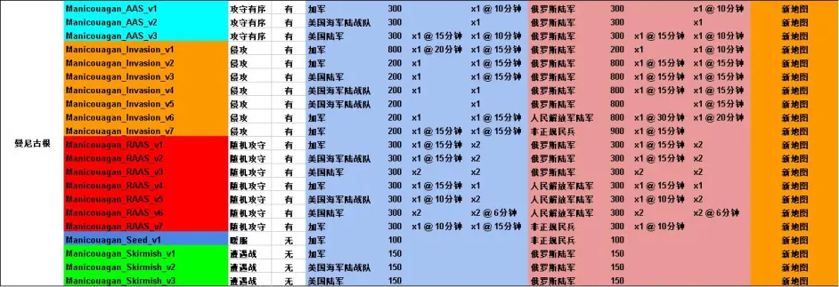

# 战术小队版本V4.3更新日志

> 文章作者：飞行ACV

## 新地图“曼尼古根”

新增地图“曼尼古根”，这是Manic-5地图的完全重制版。 

### 地图列表

{loading=lazy witdh=100%}

- Manicouagan AAS v1 – 加军 vs 俄罗斯陆军
- Manicouagan AAS v2 – 美国海军陆战队 vs 俄罗斯陆军
- Manicouagan AAS v3 – 美国陆军 vs 俄罗斯陆军
- Manicouagan Invasion v1 – 加军 vs 俄罗斯陆军 (俄罗斯陆军 攻击方)
- Manicouagan Invasion v2 – 加军 vs 俄罗斯陆军 (加军 攻击方)
- Manicouagan Invasion v3 – 美国陆军 vs 俄罗斯陆军
- Manicouagan Invasion v4 – 美国海军陆战队 vs 俄罗斯陆军
- Manicouagan Invasion v5 – 美国海军陆战队 vs 俄罗斯陆军 (水淹地图)
- Manicouagan Invasion v6 – 加军 vs 人民解放军陆军
- Manicouagan Invasion v7 – 加军 vs 非正规民兵
- Manicouagan RAAS v1 – 加军 vs 俄罗斯陆军
- Manicouagan RAAS v2 – 美国海军陆战队 vs 俄罗斯陆军
- Manicouagan RAAS v3 – 美国陆军 vs 俄罗斯陆军
- Manicouagan RAAS v4 – 加军 vs 人民解放军陆军
- Manicouagan RAAS v5 – 美国海军陆战队 vs 人民解放军陆军
- Manicouagan RAAS v6 – 美国陆军 vs 人民解放军陆军
- Manicouagan RAAS v7 – 加军 vs 非正规民兵
- Manicouagan Seed v1 – 加军 vs 非正规民兵
- Manicouagan Skirmish v1 – 加军 vs 俄罗斯陆军
- Manicouagan Skirmish v2 – 美国海军陆战队 vs 俄罗斯陆军
- Manicouagan Skirmish v3 – 美国陆军 vs 俄罗斯陆军 

此地图将替换Manic-5地图，该地图将不再可玩，也不会在SDK中提供。 

## 服务器标记

服主能使用我们提供的标记列表来标记自己的服务器。

这些标记可在服务器浏览器中快速找到服务器。

您可以通过更新后的筛选面板筛选标记。

!!! example "标记类型"
    - 语言
    - 游戏模式
    - 游戏风格
        - 轻松愉快 - 交流与协调，玩得开心！
        - 全力以赴 - 着眼于目标，为了胜利！
        - 军事模拟 - 战术与规划，强度对局！
    - 经验偏好
        - 新手友好 - 探索游戏并了解游戏规则
        - 经验优先 - 您应该知道游戏机制和常见服务器规则
    - 地图轮换类型
        - 设置轮换
        - 地图投票 - 对于使用自己的地图投票系统的服务器
    注意：未标记的服务器只会在您的服务器浏览器筛选器为默认值（或未筛选）时显示。 

### 服务器浏览器

除了标记系统外，服务器浏览器还有新的选项，可让您快速返回您喜欢的服务器：收藏夹 | 最近游戏 

## 查找比赛

你可以在主菜单点击“寻找比赛”按钮来搜索服务器。

“搜索偏好”菜单，可以帮助你缩小你想要玩的服务器类型。

除了标签和游戏模式之外，搜索偏好还包括：

- 寻找比赛类型
- 多选（默认） - 将显示3个可选的服务器
- 自动 - 连接到第一个找到的服务器
- 最大延迟
- 最小玩家人数
- 比赛持续时间

关于“寻找比赛”如何工作的其他注意事项：

- 只有在你安装了相应的模组时才显示模组服务器。
- 不显示已满员的服务器 

## 重新设计主菜单用户界面

我们很高兴地宣布，我们的主菜单进行了新的视觉更新。我们重新设计了界面，使其更加简洁、现代化，同时使导航更加容易。新的主菜单有更新的图形和动画，提高了用户体验。我们希望您喜欢我们的主菜单新外观。

## 民兵重做

### 兵种配置

=== "指挥支援"

    - 小队长 01
        - AKS-74U + 机瞄 + 45发弹匣
        - 2x RGD-5 破片手雷

    - 小队长 02
        - M4 + M68瞄具
        - 2x RGD-5 破片手雷

    - 小队长 03
        - AKS-74 + 1P29瞄具
        - 2x RGD-5 破片手雷

        解锁人数：2

    - 小队长 04
        - AK74 + GP25 + 1P63 瞄具
        - 2x 40mm 高爆榴弹
        - 1x RKG-3 反坦克手雷

        解锁人数：3

    - 小队长 05
        - AK74 + GP25 + 1P78瞄具
        - 2x 40mm 高爆榴弹

        解锁人数：6

    - 医疗兵 01
        - AKS-74U
        - 2x RGD-5 破片手雷

    - 医疗兵 02
        - AKS-74 + 1P29 瞄具
        - 1x RGD-5 破片手雷

=== "直接战斗"

    - 步枪兵 01
        - FAL
        - 2x RGD-5 破片手雷

    - 步枪兵 02
        - M4
        - 2x RGD-5 破片手雷

    - 步枪兵 03
        - AKS-74 + 1P63瞄具
        - 2x RGD-5 破片手雷

    - 步枪兵 04
        - M4 + M68 瞄具
        - 2x RGD-5 破片手雷

    - 步枪兵 05
        - AKS-74 + 1P78 瞄具
        - 1x RGD-5 破片手雷

    - 步枪兵 06
        - SKS + PU 瞄具
        - 2x RGD-5 破片手雷

    - 伏击兵 01
        - FAL
        - 5x 高爆枪榴弹
        - 1x 单兵伪装网

    - 伏击兵 02
        - M4
        - 2x RGD-5 破片手雷
        - 2x RKG-3 反坦克手雷
        - 1x 单兵伪装网

    - 自动步枪兵 01
        - Minimi【无曳光弹】
        - 1x RGD-5 破片手雷

=== "火力支援"

    - 渗透兵 01
        - AKS-74U + 45发弹匣
        - Vz 61蝎式
        - 2x RGD-5 破片手雷
        - 4x RKG-3 反坦克手雷

    - 自动步枪兵 02
        - RPK-74【无曳光弹】 + 1P78瞄具

    - 榴弹兵- 01
        - M4
        - 2x RGD-5 破片手雷
        - 5x RPG-7 破片手雷

    - 榴弹兵 02
        - AK74 + GP25
        - 10x 40mm 高爆榴弹

    - 轻型反坦克兵 01
        - FAL
        - 5x 破甲枪榴弹

    - 轻型反坦克兵 02
        - AKS-74 + 1P29瞄具
        - 2x RPG-7 破甲弹
        - 2x RPG-7 破片弹

    - 精准射手 01
        - SVD
        - 1x RGD-5破片手雷

=== "设备专家"

    - 机枪手 01
        - PKM【无曳光弹】 + 1P29瞄具

    - 重型反坦克兵 01
        - AKS-74U
        - 2x RPG-7 串联破甲弹
        - 2x RPG-7 破片手雷

    - 重型反坦克兵 02
        - FAL
        - 2x RPG-29 串联破甲弹

    - 工兵 01
        - AKS-74U
        - 3x 定时炸药
        - 3x TM62反坦克地雷

### 新武器

#### FAL 步枪榴弹

民兵现在可以为他们的 FAL 步枪使用步枪榴弹。根据兵种的不同，玩家可使用破片和破甲枪榴弹。由于有效射程有限，这些枪榴弹比其他阵营的下挂榴弹有更大的杀伤力。

#### RKG-3 反坦克手榴弹

时光倒流，RKG-3 反坦克手榴弹现在已经回到了游戏中。当扔向空中时，RKG-3 将部署降落伞，使自身弹头朝下以损坏其接触到的载具（不会对载具造成溅射伤害）。这种手榴弹对步兵的杀伤效果有限，目前无法破坏载具部件（例如：引擎，履带，弹药架，这是一个已知的问题）。

#### AK 系列重新装填动画

民兵获得了一组新的 AK 系列（AK-74、AKM 等）武器的重新装填动画，这将使它们的重新装填速度略微降低。战术换弹（当前弹夹仍有弹药）将看到当前弹夹迅速被一个已经握在手中的新弹夹替换，而空弹装填（当前弹夹中没有弹药）将描绘被俗称为“伊拉克重新装填”的动作。这些新的动画也适用于叛军，但使用 AK 系列武器的正规军将继续使用原始的装填动画。

#### AK 系列金属瞄具

除了新的重新装填动画外，我们还调整了使用光学瞄具的AK74、AKM、SKS、AKS74U、Mosin、PKM、PKP和PPSH的瞄具图像，以防止武器被歪曲。这也将瞄具的图像更靠近现实，但我们觉得在真实感和可用性之间找到适当的平衡很难，如果完全还原机瞄，很多玩家会非常不适应。

### 新载具

#### BM-21 “冰雹”火箭炮

BM-21 “冰雹”是第一个添加到游戏中的 MLRS（多管火箭系统），可以说是我们添加的第一个真正的自行火炮。它发射强大的 122 毫米火箭弹，最小安全距离为 100 米，最小射击距离为900米，最大射击距离为平坦地面上的 1500 米，并且只会出现在游戏中较大的地图上。

由于其在较短射程内的有效性有限，想要使冰雹获得最大收益，就需要与观察手密切交流和协调，以确保你击中目标密集的区域，并使火箭弹正中目标。冰雹可以有效杀伤开阔地抱团的步兵，敌方电台，或静止的轻型与中型载具。

#### 装甲乌拉尔卡车与皮卡

民兵将收到几种临时改装的装甲乌拉尔 375 卡车与现代皮卡。这些载具能为民兵的轻型载具提供更多保护，因为与正规军阵营相比，他们的载具阵容十分有限。仓促焊接的钢板将保护载具的部分乘员免受轻武器射击，尽管更大口径的弹药仍能击穿防护。

当无意中撞上敌方步兵时，装甲载具将为乘员提供有限的生存能力。装甲皮卡仍然可以通过伏击敌人或用于防御阵地来发挥最大的用处。装甲乌拉尔卡车将为民兵提供更可靠的运输和补给支持，因为他们将依赖补给来进行防御专业化，也因为他们没有直升机。

- 装甲乌拉尔 375 运输车
- 装甲乌拉尔 375 补给车
- 装甲武装载具运输车
- 装甲武装载具补给车
- 装甲武装载具 M2
- 装甲武装载具 SPG-9
- 装甲武装载具 DSHK

#### BMP-1 和 SPG-9 更新

在 4.3 版本中，我们调整了 BMP-1 的 2A28 “雷鸣”主炮和 SPG-9 无后坐力炮的最小安全距离和后坐力。最小安全距离从 35 米减少到 6 米，后坐力减小，这些变化应该会使这些武器在战斗中更加有效，并使它们的价值更符合真实性。

#### 新的旗帜和角色语音

民兵现在有一个新的旗帜和更新的角色语音。

#### 新的载具迷彩

民兵载具获得了新的涂装，我们更新了他们的迷彩图案，使它们看起来更加真实！

### 新部署物

#### ZIS-3 野战炮阵地

ZIS-3 野战炮是第一个被添加到游戏中的野战炮。它是一个武器阵地，最多可以在非正规民兵部队 FOB 内建造两个。能够发射提供破片弹，破甲弹和烟雾弹，因此对远距离的步兵和载具都很有效，但长时间使用会快速消耗 FOB 的弹药补给。

ZIS-3 最适用于伏击阵地，掩护据点或视线开阔的阵地，因为反击火力将很难迅速杀伤武器操作员来使阵地丧失战斗力。这种武器是第二次世界大战的遗物，因此它的破甲弹弹缺乏现代武器的装甲穿透能力，但仍需加以利用以抵消非正规民兵部队缺乏常规重型载具的影响。

#### 装满泥土的弹药箱

在新的更新中，民兵将获得一系列由装满泥土的弹药箱制成的新防御工事。这些将是他们防御阵地的基本组成部分。除此之外，民兵仍然可以使用木墙和沙袋。

#### 坦克陷阱

坦克陷阱是一种廉价且可快速建造的防御工事，用于封锁道路、桥梁或关隘，以便对载具进行伏击。载具乘员将不得不下车并处理坦克陷阱以清理道路，因此最好将它们放置在民兵可以伏击载具或其车组下车的位置，否则这只会带来轻微的麻烦。

#### 坦克阵地

坦克阵地是一个防御工事，其主要目的是为装甲载具（例如 BMP-1 或 T-62）在平坦地面上提供额外的正面和侧面装甲保护。每个FOB最多可以建造两辆，这将使民兵的老一代装甲车能够与更好的正规装甲车相抗衡。

#### 伪装网

作为更新的一部分，非正规民兵部队将获得几个新的伪装网防御工事。倾斜伪装网、伪装网墙和伪装网天篷将提供多种选择，不但可以隐藏步兵的战斗位置，而且天篷特别大，足以隐藏载具，兵站，坦克阵地，或者可以用作诱饵来混淆敌方无人机。

伪装网防御工事将帮助民兵在关键的咽喉要道设立伏击阵地，或者加强更大的防御阵地。

## 系统和游戏更新

进一步改进了美国陆军士兵的视觉效果；

完全修复露天炮塔载具在深水中将玩家弹出；

重新建模的中型和大型弹药箱；

重新平衡机枪弹匣数量以整体增加班机/通机携带的弹药量；

从所有 RAAS 模式上移除了票数流血机制，除非所有旗帜都已被占领（每分钟仍然有扣60票的安乐死机制）；

SQ-17206 – 现在在 AAS，RAAS，Skirmish 模式中丢失目标点时，不会再扣 10 票了；

在暖服模式下，目标点现在只需要 1 名玩家即可夺取；

改进了双手手势动画；

为预览和自定义界面的士兵添加了空闲动画；

改进了PLA ZSL10轮式运兵车敞篷炮塔的相机动画；

为QJZ89遥控武器站添加沙漠迷彩；

## 常规漏洞修复

修复了与SQVehicleWeaponTOW相关的客户端崩溃；

修复了与USQEmotePlayer::OnEmoteEnded相关的客户端崩溃；

修复了与ScriptCore.cpp相关的客户端崩溃问题；

修复了与RetractBipod相关的客户端错误问题；

修复了商店和自定义界面上的几个视觉问题；

修复了使用表情或手势时的多个轻微视觉问题；

修复了可能导致两个手势在某些地图上无法正常工作的问题；

修复了一个问题，该问题可能会在从卧姿转换到立姿期间触发第三人称手势，导致玩家无法侧身和瞄准；

修复了一个问题，该问题可能会使玩家在使用捂脸表情时似乎像握着武器等物品；

修复了一个问题，该问题使用户无法在装备伪装石时使用鼓掌手势；

修正了火箭发射器动画的对齐问题；

修复了ASLAV在最大转速下没有引擎声音的问题；

修复了包括地形呼吸在内的多个地形性能问题；

修复了一个问题，该问题会导致在建造了 SPG-9 阵地后无法出现其图标；

修复了一个问题，如果在主基地内进入管理员相机，则会使玩家变得无敌；

修复了一个问题，当切换到任何榴弹弹药类型时，可能会导致C7A2 M203A1的枪管在第三人称中消失；

修复了一个问题，使得C9A2轻机枪的枪管在第三人称中不可见；

修正了 PF98 反坦克火箭发射器激光测距仪上不正确的中文文本；

修复了一个问题，导致子弹轨迹从士兵的胸部而不是他们的武器枪口产生；

修复了郊狼的碰撞体积问题；

修复了可能导致多个玩家的水花特效不一致的问题；

修复了与图形设置显示相关的几个问题；

修复了一个问题，该问题会在其他玩家离开太近时阻止弹药箱图标出现；

修复了 BRDM-2 拱肩的一个轻微视觉问题；

修复了 M38 DMR 的准星在第三人称中不可见的问题；

修复了M2A3 IFV林地版的炮塔在车辆被摧毁时切换到沙漠纹理的问题；

修复了AUS EF88步枪的瞄准器在第三人称视角下不可见的问题；

修复了部署界面的地面名称在极少情况下会阻碍重生按钮交互的问题；

修复了人物模型出现光泽和扭曲的问题；

修复了任务目标语音变为中立的问题；

修复了某些美军角色在第一人称和第三人称视角下袖子细节上的小差异；

修复了使用自由视角时，第一人称武器重新装填动画不同步的问题；

更新了ZTZ99A主战坦克武器选择顺序，使其与其他车辆的标准设置相同；

修正了多个开放式炮塔载具的工具提示不正确的问题；

修复了FV520 CTAS40 IFV在交互弹出窗口上被错误标记为“FV520 WCSP IFV”的问题；

## 地图更新和错误修复

=== "巴士拉"

    修正了一些小的视觉问题

=== "铁砧"

    修复了 AAS V2 上的光照问题

=== "黑色海岸"

    修正了几个小的视觉问题

    修复了可能导致 UH60 在埃塞克斯登陆舰上重生时爆炸的问题

    修复了 Subpen 目标点的几个视觉问题

    修复了玩家可能从 Subpen 发射井下的隐形洞中掉落的问题

    修复了打开和关闭径向菜单时导致客户端日志刷屏的问题

=== "乔拉"

    修复了可能导致墙壁出现缝隙的视觉问题

=== "费卢杰"

    修复了多个小的视觉问题

=== "鹅湾"

    修复了可能导致玩家和车辆卡在地图西侧湖中的景观问题

    修正了几个小的视觉问题

    修复了一个问题，该问题允许将收音机放置在精炼厂无法到达的地方

    修复了可能允许玩家在栅栏下方射击的问题

=== "格洛多克"

    修复了导致某些 PLA 车辆未出现在 RAASV12 主基地内的问题

=== "哈留"

    修复了与道路相关的小视觉问题

    修复了导致某些 RGF 车辆未出现在 RAASV5 主基地内的问题

=== "太平洋训练场"

    修复了 V2 上 USMC 有四个 LAV25 而不是两个的问题

=== "叶霍里夫卡"

    在 RAAS V10 上移动了错误放置的弹药箱

    修复了在 TC V3 上选择 RUS 主基地时可能导致玩家重生在屋顶上的问题

## SDK 更新和错误修复

更新 SDK 至 V4.3

更新模组版本至 V4.3。这需要使用 V4.3 SDK 重新制作模组，任何使用 V4.2 SDK 的模组都将与 V4.3 不兼容。

修复了玩家在主基地内进入管理员摄像头可能变得无敌的问题

!!! info "版权声明"
    本文章转载自[哔哩哔哩](https://www.bilibili.com)，由[飞行ACV](https://space.bilibili.com/162372711)创作的专栏[战术小队版本V4.3更新日志](https://www.bilibili.com/read/cv22408994)，本站转载已获作者授权，未经作者授权禁止转载或摘编。