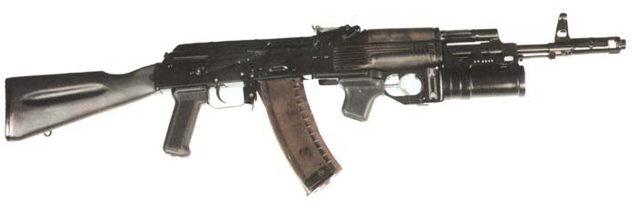

# GP-25

口径：40mm

射速：5~6rpm

在1960年代中后期，美国的M203枪挂式榴弹发射器成功研制并装备部队，枪挂式榴弹发射器既可以为步兵提供近距离火力支援，杀伤点面有生目标，又不影响枪械的正常射击。苏军对这种新式武器的战术性能很受刺激，于是苏联的工程师也于1970年代中期开始研制枪挂式榴弹发射器，第一个定型的产品为GP-15，随后在GP-15基础上进行改进，在1970年代未定型出GP-25，1981年开始装备部队，并在1984年首次在阿富汗战场露面。目前仍然是俄军的步兵班配备的武器，并在车臣大量使用。在俄军的俚语中，GP-25被称为“小型火炮”。

GP-25可以加装到俄罗斯各种现役或新研制的步枪和冲锋枪上，包括AK-47、AKM、AK-74以及新的尼柯诺夫AN94上。GP-25既可平射也可以曲射，用于摧毁50至400米射程内的暴露的单个或群体目标，或隐藏在障碍物后、掩体后、散兵坑内或小山丘背面的目标。

GP-25发射筒为钢制，内有12条右旋膛线，筒外有连接座，通过闩体、轴销和保险机与击发机连接，结构比M203更为简单。连接座上部有一个凹槽和一个固定卡扣，凹槽与枪管、刺刀、和通条配合，在尺寸设计上已经考虑了俄军列装的各种步枪和冲锋枪，因此不需要任何改变和适配都可以加装在各种武器上。安装时套在枪管上，把固定卡扣往里面压紧就可以使用，装卸时不需要作用工具，这是GP-25在GP-15上要的改进之一，GP-15是通过锁定销固定在枪身上的，装卸时需要专用工具。

GP-25有3道保险，第1道是位于击发机左侧的保险机；第2道是借助一个连杆锁住击针，只有当发射器装在步枪上才能使连杆解脱击落针；第3道则是发射管内有一个定位销与发射机连杆联动，只有当榴弹装填到位，定位销压下去时才能使连杆解脱击针。这也是在GP-15上的一项改进。扣压扳机时，扳机带动击针后移约10mm后释放击针，在击针簧的作用下完成击发过程。击发机左侧有退弹顶杆。GP-25的最大特点为前装式，没有弹膛，配用[VOG-25系列杀伤榴弹](http://pewpewpew.work/russain/gl/gp25gp30/vog25.htm)。

## 参考资料

[GP-25 枪挂式榴弹发射器 - 枪炮世界](http://pewpewpew.work/russain/gl/gp25gp30/gp25.htm)