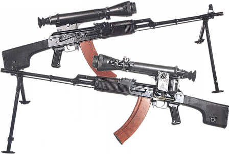

# RPK-74M

口径：5.45*39mm M74

弹匣容量：45rds

理论射速：600~650rpm

RPK-74M（俄文РПК-74М）轻机枪是[AK-74M](./AK-74M)的轻机枪型，其实就是在[RPK-74](http://pewpewpew.work/russain/kalash/ak/rpk74.htm)的基础上是采用了新的塑料护木和折叠式塑料枪托的改进型，同时还研制了有防滑纹和黑色的塑料弹匣。这个型号目前看来并未大量装备部队。

就像AK-74M有出口型[AK-100系列](http://pewpewpew.work/russain/kalash/ak100/ak100.htm)一样，RPK-74M也有两种出口型，分别为5.56 NATO口径的RPK-201和7.62X39口径的RPK-203。

## 参考资料

[RPK-74M - 枪炮世界](http://pewpewpew.work/russain/kalash/ak/rpk74m.htm)