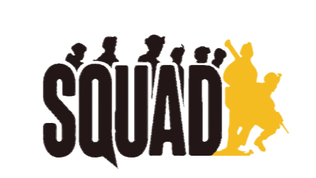

# 欢迎来到战术小队中文维基

!!! warning "我们期待着您的加入！"
    本项目的编辑团队现在只有寥寥几人，无法满足快速扩充内容的需要。
    我们期望能有更多的志愿者参与到工作中来，帮助进行文章的编辑与转载。
    详情请加QQ：321918223。
    我们期待着您的加入！

战术小队（Squad）是由 Offworld Industries 开发，在 Steam 平台上发售，由 KickStarter 资助的一款**在线、基于团队、以军事为主题的第一人称射击游戏**。

Squad 让多达 100 名玩家的团队在对局中决定如何进行前哨建设和人员部署，团队合作与沟通对于成功至关重要。

当前发布版本：4.0

战术小队中文维基致力于成为一个**开放且持续更新的战术小队非盈利性知识整合站点**，为各位玩家提供实用的游戏知识。本站为各位玩家准备了模式、载具、兵种以及阵营等游戏内容，帮助各位玩家快速深入的了解战术小队。

本项目受 [CTF Wiki](https://ctf-wiki.org/) 启发，在编写过程中参考了诸多资料，在此一并致谢。

如果您觉得本站对您有很大帮助，请考虑[投喂我们](./Intro/Support)。

!!! info "版权声明"
    本站点的所有文章内容，无特殊声明时，均在 [CC BY-SA 4.0](https://creativecommons.org/licenses/by-sa/4.0/deed.zh) 和 [SATA](https://github.com/zTrix/sata-license) 协议之条款下提供，附加条款亦可能应用。“SQ”与“SQUAD”徽标相关权利为其权利人所有，不受上述协议约束。

<figure markdown>
  [{height="100%" width="100%" }](https://www.netlify.com/)
  <figcaption>本项目托管于 Netlify</figcaption>
</figure>