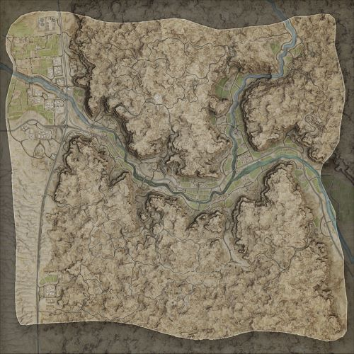

# Anvil | 铁砧

## AAS | 攻守有序

### Anvil AAS v1

切换代码： `AdminChangeLayer Anvil_AAS_v1`

预设代码： `AdminSetNextLayer Anvil_AAS_v1`

光照情况： 正午

旗点数量： 5

双方阵营： 澳军 VS 俄军

初始票数： 300  -  300

??? abstract "澳军载具"
    - HX60 Transport Truck *1
    - HX60 Logistics Truck *3
    - PMV Mag58 x3 *4
    - PMV RWS M2 *2
    - UH-60M *1

??? abstract "俄军载具"
    - KamAZ 5350 Transport Truck *1
    - KamAZ 5350 Logistics Truck *3
    - Tigr-M Kord *3
    - Tigr-M RWS Kord *2
    - BTR-80 *1
    - Mi-8 *1

### Anvil AAS v2

切换代码： `AdminChangeLayer Anvil_AAS_v2`

预设代码： `AdminSetNextLayer Anvil_AAS_v2`

光照情况： 黎明

旗点数量： 6

双方阵营： 澳军 VS 俄军

初始票数： 350  -  350

??? abstract "澳军载具"
    - HX60 Transport Truck *1
    - HX60 Logistics Truck *3
    - PMV Mag58 *2
    - PMV Mag58 x3 *2
    - PMV RWS M2 *1
    - ASLAV *2

??? abstract "俄军载具"
    - KamAZ 5350 Transport Truck *1
    - KamAZ 5350 Logistics Truck *3
    - Tigr-M Kord *3
    - Tigr-M RWS Kord *1
    - BTR-82A *2

## Invasion | 侵攻

### Anvil Invasion v1

切换代码： `AdminChangeLayer Anvil_Invasion_v1`

预设代码： `AdminSetNextLayer Anvil_Invasion_v1`

光照情况： 黎明

旗点数量： 6

双方阵营： 澳军 VS 叛军

初始票数： 200  -  800

??? abstract "澳军载具"
    - HX60 Transport Truck *1
    - HX60 Logistics Truck *3
    - PMV Mag58 *1
    - PMV Mag58 x3 *2
    - PMV RWS M2 *1

??? abstract "叛军载具"
    - Minsk 400 *2
    - Transport Pickup Truck *1
    - Logistics Pickup Truck *3
    - Ural-375D Logistics Truck *1
    - Technical DShK Shielded *2
    - Shitty Technical DShK *2
    - MT-LB ZU-23-2 *1
    - Armored Technical SPG-9 *1

### Anvil Invasion v2

切换代码： `AdminChangeLayer Anvil_Invasion_v2`

预设代码： `AdminSetNextLayer Anvil_Invasion_v2`

光照情况： 夜晚

旗点数量： 6

双方阵营： 澳军 VS 叛军

初始票数： 800  -  200

??? abstract "澳军载具"
    - HX60 Transport Truck *1
    - HX60 Logistics Truck *3
    - PMV Mag58 *1
    - PMV Mag58 x3 *2
    - PMV RWS M2 *1

??? abstract "叛军载具"
    - Minsk 400 *1
    - Transport Pickup Truck *1
    - Ural-375D Logistics Truck *1
    - Logistics Pickup Truck *3
    - Technical DShK Shielded *2
    - Shitty Technical DShK *1
    - Technical Mortar *1
    - MT-LB ZU-23-2 *1
    - Armored Technical SPG-9 *1

## RAAS | 随机攻守

### Anvil RAAS v1

切换代码： `AdminChangeLayer Anvil_RAAS_v1`

预设代码： `AdminSetNextLayer Anvil_RAAS_v1`

光照情况： 正午

旗点数量： 4

双方阵营： 俄军 VS 中东

初始票数： 400  -  400

??? abstract "俄军载具"
    - KamAZ 5350 Transport Truck *1
    - KamAZ 5350 Logistics Truck *3
    - Tigr-M Kord *2
    - BTR-82A *1
    - BMP-2 *1
    - T-72B3 *1
    - Mi-8 *1

??? abstract "中东载具"
    - Ural-4320 Transport Truck *1
    - Ural-4320 Logistics Truck *3
    - Simir MG3 *2
    - Simir Kord *2
    - MT-LBM 6MA *1
    - BMP-2 *1
    - T-72S *1
    - Mi-17 *1

### Anvil RAAS v2

切换代码： `AdminChangeLayer Anvil_RAAS_v2`

预设代码： `AdminSetNextLayer Anvil_RAAS_v2`

光照情况： 正午

旗点数量： 9

双方阵营： 加军 VS 中东

初始票数： 300  -  300

??? abstract "加军载具"
    - MSVS Transport Truck *1
    - MSVS Logistics Truck *3
    - M113A3 C6 *1
    - M113A3 M2 *1
    - M113A3 TLAV *2
    - Coyote *1
    - Leopard 2A6M CAN *1
    - CH-146 *1

??? abstract "中东载具"
    - Ural-4320 Transport Truck *1
    - Ural-4320 Logistics Truck *3
    - Simir MG3 *2
    - Simir Kord *2
    - MT-LBM 6MA *2
    - BMP-1 *1
    - T-72S *1
    - Mi-17 *1

### Anvil RAAS v3

切换代码： `AdminChangeLayer Anvil_RAAS_v3`

预设代码： `AdminSetNextLayer Anvil_RAAS_v3`

光照情况： 正午

旗点数量： 4

双方阵营： 澳军 VS 中东

初始票数： 400  -  400

??? abstract "澳军载具"
    - HX60 Transport Truck *1
    - HX60 Logistics Truck *3
    - PMV Mag58 *1
    - PMV Mag58 x3 *1
    - PMV RWS M2 *1
    - ASLAV *1
    - M1A1 *1
    - MRH-90 *1

??? abstract "中东载具"
    - Ural-4320 Transport Truck *1
    - Ural-4320 Logistics Truck *3
    - Simir MG3 *2
    - Simir Kord *2
    - MT-LBM 6MA *1
    - BMP-2 *1
    - T-72S *1
    - Mi-17 *1

### Anvil RAAS v4

切换代码： `AdminChangeLayer Anvil_RAAS_v4`

预设代码： `AdminSetNextLayer Anvil_RAAS_v4`

光照情况： 正午

旗点数量： 9

双方阵营： 澳军 VS 俄军

初始票数： 300  -  300

??? abstract "澳军载具"
    - HX60 Transport Truck *1
    - HX60 Logistics Truck *3
    - PMV Mag58 *1
    - PMV Mag58 x3 *1
    - ASLAV *2
    - M1A1 *2
    - MRH-90 *1

??? abstract "俄军载具"
    - KamAZ 5350 Transport Truck *1
    - KamAZ 5350 Logistics Truck *3
    - Tigr-M Kord *2
    - BTR-82A *2
    - T-72B3 *2
    - Mi-8 *1

## Skirmish | 遭遇战

### Anvil Skirmish v1

切换代码： `AdminChangeLayer Anvil_Skirmish_v1`

预设代码： `AdminSetNextLayer Anvil_Skirmish_v1`

光照情况： 正午&阴天

旗点数量： 5

双方阵营： 澳军 VS 俄军

初始票数： 200  -  200

??? abstract "澳军载具"
    - HX60 Transport Truck *3
    - HX60 Logistics Truck *3
    - PMV Mag58 *1

??? abstract "俄军载具"
    - KamAZ 5350 Transport Truck *3
    - KamAZ 5350 Logistics Truck *3
    - Tigr-M Kord *1

## TC | 领土控制

### Anvil TC v1

切换代码： `AdminChangeLayer Anvil_TC_v1`

预设代码： `AdminSetNextLayer Anvil_TC_v1`

光照情况： 正午&阴天

旗点数量： 56

双方阵营： 澳军 VS 俄军

初始票数： 400  -  400

??? abstract "澳军载具"
    - HX60 Transport Truck *1
    - HX60 Logistics Truck *3
    - PMV Mag58 *1
    - PMV Mag58 x3 *1
    - PMV RWS M2 *2
    - ASLAV *1

??? abstract "俄军载具"
    - KamAZ 5350 Transport Truck *1
    - KamAZ 5350 Logistics Truck *3
    - Tigr-M Kord *2
    - Tigr-M RWS Kord *2
    - BTR-82A *1