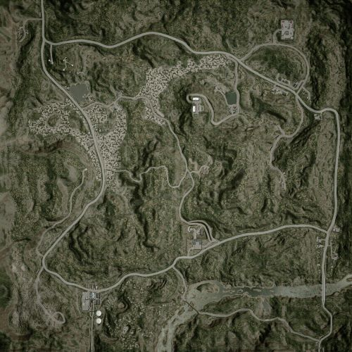

# Fool's Road | 傻瓜之路

## AAS | 攻守有序

### Fool's Road AAS v1

切换代码： `AdminChangeLayer Fools_Road_AAS_v1`

预设代码： `AdminSetNextLayer Fools_Road_AAS_v1`

光照情况： 下午&晴天

旗点数量： 5

双方阵营： 美军 VS 俄军

初始票数： 250  -  250

??? abstract "美军载具"
    - M939 Logistics Truck *3
    - M939 Transport Truck *1
    - M-ATV M2 HB *3
    - M-ATV CROWS M2 HB *1

??? abstract "俄军载具"
    - KamAZ 5350 Logistics Truck *3
    - Tigr-M Kord *2
    - Tigr-M RWS Kord *1
    - KamAZ 5350 Transport Truck *1
    - BRDM-2 *1

### Fool's Road AAS v2

切换代码： `AdminChangeLayer Fools_Road_AAS_v2`

预设代码： `AdminSetNextLayer Fools_Road_AAS_v2`

光照情况： 下午&晴天

旗点数量： 7

双方阵营： 美军 VS 俄军

初始票数： 250  -  250

??? abstract "美军载具"
    - M939 Logistics Truck *3
    - M-ATV M2 HB *1
    - M1126 CROWS M2 HB *3
    - M939 Transport Truck *1

??? abstract "俄军载具"
    - BTR-80 *1
    - KamAZ 5350 Logistics Truck *3
    - BTR-82A *2
    - KamAZ 5350 Transport Truck *1
    - Tigr-M RWS Kord *1

## Destruction | 摧毁

### Fool's Road Destruction v1

切换代码： `AdminChangeLayer Fools_Road_Destruction_v1`

预设代码： `AdminSetNextLayer Fools_Road_Destruction_v1`

光照情况： 下午&晴天

旗点数量： 2

双方阵营： 俄军 VS 民兵

初始票数： 200  -  1000

??? abstract "俄军载具"
    - BTR-80 *1
    - KamAZ 5350 Logistics Truck *3
    - BTR-82A *2
    - T-72B3 *1
    - KamAZ 5350 Transport Truck *1

??? abstract "民兵载具"
    - Technical DShK *1
    - Technical DShK Shielded *1
    - BRDM-2 Spandrel *1
    - BRDM-2 *1
    - Logistics Pickup Truck *3
    - Technical SPG-9 *2
    - MT-LB ZU-23-2 *1
    - Technical UB-32 *1
    - Transport Pickup Truck *1

## Invasion | 侵攻

### Fool's Road Invasion v1

切换代码： `AdminChangeLayer Fools_Road_Invasion_v1`

预设代码： `AdminSetNextLayer Fools_Road_Invasion_v1`

光照情况： 下午&晴天

旗点数量： 4

双方阵营： 英军 VS 民兵

初始票数： 200  -  700

??? abstract "英军载具"
    - HX60 Logistics Truck *3
    - FV510 *1
    - LPPV *1
    - LPPV RWS *1
    - HX60 Transport Truck *1
    - FV107 *1

??? abstract "民兵载具"
    - Technical DShK *1
    - BRDM-2 *1
    - Ural-375D Logistics Truck *2
    - Logistics Pickup Truck *3
    - Technical SPG-9 *1
    - Transport Pickup Truck *1
    - Minsk 400 *4
    - BMP-1 *1

## RAAS | 随机攻守

### Fool's Road RAAS v1

切换代码： `AdminChangeLayer Fools_Road_RAAS_v1`

预设代码： `AdminSetNextLayer Fools_Road_RAAS_v1`

光照情况： 下午&晴天

旗点数量： 5

双方阵营： 英军 VS 俄军

初始票数： 300  -  300

??? abstract "英军载具"
    - HX60 Logistics Truck *3
    - FV432 RWS *1
    - FV432 *2
    - HX60 Transport Truck *1
    - FV107 *1

??? abstract "俄军载具"
    - BRDM-2 *1
    - KamAZ 5350 Logistics Truck *3
    - KamAZ 5350 Transport Truck *1
    - BTR-80 *1
    - Tigr-M Kord *1
    - Tigr-M RWS Kord *2

### Fool's Road RAAS v2

切换代码： `AdminChangeLayer Fools_Road_RAAS_v2`

预设代码： `AdminSetNextLayer Fools_Road_RAAS_v2`

光照情况： 下午&晴天

旗点数量： 5

双方阵营： 英军 VS 俄军

初始票数： 250  -  250

??? abstract "英军载具"
    - HX60 Logistics Truck *3
    - FV432 *2
    - LPPV RWS *1
    - HX60 Transport Truck *1
    - FV432 RWS *1

??? abstract "俄军载具"
    - Tigr-M Kord *1
    - BRDM-2 *1
    - KamAZ 5350 Logistics Truck *3
    - KamAZ 5350 Transport Truck *1
    - Tigr-M RWS Kord *2

### Fool's Road RAAS v3

切换代码： `AdminChangeLayer Fools_Road_RAAS_v3`

预设代码： `AdminSetNextLayer Fools_Road_RAAS_v3`

光照情况： 下午&晴天

旗点数量： 6

双方阵营： 英军 VS 民兵

初始票数： 250  -  250

??? abstract "英军载具"
    - HX60 Logistics Truck *3
    - LPPV *1
    - FV510 UA *1
    - HX60 Transport Truck *1
    - FV432 *1
    - FV432 RWS *1

??? abstract "民兵载具"
    - Logistics Pickup Truck *2
    - Ural-375D Logistics Truck *2
    - MT-LBM 6MB *1
    - BMP-1 *1
    - Transport Pickup Truck *1
    - MT-LB ZU-23-2 *1
    - Technical DShK *1
    - Technical SPG-9 *1

### Fool's Road RAAS v4

切换代码： `AdminChangeLayer Fools_Road_RAAS_v4`

预设代码： `AdminSetNextLayer Fools_Road_RAAS_v4`

光照情况： 下午&晴天

旗点数量： 5

双方阵营： 澳军 VS 俄军

初始票数： 300  -  300

??? abstract "澳军载具"
    - HX60 Transport Truck *1
    - HX60 Logistics Truck *3
    - PMV Mag58 x3 *4

??? abstract "俄军载具"
    - KamAZ 5350 Transport Truck *1
    - KamAZ 5350 Logistics Truck *3
    - Tigr-M Kord *4

### Fool's Road RAAS v5

切换代码： `AdminChangeLayer Fools_Road_RAAS_v5`

预设代码： `AdminSetNextLayer Fools_Road_RAAS_v5`

光照情况： 下午&晴天

旗点数量： 5

双方阵营： 加军 VS 俄军

初始票数： 250  -  250

??? abstract "加军载具"
    - MSVS Transport Truck *1
    - MSVS Logistics Truck *3
    - M113A3 M2 *1
    - M113A3 TLAV *2

??? abstract "俄军载具"
    - KamAZ 5350 Transport Truck *1
    - KamAZ 5350 Logistics Truck *3
    - Tigr-M Kord *1
    - MT-LBM 6MA *2

## Skirmish | 遭遇战

### Fool's Road Skirmish v1

切换代码： `AdminChangeLayer Fools_Road_Skirmish_v1`

预设代码： `AdminSetNextLayer Fools_Road_Skirmish_v1`

光照情况： 下午&晴天

旗点数量： 5

双方阵营： 美军 VS 俄军

初始票数： 150  -  150

??? abstract "美军载具"
    - M939 Transport Truck *3
    - M939 Logistics Truck *3
    - M-ATV M240 *1

??? abstract "俄军载具"
    - KamAZ 5350 Transport Truck *3
    - KamAZ 5350 Logistics Truck *3
    - Tigr-M Kord *1

### Fool's Road Skirmish v2

切换代码： `AdminChangeLayer Fools_Road_Skirmish_v2`

预设代码： `AdminSetNextLayer Fools_Road_Skirmish_v2`

光照情况： 下午&晴天

旗点数量： 3

双方阵营： 美军 VS 俄军

初始票数： 200  -  200

??? abstract "美军载具"
    - M939 Logistics Truck *3
    - M-ATV M2 HB *1

??? abstract "俄军载具"
    - KamAZ 5350 Logistics Truck *3
    - Tigr-M Kord *1

## TC | 领土控制

### Fool's Road TC v1

切换代码： `AdminChangeLayer Fools_Road_TC_v1`

预设代码： `AdminSetNextLayer Fools_Road_TC_v1`

光照情况： 正午

旗点数量： 30

双方阵营： 俄军 VS 民兵

初始票数： 400  -  400

??? abstract "俄军载具"
    - KamAZ 5350 Transport Truck *1
    - KamAZ 5350 Logistics Truck *3
    - BTR-80 *1
    - BTR-82A *1
    - Tigr-M Kord *1

??? abstract "民兵载具"
    - Technical DShK *1
    - BMP-1 ZU-23-2 *1
    - BRDM-2 *1
    - Ural-375D Logistics Truck *3
    - Technical SPG-9 *1
    - MT-LB VMK *1
    - Minsk 400 *2
    - Transport Pickup Truck *1