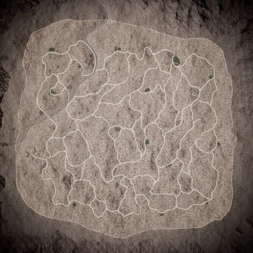

# Kamdesh Highlands | 卡姆德什高地

## AAS | 攻守有序

### Kamdesh Highlands AAS v1

切换代码： `AdminChangeLayer Kamdesh_AAS_v1`

预设代码： `AdminSetNextLayer Kamdesh_AAS_v1`

光照情况： 暴雨

旗点数量： 5

双方阵营： 澳军 VS 俄军

初始票数： 300  -  300

??? abstract "澳军载具"
    - HX60 Transport Truck *1
    - HX60 Logistics Truck *3
    - PMV RWS M2 *2
    - ASLAV *2
    - M1A1 *1

??? abstract "俄军载具"
    - KamAZ 5350 Transport Truck *1
    - KamAZ 5350 Logistics Truck *3
    - Tigr-M RWS Kord *1
    - BRDM-2 *1
    - BTR-82A *2
    - T-72B3 *1

## Insurgency | 叛乱

### Kamdesh Highlands Insurgency v1

切换代码： `AdminChangeLayer Kamdesh_Insurgency_v1`

预设代码： `AdminSetNextLayer Kamdesh_Insurgency_v1`

光照情况： 正午

旗点数量： 2

双方阵营： 澳军 VS 叛军

初始票数： 200  -  1000

??? abstract "澳军载具"
    - HX60 Transport Truck *3
    - HX60 Logistics Truck *3
    - PMV Mag58 *2
    - PMV Mag58 x3 *2
    - ASLAV *2

??? abstract "叛军载具"
    - Transport Pickup Truck *1
    - Logistics Pickup Truck *3
    - Ural-375D Logistics Truck *1
    - Minsk 400 *6
    - Technical DShK *2
    - Armored Technical DShK *1
    - Armored Technical SPG-9 *1
    - Technical SPG-9 *1
    - BRDM-2 *1
    - Technical UB-32 *2
    - Ural-375D ZU-23-2 *2

### Kamdesh Highlands Insurgency v2

切换代码： `AdminChangeLayer Kamdesh_Insurgency_v2`

预设代码： `AdminSetNextLayer Kamdesh_Insurgency_v2`

光照情况： 正午

旗点数量： 2

双方阵营： 英军 VS 叛军

初始票数： 200  -  1000

??? abstract "英军载具"
    - HX60 Transport Truck *3
    - HX60 Logistics Truck *4
    - FV510 UA *2
    - FV510 *1
    - FV432 *1

??? abstract "叛军载具"
    - Minsk 400 *2
    - Logistics Pickup Truck *4
    - Ural-375D Logistics Truck *1
    - Technical DShK *2
    - Technical UB-32 *2
    - Armored Technical DShK *1
    - Transport Pickup Truck *1
    - Technical SPG-9 *1
    - BMP-1 *1
    - Armored Technical SPG-9 *1

## Invasion | 侵攻

### Kamdesh Highlands Invasion v1

切换代码： `AdminChangeLayer Kamdesh_Invasion_v1`

预设代码： `AdminSetNextLayer Kamdesh_Invasion_v1`

光照情况： 暴雨

旗点数量： 5

双方阵营： 美军 VS 叛军

初始票数： 200  -  900

??? abstract "美军载具"
    - M-ATV M2 HB *3
    - M939 Logistics Truck *3
    - M1126 CROWS M2 HB *2
    - M939 Transport Truck *1
    - UH-60M *2

??? abstract "叛军载具"
    - Minsk 400 *2
    - Transport Pickup Truck *1
    - Logistics Pickup Truck *4
    - Technical DShK *2
    - BRDM-2 *3
    - Technical DShK Shielded *1
    - Technical Mortar *1
    - Ural-375D ZU-23-2 *1
    - MT-LB ZU-23-2 *1
    - Technical SPG-9 *1

### Kamdesh Highlands Invasion v2

切换代码： `AdminChangeLayer Kamdesh_Invasion_v2`

预设代码： `AdminSetNextLayer Kamdesh_Invasion_v2`

光照情况： 黄昏

旗点数量： 5

双方阵营： 英军 VS 叛军

初始票数： 200  -  900

??? abstract "英军载具"
    - HX60 Transport Truck *1
    - FV432 *1
    - HX60 Logistics Truck *3
    - FV510 UA *2
    - FV432 RWS *1
    - SA330 *2

??? abstract "叛军载具"
    - Minsk 400 *6
    - Logistics Pickup Truck *6
    - Transport Pickup Truck *4
    - Technical DShK Shielded *1
    - BRDM-2 *1
    - MT-LB ZU-23-2 *1
    - Armored Technical SPG-9 *1
    - Technical SPG-9 *1
    - BMP-1 *1

### Kamdesh Highlands Invasion v3

切换代码： `AdminChangeLayer Kamdesh_Invasion_v3`

预设代码： `AdminSetNextLayer Kamdesh_Invasion_v3`

光照情况： 正午

旗点数量： 5

双方阵营： 美军 VS 叛军

初始票数： 200  -  800

??? abstract "美军载具"
    - M-ATV M2 HB *3
    - M939 Logistics Truck *3
    - M939 Transport Truck *1
    - M1126 CROWS M240 *1
    - M1126 CROWS M2 HB *1
    - UH-60M *2

??? abstract "叛军载具"
    - Minsk 400 *9
    - Logistics Pickup Truck *5
    - Transport Pickup Truck *1
    - BMP-1 *1
    - Armored Technical SPG-9 *1
    - Ural-375D ZU-23-2 *1
    - Armored Technical DShK *1
    - Technical SPG-9 *1
    - BRDM-2 *1

### Kamdesh Highlands Invasion v4

切换代码： `AdminChangeLayer Kamdesh_Invasion_v4`

预设代码： `AdminSetNextLayer Kamdesh_Invasion_v4`

光照情况： 暴雨

旗点数量： 5

双方阵营： 澳军 VS 叛军

初始票数： 200  -  800

??? abstract "澳军载具"
    - HX60 Transport Truck *1
    - HX60 Logistics Truck *3
    - PMV Mag58 x3 *2
    - PMV Mag58 *1
    - ASLAV *2
    - MRH-90 *1
    - UH-60M *1

??? abstract "叛军载具"
    - Minsk 400 *5
    - Transport Pickup Truck *1
    - Logistics Pickup Truck *4
    - Technical DShK *2
    - Technical DShK Shielded *1
    - BRDM-2 *3
    - Technical Mortar *1
    - Ural-375D ZU-23-2 *1
    - MT-LB ZU-23-2 *1
    - Technical SPG-9 *1

### Kamdesh Highlands Invasion v5

切换代码： `AdminChangeLayer Kamdesh_Invasion_v5`

预设代码： `AdminSetNextLayer Kamdesh_Invasion_v5`

光照情况： 黄昏

旗点数量： 5

双方阵营： 澳军 VS 叛军

初始票数： 200  -  800

??? abstract "澳军载具"
    - HX60 Transport Truck *1
    - HX60 Logistics Truck *3
    - PMV Mag58 x3 *2
    - PMV Mag58 *1
    - ASLAV *2
    - MRH-90 *1
    - UH-60M *1

??? abstract "叛军载具"
    - Minsk 400 *5
    - Transport Pickup Truck *1
    - Logistics Pickup Truck *4
    - Technical DShK *2
    - Technical DShK Shielded *1
    - BRDM-2 *3
    - Technical Mortar *1
    - Ural-375D ZU-23-2 *1
    - MT-LB ZU-23-2 *1
    - Technical SPG-9 *1

### Kamdesh Highlands Invasion v6

切换代码： `AdminChangeLayer Kamdesh_Invasion_v6`

预设代码： `AdminSetNextLayer Kamdesh_Invasion_v6`

光照情况： 正午

旗点数量： 5

双方阵营： 澳军 VS 中东

初始票数： 200  -  800

??? abstract "澳军载具"
    - HX60 Transport Truck *1
    - HX60 Logistics Truck *3
    - PMV Mag58 x3 *2
    - PMV Mag58 *1
    - ASLAV *2
    - M1A1 *1
    - MRH-90 *1
    - UH-60M *1

??? abstract "中东载具"
    - Ural-4320 Transport Truck *1
    - Simir Logi *4
    - Simir MG3 *2
    - Simir Kord *2
    - BRDM-2 *3
    - Simir Kornet *1
    - BMP-1 *1
    - BMP-2 *1

### Kamdesh Highlands Invasion v7

切换代码： `AdminChangeLayer Kamdesh_Invasion_v7`

预设代码： `AdminSetNextLayer Kamdesh_Invasion_v7`

光照情况： 正午

旗点数量： 5

双方阵营： 加军 VS 叛军

初始票数： 200  -  900

??? abstract "加军载具"
    - MSVS Transport Truck *1
    - MSVS Logistics Truck *3
    - TAPV M2 *2
    - M113A3 TLAV *1
    - Coyote *1
    - LAV 6 *2
    - Leopard 2A6M CAN *1
    - CH-146 *1

??? abstract "叛军载具"
    - Minsk 400 *1
    - MT-LB PKT *1
    - Ural-375D Logistics Truck *3
    - Logistics Pickup Truck *3
    - BRDM-2 *1
    - Technical DShK Shielded *1
    - Armored Technical DShK *1
    - Technical SPG-9 *1
    - BMP-1 *2
    - T-62 *1

## RAAS | 随机攻守

### Kamdesh Highlands RAAS v1

切换代码： `AdminChangeLayer Kamdesh_RAAS_v1`

预设代码： `AdminSetNextLayer Kamdesh_RAAS_v1`

光照情况： 暴雨

旗点数量： 6

双方阵营： 民兵 VS 叛军

初始票数： 300  -  300

??? abstract "民兵载具"
    - Logistics Pickup Truck *2
    - Ural-375D Logistics Truck *2
    - Technical DShK Shielded *2
    - BMP-1 *1
    - Technical SPG-9 *1
    - BMP-1 ZU-23-2 *1
    - Technical UB-32 *2

??? abstract "叛军载具"
    - Logistics Pickup Truck *2
    - Ural-375D Logistics Truck *2
    - Armored Technical DShK *1
    - BMP-1 *1
    - Technical DShK Shielded *1
    - Armored Technical SPG-9 *1
    - BRDM-2 *1
    - Technical UB-32 *2

### Kamdesh Highlands RAAS v2

切换代码： `AdminChangeLayer Kamdesh_RAAS_v2`

预设代码： `AdminSetNextLayer Kamdesh_RAAS_v2`

光照情况： 暴雨

旗点数量： 7

双方阵营： 英军 VS 俄军

初始票数： 250  -  250

??? abstract "英军载具"
    - HX60 Logistics Truck *3
    - HX60 Transport Truck *1
    - FV432 *2
    - FV510 UA *1
    - FV4034 *1
    - FV432 RWS *1

??? abstract "俄军载具"
    - KamAZ 5350 Logistics Truck *3
    - KamAZ 5350 Transport Truck *1
    - BMP-2 *1
    - BTR-82A *1
    - BTR-80 *1
    - BRDM-2 *1
    - T-72B3 *1

### Kamdesh Highlands RAAS v3

切换代码： `AdminChangeLayer Kamdesh_RAAS_v3`

预设代码： `AdminSetNextLayer Kamdesh_RAAS_v3`

光照情况： 暴雨

旗点数量： 7

双方阵营： 美军 VS 中东

初始票数： 250  -  250

??? abstract "美军载具"
    - M939 Logistics Truck *3
    - M939 Transport Truck *1
    - M-ATV M2 HB *1
    - M2A3 *1
    - M1126 CROWS M2 HB *1
    - M1A2 *1
    - M-ATV TOW *1

??? abstract "中东载具"
    - Ural-4320 Logistics Truck *3
    - Ural-4320 Transport Truck *1
    - BMP-2 *1
    - Simir MG3 *2
    - T-62 *1
    - T-72S *1
    - Simir Kord *1

### Kamdesh Highlands RAAS v4

切换代码： `AdminChangeLayer Kamdesh_RAAS_v4`

预设代码： `AdminSetNextLayer Kamdesh_RAAS_v4`

光照情况： 暴雨

旗点数量： 5

双方阵营： 英军 VS 中东

初始票数： 300  -  300

??? abstract "英军载具"
    - HX60 Transport Truck *1
    - HX60 Logistics Truck *3
    - FV432 *2
    - FV432 RWS *1
    - FV510 UA *1

??? abstract "中东载具"
    - Ural-4320 Transport Truck *1
    - Ural-4320 Logistics Truck *3
    - Simir Kord *3
    - BRDM-2 *1
    - MT-LBM 6MA *1
    - BMP-2 *1

### Kamdesh Highlands RAAS v5

切换代码： `AdminChangeLayer Kamdesh_RAAS_v5`

预设代码： `AdminSetNextLayer Kamdesh_RAAS_v5`

光照情况： 暴雨

旗点数量： 6

双方阵营： 澳军 VS 中东

初始票数： 300  -  300

??? abstract "澳军载具"
    - HX60 Transport Truck *1
    - HX60 Logistics Truck *3
    - PMV Mag58 x3 *1
    - PMV Mag58 *2
    - ASLAV *2
    - M1A1 *2

??? abstract "中东载具"
    - Ural-4320 Transport Truck *1
    - Ural-4320 Logistics Truck *3
    - Simir MG3 *2
    - Simir Kord *1
    - BMP-1 *1
    - BMP-2 *1
    - T-62 *1
    - T-72S *1

### Kamdesh Highlands RAAS v6

切换代码： `AdminChangeLayer Kamdesh_RAAS_v6`

预设代码： `AdminSetNextLayer Kamdesh_RAAS_v6`

光照情况： 暴雨

旗点数量： 7

双方阵营： 澳军 VS 俄军

初始票数： 300  -  300

??? abstract "澳军载具"
    - HX60 Transport Truck *1
    - HX60 Logistics Truck *3
    - PMV Mag58 x3 *1
    - PMV Mag58 *1
    - PMV RWS M2 *1
    - ASLAV *2
    - M1A1 *1

??? abstract "俄军载具"
    - KamAZ 5350 Transport Truck *1
    - KamAZ 5350 Logistics Truck *3
    - Tigr-M Kord *2
    - BRDM-2 *1
    - BTR-82A *2
    - T-72B3 *1

### Kamdesh Highlands RAAS v7

切换代码： `AdminChangeLayer Kamdesh_RAAS_v7`

预设代码： `AdminSetNextLayer Kamdesh_RAAS_v7`

光照情况： 暴雨

旗点数量： 5

双方阵营： 加军 VS 叛军

初始票数： 300  -  300

??? abstract "加军载具"
    - LUVW Transport *2
    - LUVW Logistics *3
    - LUV-A1 Logistics *1
    - LUVW C6 *3
    - LUVW M2 *3
    - M113A3 TLAV *2

??? abstract "叛军载具"
    - Minsk 400 *1
    - Ural-375D Transport Truck *1
    - Ural-375D Logistics Truck *2
    - Logistics Pickup Truck *2
    - Technical UB-32 *1
    - Technical DShK *2
    - Technical SPG-9 *1
    - BRDM-2 *1
    - BMP-1 *2

## Skirmish | 遭遇战

### Kamdesh Highlands Skirmish v1

切换代码： `AdminChangeLayer Kamdesh_Skirmish_v1`

预设代码： `AdminSetNextLayer Kamdesh_Skirmish_v1`

光照情况： 正午

旗点数量： 3

双方阵营： 澳军 VS 英军

初始票数： 150  -  150

??? abstract "澳军载具"
    - HX60 Transport Truck *3
    - HX60 Logistics Truck *3
    - PMV Mag58 *1

??? abstract "英军载具"
    - HX60 Transport Truck *3
    - HX60 Logistics Truck *3
    - LPPV *1

## TC | 领土控制

### Kamdesh Highlands TC v1

切换代码： `AdminChangeLayer Kamdesh_TC_v1`

预设代码： `AdminSetNextLayer Kamdesh_TC_v1`

光照情况： 暴雨

旗点数量： 43

双方阵营： 英军 VS 俄军

初始票数： 400  -  400

??? abstract "英军载具"
    - HX60 Logistics Truck *3
    - HX60 Transport Truck *1
    - FV107 *1
    - FV520 CTAS40 *1
    - LPPV *2
    - SA330 *1

??? abstract "俄军载具"
    - KamAZ 5350 Logistics Truck *3
    - KamAZ 5350 Transport Truck *1
    - BMP-2 *1
    - BTR-82A *2
    - BRDM-2 *1
    - Mi-8 *1

### Kamdesh Highlands TC v2

切换代码： `AdminChangeLayer Kamdesh_TC_v2`

预设代码： `AdminSetNextLayer Kamdesh_TC_v2`

光照情况： 暴雨

旗点数量： 43

双方阵营： 民兵 VS 叛军

初始票数： 400  -  400

??? abstract "民兵载具"
    - Logistics Pickup Truck *4
    - Transport Pickup Truck *1
    - Technical DShK Shielded *2
    - BMP-1 *1
    - Ural-375D Logistics Truck *1
    - Minsk 400 *4

??? abstract "叛军载具"
    - Logistics Pickup Truck *3
    - Transport Pickup Truck *1
    - BMP-1 *1
    - Technical DShK *2
    - Ural-375D Logistics Truck *1
    - BMP-1 ZU-23-2 *1
    - Armored Technical SPG-9 *1
    - Minsk 400 *4

### Kamdesh Highlands TC v3

切换代码： `AdminChangeLayer Kamdesh_TC_v3`

预设代码： `AdminSetNextLayer Kamdesh_TC_v3`

光照情况： 暴雨

旗点数量： 43

双方阵营： 澳军 VS 俄军

初始票数： 400  -  400

??? abstract "澳军载具"
    - HX60 Transport Truck *1
    - HX60 Logistics Truck *3
    - PMV Mag58 x3 *1
    - PMV Mag58 *1
    - PMV RWS M2 *1
    - ASLAV *2
    - M1A1 *1
    - MRH-90 *1

??? abstract "俄军载具"
    - KamAZ 5350 Transport Truck *1
    - KamAZ 5350 Logistics Truck *3
    - Tigr-M Kord *2
    - BRDM-2 *1
    - BTR-82A *2
    - T-72B3 *1
    - Mi-8 *1

### Kamdesh Highlands TC v4

切换代码： `AdminChangeLayer Kamdesh_TC_v4`

预设代码： `AdminSetNextLayer Kamdesh_TC_v4`

光照情况： 暴雨

旗点数量： 33

双方阵营： 加军 VS 叛军

初始票数： 450  -  450

??? abstract "加军载具"
    - MSVS Transport Truck *1
    - MSVS Logistics Truck *3
    - TAPV C6 *1
    - LUVW C6 *2
    - M113A3 TLAV *1

??? abstract "叛军载具"
    - Minsk 400 *1
    - Transport Pickup Truck *1
    - Ural-375D Logistics Truck *2
    - Logistics Pickup Truck *2
    - Technical UB-32 *1
    - Technical DShK Shielded *3
    - BRDM-2 *2