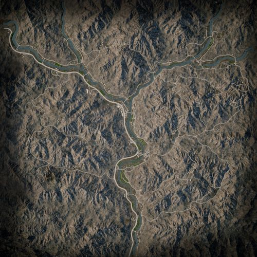

# Lashkar Valley | 拉什卡谷

## AAS | 攻守有序

### Lashkar Valley AAS v1

切换代码： `AdminChangeLayer LashkarValley_AAS_v1`

预设代码： `AdminSetNextLayer LashkarValley_AAS_v1`

光照情况： 正午

旗点数量： 7

双方阵营： 英军 VS 俄军

初始票数： 250  -  250

??? abstract "英军载具"
    - HX60 Logistics Truck *3
    - HX60 Transport Truck *1
    - FV520 CTAS40 *1
    - LPPV RWS *1
    - FV107 *1
    - SA330 *2

??? abstract "俄军载具"
    - Mi-8 *2
    - KamAZ 5350 Logistics Truck *3
    - KamAZ 5350 Transport Truck *1
    - BTR-82A *2
    - BMP-2 *1
    - Tigr-M RWS Kord *1

### Lashkar Valley AAS v2

切换代码： `AdminChangeLayer LashkarValley_AAS_v2`

预设代码： `AdminSetNextLayer LashkarValley_AAS_v2`

光照情况： 正午

旗点数量： 7

双方阵营： 美军 VS 中东

初始票数： 250  -  250

??? abstract "美军载具"
    - M939 Logistics Truck *3
    - M939 Transport Truck *1
    - M-ATV M2 HB *2
    - M1126 CROWS M2 HB *1
    - M2A3 *1
    - UH-60M *2

??? abstract "中东载具"
    - Mi-17 *2
    - Ural-4320 Logistics Truck *3
    - Ural-4320 Transport Truck *1
    - MT-LBM 6MA *1
    - BRDM-2 *1
    - BMP-2 *1
    - Simir Kord *2

### Lashkar Valley AAS v3

切换代码： `AdminChangeLayer LashkarValley_AAS_v3`

预设代码： `AdminSetNextLayer LashkarValley_AAS_v3`

光照情况： 正午

旗点数量： 7

双方阵营： 澳军 VS 俄军

初始票数： 250  -  250

??? abstract "澳军载具"
    - HX60 Transport Truck *1
    - HX60 Logistics Truck *3
    - PMV RWS M2 *1
    - PMV Mag58 x3 *1
    - ASLAV *2
    - MRH-90 *1
    - UH-60M *1

??? abstract "俄军载具"
    - KamAZ 5350 Transport Truck *1
    - KamAZ 5350 Logistics Truck *3
    - Tigr-M Kord *1
    - Tigr-M RWS Kord *1
    - BTR-82A *2
    - Mi-8 *2

### Lashkar Valley AAS v4

切换代码： `AdminChangeLayer LashkarValley_AAS_v4`

预设代码： `AdminSetNextLayer LashkarValley_AAS_v4`

光照情况： 正午

旗点数量： 7

双方阵营： 澳军 VS 中东

初始票数： 250  -  250

??? abstract "澳军载具"
    - HX60 Transport Truck *1
    - HX60 Logistics Truck *3
    - PMV RWS M2 *1
    - PMV Mag58 x3 *1
    - ASLAV *2
    - MRH-90 *1
    - UH-60M *1

??? abstract "中东载具"
    - Ural-4320 Transport Truck *1
    - Ural-4320 Logistics Truck *3
    - BRDM-2 *1
    - Simir MG3 *1
    - Simir Kord *1
    - BMP-1 *1
    - BMP-2 *1
    - Mi-17 *2

## Insurgency | 叛乱

### Lashkar Valley Insurgency v1

切换代码： `AdminChangeLayer LashkarValley_Insurgency_v1`

预设代码： `AdminSetNextLayer LashkarValley_Insurgency_v1`

光照情况： 早晨

旗点数量： 5

双方阵营： 美军 VS 叛军

初始票数： 200  -  1000

??? abstract "美军载具"
    - M939 Logistics Truck *4
    - UH-60M *2
    - M939 Transport Truck *1
    - M-ATV M2 HB *3

??? abstract "叛军载具"
    - Minsk 400 *1
    - Logistics Pickup Truck *1
    - Technical DShK Shielded *2
    - Technical DShK *1
    - Armored Technical DShK *1
    - Ural-375D ZU-23-2 *1
    - Technical UB-32 *3
    - BMP-1 ZU-23-2 *1
    - Armored Technical SPG-9 *1
    - BRDM-2 *2

## Invasion | 侵攻

### Lashkar Valley Invasion v1

切换代码： `AdminChangeLayer LashkarValley_Invasion_v1`

预设代码： `AdminSetNextLayer LashkarValley_Invasion_v1`

光照情况： 暴雨

旗点数量： 8

双方阵营： 美军 VS 叛军

初始票数： 200  -  900

??? abstract "美军载具"
    - M939 Logistics Truck *3
    - M939 Transport Truck *1
    - M-ATV M2 HB *2
    - M1126 CROWS M2 HB *1
    - M2A3 *1
    - UH-60M *2

??? abstract "叛军载具"
    - Ural-375D Logistics Truck *1
    - Minsk 400 *1
    - Logistics Pickup Truck *2
    - Ural-375D ZU-23-2 *1
    - Technical UB-32 *2
    - Technical DShK Shielded *1
    - BRDM-2 *1
    - Armored Technical SPG-9 *1
    - MT-LB PKT *1
    - BMP-1 *1

### Lashkar Valley Invasion v2

切换代码： `AdminChangeLayer LashkarValley_Invasion_v2`

预设代码： `AdminSetNextLayer LashkarValley_Invasion_v2`

光照情况： 正午

旗点数量： 8

双方阵营： 澳军 VS 叛军

初始票数： 200  -  900

??? abstract "澳军载具"
    - HX60 Transport Truck *1
    - HX60 Logistics Truck *3
    - PMV RWS M2 *1
    - PMV Mag58 x3 *2
    - ASLAV *3
    - MRH-90 *1
    - UH-60M *1

??? abstract "叛军载具"
    - Minsk 400 *1
    - Logistics Pickup Truck *2
    - Ural-375D Logistics Truck *1
    - Ural-375D ZU-23-2 *1
    - Technical UB-32 *2
    - Technical DShK Shielded *1
    - BRDM-2 *1
    - Armored Technical SPG-9 *1
    - MT-LB PKT *1
    - BMP-1 *1

### Lashkar Valley Invasion v3

切换代码： `AdminChangeLayer LashkarValley_Invasion_v3`

预设代码： `AdminSetNextLayer LashkarValley_Invasion_v3`

光照情况： 正午

旗点数量： 8

双方阵营： 加军 VS 叛军

初始票数： 200  -  900

??? abstract "加军载具"
    - MSVS Transport Truck *1
    - MSVS Logistics Truck *3
    - LUVW C6 *2
    - TAPV C6 *1
    - M113A3 TLAV *1
    - Coyote *1
    - LAV 6 *2
    - CH-146 *2

??? abstract "叛军载具"
    - Minsk 400 *1
    - Logistics Pickup Truck *2
    - Technical DShK Shielded *1
    - Technical ZU-23-2 *1
    - Ural-375D ZU-23-2 *1
    - Technical UB-32 *2
    - MT-LB PKT *1
    - Armored Technical SPG-9 *1
    - BRDM-2 *1
    - BMP-1 *1

## RAAS | 随机攻守

### Lashkar Valley RAAS v1

切换代码： `AdminChangeLayer LashkarValley_RAAS_v1`

预设代码： `AdminSetNextLayer LashkarValley_RAAS_v1`

光照情况： 早晨

旗点数量： 7

双方阵营： 美军 VS 中东

初始票数： 250  -  250

??? abstract "美军载具"
    - M939 Logistics Truck *3
    - UH-60M *2
    - M939 Transport Truck *1
    - M-ATV M2 HB *2
    - M1126 CROWS M2 HB *1
    - M-ATV M240 *1
    - M-ATV CROWS M2 HB *1

??? abstract "中东载具"
    - Mi-17 *2
    - Ural-4320 Logistics Truck *3
    - Ural-4320 Transport Truck *1
    - MT-LBM 6MA *1
    - Simir Kord *2
    - Simir Kornet *1
    - BRDM-2 *1

### Lashkar Valley RAAS v2

切换代码： `AdminChangeLayer LashkarValley_RAAS_v2`

预设代码： `AdminSetNextLayer LashkarValley_RAAS_v2`

光照情况： 正午

旗点数量： 7

双方阵营： 澳军 VS 俄军

初始票数： 250  -  250

??? abstract "澳军载具"
    - HX60 Transport Truck *1
    - HX60 Logistics Truck *3
    - PMV RWS M2 *1
    - PMV Mag58 x3 *1
    - ASLAV *2
    - MRH-90 *1
    - UH-60M *1

??? abstract "俄军载具"
    - KamAZ 5350 Transport Truck *1
    - KamAZ 5350 Logistics Truck *3
    - Tigr-M Kord *1
    - Tigr-M RWS Kord *1
    - BTR-82A *2
    - Mi-8 *2

### Lashkar Valley RAAS v3

切换代码： `AdminChangeLayer LashkarValley_RAAS_v3`

预设代码： `AdminSetNextLayer LashkarValley_RAAS_v3`

光照情况： 暴雨

旗点数量： 7

双方阵营： 澳军 VS 中东

初始票数： 250  -  250

??? abstract "澳军载具"
    - HX60 Transport Truck *1
    - HX60 Logistics Truck *3
    - PMV RWS M2 *1
    - PMV Mag58 x3 *1
    - ASLAV *2
    - MRH-90 *1
    - UH-60M *1

??? abstract "中东载具"
    - Ural-4320 Transport Truck *1
    - Ural-4320 Logistics Truck *3
    - BRDM-2 *1
    - Simir MG3 *1
    - Simir Kord *1
    - BMP-1 *1
    - BMP-2 *1
    - Mi-17 *2

### Lashkar Valley RAAS v4

切换代码： `AdminChangeLayer LashkarValley_RAAS_v4`

预设代码： `AdminSetNextLayer LashkarValley_RAAS_v4`

光照情况： 正午

旗点数量： 7

双方阵营： 加军 VS 叛军

初始票数： 300  -  340

??? abstract "加军载具"
    - MSVS Transport Truck *1
    - LUVW Logistics *3
    - LUVW C6 *2
    - LUVW M2 *2
    - LAV III C6 RWS *1
    - M113A3 TLAV *1
    - Coyote *2
    - CH-146 *2

??? abstract "叛军载具"
    - Ural-375D Transport Truck *1
    - Ural-375D Logistics Truck *2
    - Logistics Pickup Truck *6
    - Technical DShK Shielded *2
    - Technical SPG-9 *2
    - Technical UB-32 *2
    - BRDM-2 *1
    - MT-LB ZU-23-2 *2
    - BTR-80 *1
    - BMP-1 *1
    - T-62 *1

### Lashkar Valley RAAS v5

切换代码： `AdminChangeLayer LashkarValley_RAAS_v5`

预设代码： `AdminSetNextLayer LashkarValley_RAAS_v5`

光照情况： 正午

旗点数量： 7

双方阵营： USMC VS 叛军

初始票数： 300  -  340

??? abstract "USMC载具"
    - M939 Transport Truck *1
    - M939 Logistics Truck *3
    - M1151 M2 *3
    - M1151 M2 Open Doors *2
    - AAVP-7A1 *1
    - LAV-25 *2
    - UH-1Y *2

??? abstract "叛军载具"
    - Ural-375D Transport Truck *1
    - Ural-375D Logistics Truck *2
    - Logistics Pickup Truck *6
    - Technical DShK Shielded *2
    - Technical SPG-9 *2
    - Technical UB-32 *2
    - BRDM-2 *1
    - MT-LB ZU-23-2 *2
    - BTR-80 *1
    - BMP-1 *1
    - T-62 *1

## Skirmish | 遭遇战

### Lashkar Valley Skirmish v1

切换代码： `AdminChangeLayer LashkarValley_Skirmish_v1`

预设代码： `AdminSetNextLayer LashkarValley_Skirmish_v1`

光照情况： 正午

旗点数量： 7

双方阵营： 澳军 VS 叛军

初始票数： 200  -  200

??? abstract "澳军载具"
    - HX60 Transport Truck *3
    - HX60 Logistics Truck *3
    - PMV Mag58 *1

??? abstract "叛军载具"
    - Minsk 400 *1
    - Transport Pickup Truck *2
    - Logistics Pickup Truck *4
    - Technical DShK *1

## TC | 领土控制

### Lashkar Valley TC v1

切换代码： `AdminChangeLayer LashkarValley_TC_v1`

预设代码： `AdminSetNextLayer LashkarValley_TC_v1`

光照情况： 暴雨

旗点数量： 98

双方阵营： 英军 VS 中东

初始票数： 250  -  250

??? abstract "英军载具"
    - HX60 Logistics Truck *3
    - HX60 Transport Truck *1
    - FV432 *1
    - LPPV RWS *1
    - FV520 CTAS40 *1
    - SA330 *2
    - FV4034 *1

??? abstract "中东载具"
    - Mi-17 *2
    - Ural-4320 Logistics Truck *3
    - Ural-4320 Transport Truck *1
    - MT-LBM 6MA *1
    - BMP-2 *2
    - T-72S *1
    - Simir MG3 *1

### Lashkar Valley TC v2

切换代码： `AdminChangeLayer LashkarValley_TC_v2`

预设代码： `AdminSetNextLayer LashkarValley_TC_v2`

光照情况： 暴雨

旗点数量： 65

双方阵营： 美军 VS 中东

初始票数： 450  -  450

??? abstract "美军载具"
    - M939 Transport Truck *1
    - M939 Logistics Truck *1
    - M2A3 *1
    - M1A2 *1

??? abstract "中东载具"
    - Ural-4320 Transport Truck *1
    - Simir Logi *1
    - Ural-4320 Logistics Truck *1
    - BMP-1 *1
    - BMP-2 *1
    - T-62 *1

### Lashkar Valley TC v3

切换代码： `AdminChangeLayer LashkarValley_TC_v3`

预设代码： `AdminSetNextLayer LashkarValley_TC_v3`

光照情况： 早晨

旗点数量： 132

双方阵营： 英军 VS 俄军

初始票数： 250  -  250

??? abstract "英军载具"
    - HX60 Logistics Truck *3
    - HX60 Transport Truck *1
    - FV432 *1
    - FV432 RWS *1
    - FV510 *1
    - SA330 *2
    - FV4034 *1

??? abstract "俄军载具"
    - Mi-8 *2
    - KamAZ 5350 Logistics Truck *3
    - KamAZ 5350 Transport Truck *1
    - BTR-82A *1
    - BTR-80 *1
    - BMP-2 *1
    - T-72B3 *1

### Lashkar Valley TC v4

切换代码： `AdminChangeLayer LashkarValley_TC_v4`

预设代码： `AdminSetNextLayer LashkarValley_TC_v4`

光照情况： 暴雨

旗点数量： 98

双方阵营： 澳军 VS 俄军

初始票数： 250  -  250

??? abstract "澳军载具"
    - HX60 Transport Truck *1
    - HX60 Logistics Truck *3
    - PMV RWS M2 *1
    - PMV Mag58 x3 *1
    - ASLAV *2
    - MRH-90 *1
    - UH-60M *1

??? abstract "俄军载具"
    - KamAZ 5350 Transport Truck *1
    - KamAZ 5350 Logistics Truck *3
    - Tigr-M Kord *1
    - Tigr-M RWS Kord *1
    - BTR-82A *2
    - Mi-8 *2

### Lashkar Valley TC v5

切换代码： `AdminChangeLayer LashkarValley_TC_v5`

预设代码： `AdminSetNextLayer LashkarValley_TC_v5`

光照情况： 暴雨

旗点数量： 62

双方阵营： 加军 VS 叛军

初始票数： 450  -  450

??? abstract "加军载具"
    - MSVS Transport Truck *1
    - MSVS Logistics Truck *3
    - LAV III C6 RWS *1
    - M113A3 TLAV *1
    - LAV 6 *2
    - Leopard 2A6M CAN *1
    - CH-146 *1

??? abstract "叛军载具"
    - Minsk 400 *1
    - Transport Pickup Truck *1
    - Logistics Pickup Truck *1
    - Ural-375D Logistics Truck *1
    - Armored Technical DShK *2
    - Technical UB-32 *2
    - Armored Technical SPG-9 *2
    - BMP-1 *1
    - T-62 *2