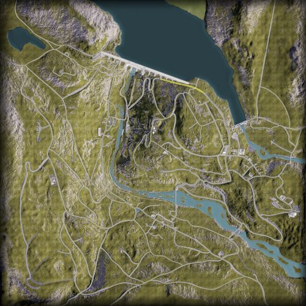

# Manic-5 | 马尼克大坝

## AAS | 攻守有序

### Manic-5 AAS v1

切换代码： `AdminChangeLayer Manic_AAS_v1`

预设代码： `AdminSetNextLayer Manic_AAS_v1`

光照情况： 正午

旗点数量： 7

双方阵营： 加军 VS 俄军

初始票数： 300  -  300

??? abstract "加军载具"
    - MSVS Transport Truck *1
    - MSVS Logistics Truck *3
    - LUVW M2 *2
    - M113A3 TLAV *2
    - LAV 6 *1
    - Leopard 2A6M CAN *1
    - CH-146 *1

??? abstract "俄军载具"
    - KamAZ 5350 Transport Truck *1
    - KamAZ 5350 Logistics Truck *3
    - Tigr-M Kord *2
    - MT-LBM 6MA *2
    - BTR-82A *1
    - T-72B3 *1
    - Mi-8 *1

### Manic-5 AAS v2

切换代码： `AdminChangeLayer Manic_AAS_v2`

预设代码： `AdminSetNextLayer Manic_AAS_v2`

光照情况： 正午

旗点数量： 7

双方阵营： 加军 VS 俄军

初始票数： 300  -  300

??? abstract "加军载具"
    - MSVS Transport Truck *1
    - MSVS Logistics Truck *3
    - LUVW M2 *3
    - TAPV M2 *2
    - CH-146 *3

??? abstract "俄军载具"
    - KamAZ 5350 Transport Truck *1
    - KamAZ 5350 Logistics Truck *3
    - Tigr-M Kord *3
    - Tigr-M RWS Kord *2
    - Mi-8 *3

## Invasion | 侵攻

### Manic-5 Invasion v1

切换代码： `AdminChangeLayer Manic_Invasion_v1`

预设代码： `AdminSetNextLayer Manic_Invasion_v1`

光照情况： 正午

旗点数量： 5

双方阵营： 加军 VS 俄军

初始票数： 200  -  900

??? abstract "加军载具"
    - MSVS Transport Truck *1
    - MSVS Logistics Truck *3
    - TAPV M2 *2
    - M113A3 TLAV *1
    - Coyote *1
    - LAV 6 *3
    - Leopard 2A6M CAN *1
    - CH-146 *1

??? abstract "俄军载具"
    - KamAZ 5350 Transport Truck *1
    - KamAZ 5350 Logistics Truck *4
    - Tigr-M Kord *3
    - Tigr-M RWS Kord *2
    - MT-LBM 6MA *1
    - MT-LB VMK *1
    - T-72B3 *1

### Manic-5 Invasion v2

切换代码： `AdminChangeLayer Manic_Invasion_v2`

预设代码： `AdminSetNextLayer Manic_Invasion_v2`

光照情况： 正午

旗点数量： 5

双方阵营： 加军 VS 美军

初始票数： 900  -  200

??? abstract "加军载具"
    - MSVS Transport Truck *1
    - LUVW Logistics *4
    - LUVW C6 *2
    - LUVW M2 *2
    - Coyote *2
    - LUV-A1 Transport *1
    - LUV-A1 Logistics *1

??? abstract "美军载具"
    - M939 Transport Truck *1
    - M939 Logistics Truck *3
    - M-ATV M2 HB *2
    - M-ATV CROWS M2 HB *2
    - M2A3 *3
    - M1A2 *1
    - UH-60M *1

## RAAS | 随机攻守

### Manic-5 RAAS v1

切换代码： `AdminChangeLayer Manic_RAAS_v1`

预设代码： `AdminSetNextLayer Manic_RAAS_v1`

光照情况： 正午

旗点数量： 7

双方阵营： 加军 VS 俄军

初始票数： 350  -  350

??? abstract "加军载具"
    - MSVS Transport Truck *1
    - MSVS Logistics Truck *3
    - LUVW M2 *1
    - TAPV M2 *1
    - M113A3 TLAV *1
    - Coyote *1
    - LAV 6 *2
    - Leopard 2A6M CAN *1
    - CH-146 *2

??? abstract "俄军载具"
    - KamAZ 5350 Transport Truck *1
    - KamAZ 5350 Logistics Truck *3
    - Tigr-M Kord *1
    - Tigr-M RWS Kord *1
    - MT-LBM 6MA *1
    - BTR-82A *3
    - T-72B3 *1
    - Mi-8 *2

### Manic-5 RAAS v2

切换代码： `AdminChangeLayer Manic_RAAS_v2`

预设代码： `AdminSetNextLayer Manic_RAAS_v2`

光照情况： 正午

旗点数量： 5

双方阵营： 加军 VS 民兵

初始票数： 350  -  370

??? abstract "加军载具"
    - MSVS Transport Truck *1
    - LUVW Logistics *4
    - LUVW C6 *4
    - LUVW M2 *2
    - M113A3 TLAV *2
    - CH-146 *1

??? abstract "民兵载具"
    - Ural-375D Transport Truck *2
    - Ural-375D Logistics Truck *2
    - Logistics Pickup Truck *4
    - Technical M2 HB *4
    - Technical SPG-9 *2
    - Technical ZU-23-2 *2
    - Technical UB-32 *1
    - Ural-375D ZU-23-2 *1

### Manic-5 RAAS v3

切换代码： `AdminChangeLayer Manic_RAAS_v3`

预设代码： `AdminSetNextLayer Manic_RAAS_v3`

光照情况： 正午

旗点数量： 7

双方阵营： 加军 VS 俄军

初始票数： 350  -  350

??? abstract "加军载具"
    - MSVS Transport Truck *1
    - MSVS Logistics Truck *3
    - M113A3 TLAV *2
    - Leopard 2A6M CAN *3
    - CH-146 *1

??? abstract "俄军载具"
    - KamAZ 5350 Transport Truck *1
    - KamAZ 5350 Logistics Truck *3
    - MT-LB VMK *2
    - T-72B3 *3
    - Mi-8 *1

### Manic-5 RAAS v4

切换代码： `AdminChangeLayer Manic_RAAS_v4`

预设代码： `AdminSetNextLayer Manic_RAAS_v4`

光照情况： 正午

旗点数量： 6

双方阵营： 加军 VS 俄军

初始票数： 300  -  300

??? abstract "加军载具"
    - MSVS Transport Truck *1
    - LUVW Logistics *3
    - LUVW C6 *2
    - LUVW M2 *2
    - Coyote *2
    - Leopard 2A6M CAN *1
    - CH-146 *3

??? abstract "俄军载具"
    - KamAZ 5350 Transport Truck *1
    - KamAZ 5350 Logistics Truck *3
    - BTR-82A *4
    - T-72B3 *1
    - Mi-8 *1

## Skirmish | 遭遇战

### Manic-5 Skirmish v1

切换代码： `AdminChangeLayer Manic_Skirmish_v1`

预设代码： `AdminSetNextLayer Manic_Skirmish_v1`

光照情况： 阴天

旗点数量： 5

双方阵营： 加军 VS 民兵

初始票数： 150  -  150

??? abstract "加军载具"
    - LUV-A1 Transport *4
    - MSVS Transport Truck *1
    - LUV-A1 Logistics *2
    - MSVS Logistics Truck *2
    - LUVW C6 *1

??? abstract "民兵载具"
    - Transport Pickup Truck *2
    - Ural-375D Transport Truck *1
    - Ural-375D Logistics Truck *3
    - Technical DShK *2

### Manic-5 Skirmish v2

切换代码： `AdminChangeLayer Manic_Skirmish_v2`

预设代码： `AdminSetNextLayer Manic_Skirmish_v2`

光照情况： 正午

旗点数量： 5

双方阵营： 加军 VS 美军

初始票数： 150  -  150

??? abstract "加军载具"
    - MSVS Transport Truck *3
    - MSVS Logistics Truck *3
    - LUVW M2 *1

??? abstract "美军载具"
    - M939 Transport Truck *3
    - M939 Logistics Truck *3
    - M-ATV M240 *1

## TC | 领土控制

### Manic-5 TC v1

切换代码： `AdminChangeLayer Manic_TC_v1`

预设代码： `AdminSetNextLayer Manic_TC_v1`

光照情况： 黄昏

旗点数量： 55

双方阵营： 加军 VS 俄军

初始票数： 450  -  450

??? abstract "加军载具"
    - MSVS Transport Truck *1
    - MSVS Logistics Truck *3
    - LUVW M2 *2
    - M113A3 TLAV *1
    - Coyote *1
    - CH-146 *1

??? abstract "俄军载具"
    - KamAZ 5350 Transport Truck *1
    - KamAZ 5350 Logistics Truck *3
    - Tigr-M Kord *2
    - BRDM-2 *1
    - BTR-82A *1
    - Mi-8 *1
