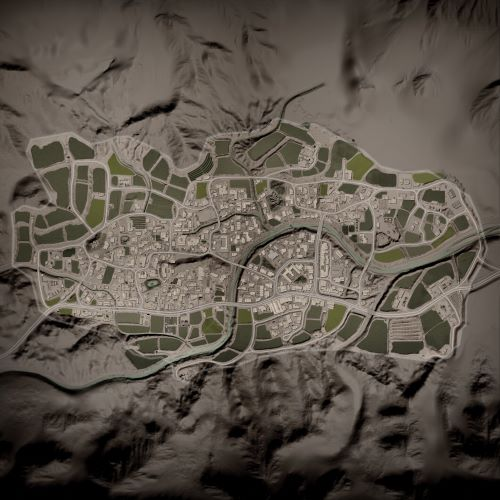

# Sumari Bala | 索马里

## AAS | 攻守有序

### Sumari Bala AAS v1

切换代码： `AdminChangeLayer Sumari_AAS_v1`

预设代码： `AdminSetNextLayer Sumari_AAS_v1`

光照情况： 黎明

旗点数量： 5

双方阵营： 英军 VS 中东

初始票数： 250  -  250

??? abstract "英军载具"
    - HX60 Transport Truck *1
    - HX60 Logistics Truck *3
    - LPPV *2

??? abstract "中东载具"
    - Simir Logi *2
    - Ural-4320 Logistics Truck *3
    - Simir Kord *2
    - Simir MG3 *1

### Sumari Bala AAS v2

切换代码： `AdminChangeLayer Sumari_AAS_v2`

预设代码： `AdminSetNextLayer Sumari_AAS_v2`

光照情况： 黎明

旗点数量： 5

双方阵营： 美军 VS 俄军

初始票数： 250  -  250

??? abstract "美军载具"
    - M939 Transport Truck *1
    - M939 Logistics Truck *3
    - M-ATV M2 HB *2
    - M-ATV CROWS M240 *1
    - M-ATV CROWS M2 HB *1

??? abstract "俄军载具"
    - KamAZ 5350 Transport Truck *1
    - KamAZ 5350 Logistics Truck *3
    - Tigr-M Kord *3
    - Tigr-M RWS Kord *1

### Sumari Bala AAS v3

切换代码： `AdminChangeLayer Sumari_AAS_v3`

预设代码： `AdminSetNextLayer Sumari_AAS_v3`

光照情况： 黎明

旗点数量： 5

双方阵营： 澳军 VS 俄军

初始票数： 250  -  250

??? abstract "澳军载具"
    - HX60 Transport Truck *1
    - HX60 Logistics Truck *3
    - PMV Mag58 x3 *3
    - PMV RWS M2 *1

??? abstract "俄军载具"
    - KamAZ 5350 Transport Truck *1
    - KamAZ 5350 Logistics Truck *3
    - Tigr-M Kord *3
    - Tigr-M RWS Kord *1

### Sumari Bala AAS v4

切换代码： `AdminChangeLayer Sumari_AAS_v4`

预设代码： `AdminSetNextLayer Sumari_AAS_v4`

光照情况： 正午&多云

旗点数量： 7

双方阵营： 加军 VS 中东

初始票数： 250  -  250

??? abstract "加军载具"
    - MSVS Transport Truck *1
    - MSVS Logistics Truck *1
    - LUVW Logistics *2
    - LUVW M2 *3

??? abstract "中东载具"
    - Ural-4320 Transport Truck *1
    - Simir Logi *4
    - Simir Kord *3

### Sumari Bala AAS v5

切换代码： `AdminChangeLayer Sumari_AAS_v5`

预设代码： `AdminSetNextLayer Sumari_AAS_v5`

光照情况： 黎明

旗点数量： 7

双方阵营： USMC VS 中东

初始票数： 250  -  250

??? abstract "USMC载具"
    - M939 Transport Truck *1
    - M939 Logistics Truck *2
    - M1151 M2 Open Doors *3

??? abstract "中东载具"
    - Ural-4320 Transport Truck *1
    - Simir Logi *4
    - Simir Kord *3

## Insurgency | 叛乱

### Sumari Bala Insurgency v1

切换代码： `AdminChangeLayer Sumari_Insurgency_v1`

预设代码： `AdminSetNextLayer Sumari_Insurgency_v1`

光照情况： 黎明

旗点数量： 2

双方阵营： 美军 VS 叛军

初始票数： 200  -  1000

??? abstract "美军载具"
    - M-ATV M2 HB *2
    - M939 Logistics Truck *3
    - M-ATV CROWS M240 *1

??? abstract "叛军载具"
    - Minsk 400 *1
    - Transport Pickup Truck *2
    - Logistics Pickup Truck *3
    - Technical DShK Shielded *1
    - Armored Technical DShK *1
    - Armored Technical SPG-9 *2

## Invasion | 侵攻

### Sumari Bala Invasion v1

切换代码： `AdminChangeLayer Sumari_Invasion_v1`

预设代码： `AdminSetNextLayer Sumari_Invasion_v1`

光照情况： 黎明

旗点数量： 6

双方阵营： 美军 VS 叛军

初始票数： 200  -  900

??? abstract "美军载具"
    - M939 Transport Truck *1
    - M939 Logistics Truck *3
    - M-ATV M2 HB *2
    - M-ATV CROWS M240 *1

??? abstract "叛军载具"
    - Minsk 400 *1
    - Transport Pickup Truck *1
    - Logistics Pickup Truck *4
    - Technical DShK Shielded *1
    - Armored Technical DShK *1

## RAAS | 随机攻守

### Sumari Bala RAAS v1

切换代码： `AdminChangeLayer Sumari_RAAS_v1`

预设代码： `AdminSetNextLayer Sumari_RAAS_v1`

光照情况： 正午&多云

旗点数量： 6

双方阵营： 美军 VS 中东

初始票数： 250  -  250

??? abstract "美军载具"
    - M939 Logistics Truck *3
    - M939 Transport Truck *1
    - M-ATV M240 *1

??? abstract "中东载具"
    - Simir MG3 *1
    - Simir Kord *1
    - Ural-4320 Logistics Truck *3
    - Simir Logi *2

### Sumari Bala RAAS v2

切换代码： `AdminChangeLayer Sumari_RAAS_v2`

预设代码： `AdminSetNextLayer Sumari_RAAS_v2`

光照情况： 正午&多云

旗点数量： 6

双方阵营： 英军 VS 中东

初始票数： 250  -  250

??? abstract "英军载具"
    - HX60 Logistics Truck *3
    - HX60 Transport Truck *1

??? abstract "中东载具"
    - Ural-4320 Logistics Truck *3
    - Simir Logi *2

## Seed | 暖服

### Sumari Bala Seed v1

切换代码： `AdminChangeLayer Sumari_Seed_v1`

预设代码： `AdminSetNextLayer Sumari_Seed_v1`

光照情况： 正午&多云

旗点数量： 5

双方阵营： 美军 VS 俄军

初始票数： 300  -  300

??? abstract "美军载具"
    - M939 Transport Truck *3
    - M939 Logistics Truck *4

??? abstract "俄军载具"
    - KamAZ 5350 Transport Truck *3
    - KamAZ 5350 Logistics Truck *4

### Sumari Bala Seed v2

切换代码： `AdminChangeLayer Sumari_Seed_v2`

预设代码： `AdminSetNextLayer Sumari_Seed_v2`

光照情况： 正午&多云

旗点数量： 5

双方阵营： 澳军 VS 叛军

初始票数： 300  -  300

??? abstract "澳军载具"
    - HX60 Transport Truck *3
    - HX60 Logistics Truck *4

??? abstract "叛军载具"
    - Minsk 400 *1
    - Transport Pickup Truck *3
    - Logistics Pickup Truck *4

## Skirmish | 遭遇战

### Sumari Bala Skirmish v1

切换代码： `AdminChangeLayer Sumari_Skirmish_v1`

预设代码： `AdminSetNextLayer Sumari_Skirmish_v1`

光照情况： 阴天

旗点数量： 5

双方阵营： 民兵 VS 叛军

初始票数： 150  -  150

??? abstract "民兵载具"
    - Transport Pickup Truck *2
    - Ural-375D Transport Truck *1
    - Ural-375D Logistics Truck *3
    - Technical DShK *2

??? abstract "叛军载具"
    - Minsk 400 *1
    - Transport Pickup Truck *2
    - Logistics Pickup Truck *4
    - Technical DShK *1

## TC | 领土控制

### Sumari Bala TC v1

切换代码： `AdminChangeLayer Sumari_TC_v1`

预设代码： `AdminSetNextLayer Sumari_TC_v1`

光照情况： 正午&多云

旗点数量： 23

双方阵营： 美军 VS 中东

初始票数： 400  -  400

??? abstract "美军载具"
    - M939 Logistics Truck *3
    - M939 Transport Truck *1
    - M-ATV M240 *1

??? abstract "中东载具"
    - Simir MG3 *1
    - Simir Kord *1
    - Ural-4320 Logistics Truck *3
    - Simir Logi *2

